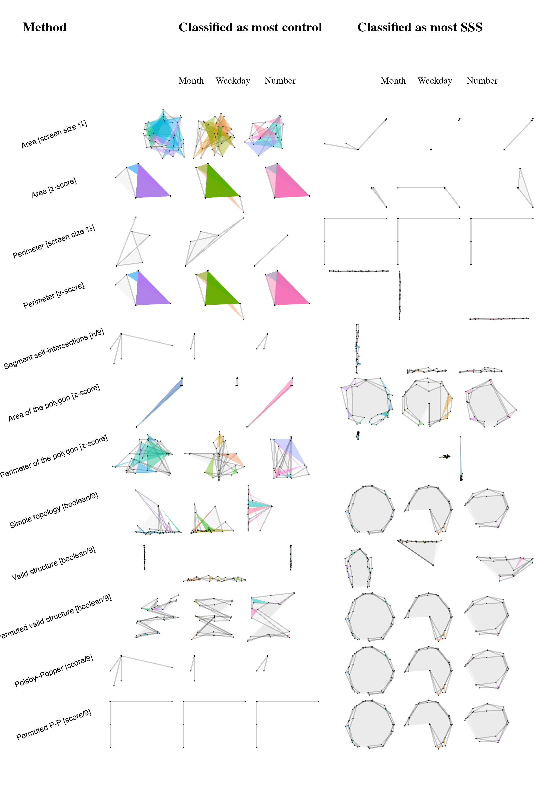

```{r, libraries, message=FALSE, warning=FALSE}
# To reproduce the manuscript:
# 1. Download all the github repository (including data [.csv] and bibliography [.bib])
# 2. Requires Quarto (RStudio) + apa-quarto template (https://github.com/wjschne/apaquarto).
#     To install apa-quarto template:
#     quarto::quarto_use_template("wjschne/apaquarto")
#     (Or in the terminal: quarto use template wjschne/apaquarto )
# 3. Requires the following packages to be installed 
#     (i.e. install.package("package_name"))
# 4. Install LateX engine to render to .pdf. (https://github.com/rstudio/tinytex).
#     (Otherwise change the YAML above to render to html, typst or other supported formats)
# 5. Click on render (current version is optimized for .pdf format (via LateX)).

# Packages are sorted by anti-hierachical importance for the code. That is, the least important package is loaded first and the most last. The reason is that R functions call priority is higher for the last loaded package. For example, conflicting functions (those with the same name across different packages), the last that has been loaded will be the one effectively used. 

############ Load R packages: ################

# Render Formatting
# library(papaja)
library(RColorBrewer)
# library(kableExtra)
library(pakret) # R package in text citation
# Plots
library(ggplot2)
library(ggridges)
library(ggalluvial)
library(ggVennDiagram)
library(ggridges)
library(ggforce)
library(cowplot) # for multiplot in 1 figure
library(corrplot)
library(gt)
# Data import
library(readr)
library(readxl)
# Data wrangling:
library(tidyr)
library(dplyr)
# geometry/geography feature package
library(sf)
# for ROC analyses:
library(pROC) # See https://www.r-bloggers.com/2019/02/some-r-packages-for-roc-curves/

# Make shure environment is empty
rm(list = ls())
```

```{r, review, message=FALSE, warning=FALSE}
############## For review purposes ##############
# Might be a bit over-ingegneered, the hope is that this is work that won't need to be done in later review processes. 

############## Instructions: ##############
# r track("text changed") : text font color for changed (exclude references)
# r nr("comment from author nr"): comment from nr. Will appear as a cartoon bubble style. Same for cs("").
# r nr("comment from author nr",done =1): the one indicate this has been implemented. Will be rendered to a check icon. 
# r rl("note about implemented change"): will appear as a note.

## Remove all comments if 1
noComments <- 0 
## "Track" changes if 1
TrackChanges <- 1

track <- function(word) {
  if(TrackChanges == 1){
    paste0("\\textcolor{teal}{", word, "}")
  } else {
    paste0("\\textcolor{black}{", word, "}")
  } 
}

## Add comments:
# Requires: tinytex::tlmgr_install("pdfcomment")
# Add function by reviewer:
.nr_counter <- 0
nr <- function( text, n = NULL, done = NULL) {
  if (is.null(n)) {
    .nr_counter <<- .nr_counter + 1
    n <- .nr_counter
  } else {
    .nr_counter <<- n
  }
  
  if (knitr::is_latex_output()) {
    
    ### Manipulate text:
    # escape characters that would break LaTeX
    text <- gsub("\\\\", "\\\\textbackslash{}", text)
    text <- gsub("([#$%&_{}])", "\\\\\\1", text, perl = TRUE)
    # add Author + comment nr:
    text <- paste0("NR", n, ": ", text)
    if(noComments == 1){
      text <- ""
    }
    
    ### Latex pdfcomment instructions
    if(!is.null(done) && done == 1){
      paste0("\\pdfcomment[icon=", "Check", ",color={", "0 0 1", "}]{",text,"}" )
    } else {
      paste0("\\pdfcomment","{", text, "}")
    }
  } else {
    # color <- if (!is.null(done) && done == 1) "green" else "red"
    # paste0('<span style="color: ', color, ';">[NR ', n, ': ', text, ']</span>')
    paste0('<span style="color: red;">[NR, comment ', n, ': ', text, ']</span>')
  }
}


.cs_counter <- 0
cs <- function(text, n = NULL, done = NULL) {
  
  if (is.null(n)) {
    .cs_counter <<- .cs_counter + 1
    n <- .cs_counter
  } else {
    .cs_counter <<- n
  }

  if (knitr::is_latex_output()) {
    # escape characters that would break LaTeX
    text <- gsub("\\\\", "\\\\textbackslash{}", text)
    text <- gsub("([#$%&_{}])", "\\\\\\1", text, perl = TRUE)
    text <- paste0("CS", n, ": ", text)
     if(noComments == 1){
      text <- ""
    }
    
    if(!is.null(done) && done == 1){
      paste0("\\pdfcomment[icon=", "Check", ",color={", "0 1 0", "}]{",text,"}" )
    } else {
      paste0("\\pdfcomment","{", text, "}")
    }
  } else {
   paste0('<span style="color: red;">[CS, comment ', n, ': ', text, ']</span>')
  }
}

.rl_counter <- 0
rl <- function(text, n = NULL) {
  
  if (is.null(n)) {
    .rl_counter <<- .rl_counter + 1
    n <- .rl_counter
  } else {
    .rl_counter <<- n
  }
     
  if (knitr::is_latex_output()) {
    # escape characters that would break LaTeX
    text <- gsub("\\\\", "\\\\textbackslash{}", text)
    text <- gsub("([#$%&_{}])", "\\\\\\1", text, perl = TRUE)
    # add Author + comment nr:
    text <- paste0("RL", n, ": ", text)
     if(noComments == 1){
      text <- ""
    }
    paste0("\\pdfcomment[icon=Note,color={1 0 0}]","{", text, "}")
  } else {
   paste0('<span style="color: red;">[RL, comment ', n, ': ', text, ']</span>')
  }
}

# What I learned to add comments from quarto to pdf's via LateX: don't use 
# todonotes. You will need to adjust margins & font size. 
# Hence long comments are just not manageable. 
# pdfcomment is the optimal (still limited) option. It seems not possible to change the icons colour for example, they are yellow, i.e. default from the pdf reader. 
```

# Introduction {#sec-introduction}

Sequence-Space Synaesthesia (SSS), or visuo-spatial forms, is the
phenomenon where people visualize ordered sequences in particular
spatial positions. For example, numbers, weekdays or months (synesthetic
*inducers*) are represented as arranged into specific spatial positions
in space (synesthetic *concurrents*). The synaesthetic spatial-forms can
be complex and have variable geometric forms. These geometric forms
might be different for each category (i.e. number-forms weekdays and
months), with forms such as ellipses, zig-zags or curbed lines
[@galton1880; @flournoy1893]. However, the spatial-forms of individuals
with SSS are consistent and automatic [@seron1992;
@deroy2013].`r nr("add referencese", done =1)` Existing methods for
classifying SSS and controls based on consistency tests have some
limitations [@brang2010; @rothen2016; @ward2022; @ward2018;
@eagleman2007; @sagiv2006; @baron-cohen1987]
`r nr("add Reference", done = 1)`.The aim of
`r track("the present exploratory phase 1 study is to optimize consistency methods from aggregated and already available datasets. Then, in confirmatory phase 2 registered report study")`,
we aim to test and compare the optimal methods on data that has yet to
be collected.
`r nr("However, it is not clear that Study 1 and Study 2 will both be in the same paper, while Study 1 is exploratory and Study 2 based on registration of the results from the first study confirmatory. I think, you must make clear that Study 2 is why we submit this manuscript as registered report.", done =1)`

SSS frequently co-occurs with other subtypes of synaesthesia and as for
other subtypes of synaesthesia it is idiosyncratic. Grapheme-colour
synaesthesia, where a grapheme *inducer* triggers a *concurrent* colour
(i.e. “A” seen as red), co-occurs at 71% to 76% with SSS [@sagiv2006].
Nevertheless, across different synaesthetic subtypes, self-reported SSS
tend to cluster together [@ward2022], indicating a degree of internal
homogeneity and justifying the study of it as a distinct phenomenon.
Spatial-forms are idiosyncratic, which results in considerable
heterogeneity in how this phenomenon is manifested across individuals.
One source of heterogeneity is given by dimensionality: some SSS
experiences can involve three-dimensional (3D) and two-dimensional (2D)
arrangements [@eagleman2009a; @price2013]. Another source of
heterogeneity is the reference frame, for example, the spatial-forms
might take place in an external space around the body (*i.e.* projector)
or in an egocentric internal space (*i.e.* associator) [@dixon2004;
@smilek2007]. Further variability can be explained by temporal-spatial
properties and mental-manipulation of spatial-forms such as “zooming” in
and out or rotating or shifting perspectives at will [@gould2014;
@jarick2009]. Lastly, the shape, complexity and layout of the
spatial-forms are also heterogeneous such as forming for example ovals,
lines, zig-zags or loops. With some recurring shapes being more frequent
across SSS, such as ovals for months [@eagleman2009a].

## Consistency tests {#sec-consistency-tests}

`r nr("All the information is there, but the strucutre is not yet optimal. The second sentence in the following paragraph can only be understood when one knows how a consistency tests works. -> Recommendation: I would start with a more general statement that synaesthesia is diagnosed on the basis of phenomenological reports, for instance by means of questionnaires, and consistency tests. Then, explain how consistency tests work. Then wirte about consistency tests in SSS.", done = 1)`

Individuals with SSS are usually identified by the means of
phenomenological reports such as questionnaires and consistency tests.
`r track("Questionnaires rely on self-report of the consistency, automaticity, directionality and developmental onset of spatial associations. Consistency tests rely on more objective behavioural tasks used to evaluate how stable synesthetic experiences are over time ")`[@rothen2013a;
@rothen2016].

`r track("In the SSS consistency task, participants complete multiple rounds of the same stimuli (e.g., digits, days of the week, and months of the year) and are asked to indicate a spatial location for each stimulus by clicking on the computer screen. Hence, consistency tasks are designed to assess")`
how similar participant's responses are across repetitions (i.e.
*inducer*-*concurrent* associations). An individual is identified as a
synaesthete based on the variability between repeated responses
`r track("to the same inducer or stimuli")`: less variable responses
being an indicator of the consistent responses characteristic of
synaesthesia.
`r track("This because synaesthetes can respond from their perceptual experience while non-synesthetes can only be consistent by relying on a memorization strategy")`
`r nr("Add explanation -> because synaesthetes can rely on experiences, but non-synaesthetes must rely on memory", done = 1)`.
Consistency tests have proven effective for colour-grapheme
synaesthesia. Measures of individual consistency can be derived using
colour pickers while repeatedly presenting the same inducer (i.e. “A”).
The quantification of the distance between concurrents from the same
inducers is used to discriminate consistent synaesthetes from controls
[@rothen2013a]. A similar rationale to that used for colour-grapheme
synaesthesia has been applied to characterize SSS from consistency
tasks.

@brang2010 for example evaluated consistency as the distance between
repeated responses to the same inducer or stimuli (e.g. January and
January) relative to adjacent stimuli (e.g. February). A response was
defined as consistent if it fell within 1.96 *z-scores*. However, this
criterion was noted to be potentially too conservative, as it identified
synaesthesia in 4 of 81 self-reported synaesthetes. Geometrical features
such as area and perimeter between the coordinates of repeated inducers
have further been used as a measure of the distance between same
inducers, hence as a metric for consistency. Less consistent responses
lead to smaller triangle perimeters and area [@rothen2016]. A cut-off
has been proposed whereby individuals are classified as SSS if their
average response area is smaller than 0.203% of the total screen area
[see also @ward2018].

`r rl("Added following paragraph")` In contrast to the consistency tests
for colour-grapheme synaesthesia, performances of consistency test for
SSS at the suggested cut-off are less performant. For example, existing
consistency tests for Colour-grapheme lead to an Area Under the Curve of
93%, which corresponds to the probability of the test to correctly
classify synesthetes from non synaesthetes (Sensitivity = 90%,
Specificity = 94%, see @rothen2013a). In contrast, consistency tests for
SSS lead to an Area Under the Curve of 76% (Sensitivity = 88%,
Specificity = 77%, see @rothen2016).
`r nr("I would recommend adding to the introdcution -> the level of sensitivity and specificity which can be reached with consistency tests for grapheme-colour synaesthesia -> somehow adding that the performance of consistency tests in SSS are not as good as for GCS -> add a reason or your limitations why this is the case", done = 1)`

## Limitations of current methods of consistency tests

`r rl("this whole section has been restructured")`

A first limitation of current SSS consistency tests is that participants
that respond with the same position, for example when not knowing the
response, will have artificially high consistencies with those metrics
[@rothen2016]. Indeed, exclusion via visual inspection of these
responses lead to improved classification performances using the area
test (i.e. Sensitivity = 87%; Specificity = 81%, Area Under the Curve =
85%, see @rothen2016).
`r nr("Do these limitations apply in general or only to SSS consistency tests?", done = 1)`
A second limitation is that consistency methods may favour certain
spatial-forms[@ward2018] in particular those with linear or highly
regular spatial layouts, i.e. elliptical patterns for
months[@flournoy1893; @eagleman2009a; @brang2010]. This has led to
alternative approaches such as to add the standard deviation of
responses, questionnaire cut-off [@ward2018] or permutation-based
comparison of individual responses to chance levels for colour-grapheme
[@root2021] and SSS [@ward2022a]. Third, these consistency tests
evaluate the variability of responses to the same stimuli, therefore the
ordinality between stimuli is not taken into account. Synaesthetic
spatial-forms follow ordinal rules (e.g. Monday `→` Tuesday `→`
Wednesday). In the domain of numerical cognition, ordinality has been
identified as an important information when processing sequences
[@lyons2013]. Some studies of SSS have systematically investigated
ordinality by investigating metrics of adjacent inducer-concurrent pairs
such as distances [@brang2010] or angles [@eagleman2009a]. However,
ordinality of the concurrent spatial-form might be particularly relevant
considering all the stimuli of a certain category (i.e. weekdays or
months).

`r rl("New paragraph:")` Another limitation of consistency tests for SSS
concerns the number category. Indeed, spatial representations for
numbers are also phenomenological in the general population. It has been
theorized the existence of a mental number line, where numbers are
spatially represented from small-left to large-right[@dehaene1993;
@hubbard2005a]. Experimentally, the Spatial Numerical Association of
Response Code, in short SNARC effect, finds that smaller numbers are
responded faster with the left hand and larger number with the right
hand[@dehaene1993]. Hence controls could have an internalized
representation for numbers in space. It is however important to note
that the SNARC is not reliable on an individual level [@cipora2019;
@ramos2026] and that the SNARC effect might also arise from a response
rather than a representational level [@bassomoro2018; @keus2005].
Nevertheless this phenomenon might lead to consistent responses for
numbers also by controls.

Here, we aim at optimizing the identification of SSS from consistency
tasks using geometrical characteristics of spatial-forms from ordered
stimuli or inducers.

`r nr("Also add the problem of SNARC which is present in non-synesthetes and differentiate the phenomenon from synaesthesia -> this will give your research more impact, because it will also be interesting for the SNARC people. My recommendations do not have the be necessarily included in the same paragraph. For instance the information for consistency in GCS can be added somewhere further above and then further below you could write: in contrast to consistency in grapheme-colour synaesthesia, consistency in sequence-space synaesthesia has some limitations...", done = 1)`

## Present study

`r rl("Several changes here too")`

`r ("This registered consists of two phases,")` *phase I* is an
exploratory study to find an optimal consistency test to classify SSS
and controls, on available aggregated datasets. *Phase II* is a
confirmatory study of the most optimal consistency tests on data that
has yet to be collected.

In the present *Phase I*, we merge four previously available datasets
using the same task on both SSS and control groups [@ward2022a]. First,
we aimed to reproduce established consistency test methods based on
stimulus-level consistency metrics, such as area and perimeter. Second,
we explored a new approach comparing geometrical features across
repetitions of the same categories (weekday, month and numbers), such as
segments and polygons. These novel tests are designed to take advantage
of the sequentiality or ordinality between the responses and the
geometrical properties at the spatial-form level, see @fig-01. All the
consistency tests are then optimized using ROC analyses based on
self-reported
`r nr("better -> optimizing based on self-report", done = 1)`
classification self-reported SSS and control groups.

In *Phase II*
`r nr("could be called Phase II. In a future is not so clear whether it will be part of this manuscript or something entirely new. It must be made clear that it will be part of this manuscript. You could also state that this study consists of two phases: phase I is exploratory and based on existing data and phase II is confirmatory and based on to be collected data.", done = 1)`,
we will assess whether the tests identified in the present study
generalize and are validated on an independent dataset that is yet to be
acquired (@sachdeva2024, Stage 1 in-principle acceptance, see also
<https://osf.io/6wn4m>).

```{r Load data}
# In the following I upload and merge the data from Ward, Rothen and Van Peters. Data is stored into a full dataset ds (i.e. 1 row per trial) and a dataset per participant ds_Quest (i.e. 1 row per participant).

###  Ward Data
ds_syn       <- read_excel("Data/raw_synaesthetes_consistency_anon.xlsx")
ds_syn$group <- "Syn"
ds_ctl       <- read_excel("Data/raw_controls_consistency_anon.xlsx")
ds_ctl$group <- "Ctl"

ds_Q_syn       <- read_excel("Data/raw_synaesthetes_questionnaire_anon.xlsx")
ds_Q_syn$group <- "Syn"
ds_Q_ctl       <- read_excel("Data/raw_controls_questionnaire_anon.xlsx")
ds_Q_ctl$group <- "Ctl"

# Merge wards datafiles:
ds <- merge(ds_syn,ds_ctl, all = TRUE)
ds_Q <- merge(ds_Q_syn,ds_Q_ctl, all = TRUE)

# Ward only uses those who completed the Questionnaire (i.e. N = 215+252 = 467)
ds <- ds %>% 
  filter(session_id %in% unique(ds_Q$session_id))
 
### Rothen Data

ds_Rothen <- read.csv("Data/rawdata.txt", sep="")

### Rename variables to match datasets

# sum(ds_Q$consistency_score != ds_Q$consistency) # Duplicate variable
ds_Q$consistency <- NULL
ds_Q$...36 <- NULL
ds_Q$...37 <- NULL
ds_Q$mean_simulation_Z <- NULL
ds_Q$SD_simulation <- NULL
ds_Q$`z-score`  <- NULL

rm(ds_syn,ds_ctl,ds_Q_syn,ds_Q_ctl)

ds$ID <- ds$session_id
ds_Q$ID <- ds_Q$session_id

ds_Q$dataSource <- "Ward"
ds$dataSource   <- "Ward"

# From Rothen:
names(ds_Rothen)[names(ds_Rothen) == "Group"] <- "group"
ds_Rothen$group <- as.factor(ds_Rothen$group)
levels(ds_Rothen$group) <- c("Ctl","Syn")
names(ds_Rothen)[names(ds_Rothen) == "Inducer"] <- "stimulus"
names(ds_Rothen)[names(ds_Rothen) == "X"] <- "x"
names(ds_Rothen)[names(ds_Rothen) == "Y"] <- "y"
ds_Rothen$SynQuest <- ds_Rothen$group == "Syn"

ds_Rothen$dataSource <- "Rothen"

# From the paper (all the same since lab based):
ds_Rothen$width  <- 1024
ds_Rothen$height <- 768
```

```{r Merge1 Rothen and Ward data}
## 0.2 Merge data:
# remove non matching colnames: 
ColNames_ds <- colnames(ds_Rothen)[colnames(ds_Rothen) %in% colnames(ds)]

ds <- ds %>%
  select(all_of(ColNames_ds))
ds_Rothen <- ds_Rothen %>%
  select(all_of(ColNames_ds))

# Merge Data:
ds   <- merge(ds,ds_Rothen, all = TRUE)

# Because there is no questionnaire in Nicola's data:
ds$SynQuest[ds$dataSource == "Rothen"] = "NaN"

# Questionnaire:
ID <- unique((ds_Rothen$ID))
ds_Q_Rothen <- as.data.frame(ID)
ds_Q_Rothen$dataSource <- "Rothen"
ds_Q_Rothen <- merge(ds_Q_Rothen, ds_Rothen %>% group_by(ID) %>% select(ID, dataSource, group) %>% filter(row_number() == 1), by = c("ID","dataSource"))

# Append rows:
ds_Q$ID <- as.character(ds_Q$ID)
ds_Q <-  bind_rows(ds_Q,ds_Q_Rothen)

# Clear up:
rm(ds_Q_Rothen, ds_Rothen)

## 0.3 Wrangle dataset
# Add Condition, i.e. stim type:
ds$Cond <- NaN
ds$Cond[ds$stimulus %in% c("1","2","3","4","5","6","7","8","9","0")] <- "number"
ds$Cond[ds$stimulus %in% c("Monday","Tuesday","Wednesday","Thursday","Friday","Saturday","Sunday")] <- "weekday"
ds$Cond[ds$stimulus %in% c("January", "February", "March", "April", "May","June","July","August","September","October","November","December")] <- "month"
```

```{r MergeVanPeters}
### ADD Van Petersen Cortex data
filedir <- "Data/vanPeterPerID/"
fn <- paste0(filedir,dir(filedir))

ds_PeterCor <- read_excel(fn[1],
                                col_types = c("text", "numeric", "text", 
                                              "text", "numeric", "numeric", "numeric", 
                                              "numeric", "numeric", "numeric", 
                                              "numeric", "numeric", "text", "text", 
                                              "text", "numeric", "numeric", "numeric"))

for(i in 2:length(fn)){
  ds_i <- read_excel(fn[i],
                     col_types = c("text", "numeric", "text", 
                                   "text", "numeric", "numeric", "numeric", 
                                   "numeric", "numeric", "numeric", 
                                   "numeric", "numeric", "text", "text", 
                                   "text", "numeric", "numeric", "numeric"))
    ds_PeterCor <- merge(ds_PeterCor, ds_i, all = TRUE)
}

# Here information about group:
ds_PeterCor_Q <- read_excel("Data/Consistency_scores.xlsx")

names(ds_PeterCor_Q)[names(ds_PeterCor_Q) == "PPcode"] <- "ID"
names(ds_PeterCor)[names(ds_PeterCor) == "Code"] <- "ID"

ID_IN <- intersect(ds_PeterCor$ID, ds_PeterCor_Q$ID)
ds_PeterCor <- ds_PeterCor %>%
    filter(ID %in% ID_IN)
ds_PeterCor_Q <- ds_PeterCor_Q %>%
    filter(ID %in% ID_IN)

# Merge data with group and all dataset: 
ds_PeterCor <- ds_PeterCor_Q %>%
  left_join(ds_PeterCor, by = "ID")

# Rename to match:
names(ds_PeterCor)[names(ds_PeterCor) == "Group"] <- "group"
ds_PeterCor[ds_PeterCor$group == "SSS",]$group <- "Syn"
ds_PeterCor[ds_PeterCor$group == "control",]$group <- "Ctl"
names(ds_PeterCor)[names(ds_PeterCor) == "MouseClick.RESPCursorY"] <- "y"
names(ds_PeterCor)[names(ds_PeterCor) == "MouseClick.RESPCursorX"] <- "x"
names(ds_PeterCor)[names(ds_PeterCor) == "word"] <- "stimulus" # Will need to translate to english!
names(ds_PeterCor)[names(ds_PeterCor) == "BlockList.Cycle"] <- "repetition"

ds_PeterCor$width  <- 1920 # "screen with display resolution set to 1920 x 1080, controlled by a Dell computer running Windows 7."
ds_PeterCor$height <- 1080
ds_PeterCor$dataSource <- "PeterCor"

ds_PeterCor <- ds_PeterCor %>%
  select(all_of(ColNames_ds))

# Translate, weekdays:
ds_PeterCor$stimulus[ds_PeterCor$stimulus == "maandag"]   <- "Monday"
ds_PeterCor$stimulus[ds_PeterCor$stimulus == "dinsdag"]   <- "Tuesday"
ds_PeterCor$stimulus[ds_PeterCor$stimulus == "woensdag"]  <- "Wednesday"
ds_PeterCor$stimulus[ds_PeterCor$stimulus == "donderdag"] <- "Thursday"
ds_PeterCor$stimulus[ds_PeterCor$stimulus == "vrijdag"]   <- "Friday"
ds_PeterCor$stimulus[ds_PeterCor$stimulus == "zaterdag"]  <- "Saturday"
ds_PeterCor$stimulus[ds_PeterCor$stimulus == "zondag"]    <- "Sunday"

# Translate, Monthc:
ds_PeterCor$stimulus[ds_PeterCor$stimulus == "januari"]   <- "January"
ds_PeterCor$stimulus[ds_PeterCor$stimulus == "februari"]  <- "February"
ds_PeterCor$stimulus[ds_PeterCor$stimulus == "maart"]     <- "March"
ds_PeterCor$stimulus[ds_PeterCor$stimulus == "april"]     <- "April"
ds_PeterCor$stimulus[ds_PeterCor$stimulus == "mei"]       <- "May"
ds_PeterCor$stimulus[ds_PeterCor$stimulus == "juni"]      <- "June"
ds_PeterCor$stimulus[ds_PeterCor$stimulus == "juli"]      <- "July"
ds_PeterCor$stimulus[ds_PeterCor$stimulus == "augustus"]  <- "August"
ds_PeterCor$stimulus[ds_PeterCor$stimulus == "september"] <- "September"
ds_PeterCor$stimulus[ds_PeterCor$stimulus == "oktober"]   <- "October"
ds_PeterCor$stimulus[ds_PeterCor$stimulus == "november"]  <- "November"
ds_PeterCor$stimulus[ds_PeterCor$stimulus == "december"] <- "December"

# They added 2 numbers that are not in the other datasets:
ds_PeterCor <- ds_PeterCor %>%
    filter(stimulus != "50") %>%
    filter(stimulus != "100")

# MERGE  
ds   <- merge(ds,ds_PeterCor, all = TRUE)

# Questionnaire:
names(ds_PeterCor_Q)[names(ds_PeterCor_Q) == "Group"] <- "group"
ds_PeterCor_Q[ds_PeterCor_Q$group == "SSS",]$group <- "Syn"
ds_PeterCor_Q[ds_PeterCor_Q$group == "control",]$group <- "Ctl"

ds_PeterCor_Q$dataSource <- "PeterCor"

ds_PeterCor_Q <- ds_PeterCor_Q %>%
  select(ID, group, `Consistency All`, `Consistency Days`, `Consistency Months`,`Consistency Numbers`, dataSource)

# Append rows:
ds_Q <-  bind_rows(ds_Q,ds_PeterCor_Q)

# Tidy workspace:
rm(ds_PeterCor_Q,ds_PeterCor,ds_i, ID, fn,ColNames_ds,i,ID_IN)
```

```{r MergeWard2}
# This data was provided by Jamie by mail. The data is prepared in a separeate file
# Preserve "?" in the colnames: 
ds_Ward2 <- read.csv2("Data/WardData2.csv", fileEncoding = "UTF-8", check.names = FALSE)
ds_Ward2$ID <- ds_Ward2$session_id 
ds_Ward2$dataSource <- "Ward2"

# Add Cond
ds_Ward2$Cond <- NaN
ds_Ward2$Cond[ds_Ward2$stimulus %in% c("1","2","3","4","5","6","7","8","9","0")] <- "number"
ds_Ward2$Cond[ds_Ward2$stimulus %in% c("Monday","Tuesday","Wednesday","Thursday","Friday","Saturday","Sunday")] <- "weekday"
ds_Ward2$Cond[ds_Ward2$stimulus %in% c("January", "February", "March", "April", "May","June","July","August","September","October","November","December")] <- "month"

# Now I somehow need to define the groups
# If a response in the questionnaire then syn, if not then control.
ds_Ward2$group <- NaN
ds_Ward2$group[is.na(ds_Ward2$`Q1 . Some people routinely think about sequences as arranged in a particular spatial configuration (as in the examples below), do you think this might apply to you? (1=strongly agree, 5= strongly disagree)`)] <- "Ctl"
ds_Ward2$group[!is.na(ds_Ward2$`Q1 . Some people routinely think about sequences as arranged in a particular spatial configuration (as in the examples below), do you think this might apply to you? (1=strongly agree, 5= strongly disagree)`)] <- "Syn"

colNWard2 <- colnames(ds_Ward2)

ds_Ward2_Q <- ds_Ward2 %>%  
  select(c(ID, dataSource, colNWard2[colNWard2 %in% colnames(ds_Q)])) %>% 
  group_by(ID) %>%
  filter(row_number() == 1)

ds_Ward2_Q <- as.data.frame(ds_Ward2_Q)
ds_Ward2_Q$`questionnaire score` <- ds_Ward2_Q[,4] +  
  rowSums(ds_Ward2_Q[,21:24]) +
  rowSums(6 - ds_Ward2_Q[,25:28])

## Merge
ds         <- merge(ds,ds_Ward2, all = TRUE)
ds_Q       <- merge(ds_Q,ds_Ward2_Q,all = TRUE)

rm(ds_Ward2,ds_Ward2_Q)
```

```{r Wrangle data}
# Now we can enrich our dataset and process  several checks
# Add Condition, i.e. stim type:
ds$Cond <- NaN
ds$Cond[ds$stimulus %in% c("1","2","3","4","5","6","7","8","9","0")] <- "number"
ds$Cond[ds$stimulus %in% c("Monday","Tuesday","Wednesday","Thursday","Friday","Saturday","Sunday")] <- "weekday"
ds$Cond[ds$stimulus %in% c("January", "February", "March", "April", "May","June","July","August","September","October","November","December")] <- "month"

# Add stimulus repetition number
ds <- ds %>%
  group_by(ID, stimulus) %>%
  arrange(ID, stimulus, .by_group = TRUE) %>%
  mutate(repetition = row_number()) %>%
  ungroup()

# few trials that have more than 3 repetitions somehow:
ds <- ds %>% filter(repetition <= 3)

# Factorialize group variable to avoid confusions:
ds$group   <- as.factor(ds$group)
ds_Q$group <- as.factor(ds_Q$group)
```

```{r, FilterTrials}
# This is potentially a critical part for the results. Need to decide:
# (1) how to treat same coordinate responses, i.e. when ID clicks on the same position (see also Rothen and Ward)
# (2) how to treat missing data (i.e. NA & NaN)

# For (1), since z-score might fail (i.e. if all same coordinates) -->  turn same coordinates to NaN
# For (2), since sf does not accept missing data -->  we exclude those responses.
# This leads to some stimuli having only 2 repetitions (i.e. ID %in% 4_JB) AND some ID having to few pairs.
# Since polygons need at least 4 coordinate pairs. --> check enough data per repetition

# Important. To reproduce Rothen, the X = -1 and Y = -1 need to be interpreted as missing data (NaN):
ds$x[ds$x == -1] <- NaN
ds$y[ds$y == -1] <- NaN

# Detect ID has the same coordinates across Conditions:
ds <- ds %>%
    group_by(ID, Cond) %>% 
    mutate(SameCoord_x = length(unique(x[!is.na(x)])) == 1,SameCoord_y = length(unique(y[!is.na(y)])) == 1)

# NaNification:
ds$x[ds$SameCoord_x] <- NaN
ds$y[ds$SameCoord_y] <- NaN
ds$x[is.na(ds$x)]    <- NaN  # In VanPeters, some NA data all as NaN
ds$y[is.na(ds$y)]    <- NaN 

N1 <- length(unique(ds$ID)) # Track if ID loss

# Remove NaN from the dataset:
All_n <- length(ds$x) # Track trial loss
ds <- ds %>%
  filter(!is.na(x))
ds <- ds %>%
  filter(!is.na(y))
All_n2 <- length(ds$x)

N2 <- length(unique(ds$ID))  # Track if ID loss

# Check that each stimulus has 3 repetitions (3+2+1 = 6).
ds <- ds %>%
    ungroup() %>%
    group_by(ID, stimulus) %>%
    mutate(SumRep = sum(repetition)== 6)

ds <- ds[ds$SumRep,]
All_n3<- length(ds$x)

# Counts how many full conditions each ID has (should be 3):
tmp2 <- ds %>%
  ungroup() %>%
  group_by(ID, Cond, repetition) %>%
  filter(row_number() == 1) %>%
  summarize(ntrials = length(x)) %>%
  ungroup() %>%
  group_by(ID) %>%
  summarize(nCond = sum(ntrials)/3)

# Later on, we make polygons. These need at least 4 points. Hence we exclude ID's with less than 4 responses per condition:
tmp <- ds %>%
  ungroup() %>%
  group_by(ID, Cond, repetition) %>%
  summarize(ntrials = length(x))

ds <- ds %>%
  filter(!ID %in% tmp$ID[tmp$ntrials < 4])

N3 <- length(unique(ds$ID))

# Match ID to ds_Q:
IDlist <- unique(ds$ID)
ds_Q <- ds_Q %>%
  filter(ID %in% IDlist)
```

```{r Add_zs}
## Standardize/scale coordinates
ds <- ds %>%
  group_by(ID) %>% 
  mutate(x_zs = scale(x)) %>%
  mutate(y_zs = scale(y))
```

```{r ManualAdjust}

# Manually adjust pixels of invalid screen size
# Note: 29 since 29 stimuli
ds$height[ds$ID == 29324] <- 1080
ds$width[ds$ID == 32190 ] <- 1440

# This ID has unexpected changing screen settings, consider exclusion:
ds$width[ds$ID == 33168 ]  <- 308
ds$height[ds$ID == 33168 ] <- 149

ds$width[ds$ID == 35556 ]  <- 1439
ds$height[ds$ID == 35556 ] <- 734

ds$width[ds$ID == 48114 ]  <- 1593
ds$height[ds$ID == 48114 ] <- 671

ds$width[ds$ID == 59854]  <- 1366
ds$height[ds$ID == 59854] <- 663

ds$width[ds$ID == 63127]  <- 1920
ds$height[ds$ID == 63127] <- 880


ds$Screen_area <- ds$width*ds$height
```

```{r}
#| label: fig-01
#| apa-note: Example of a participant's months space-form illustrating the novel method's design.
#| dpi: 300
#| fig-cap: Design for novel method for consistency test from between trial varibility to Segment and polygons formed by the space-forms using geography tools.
#| fig-format: png
#| fig-pos: "H"
#| fig-width: 6
#| fig-height: 2

# Sorry for the lengthy piping, I call sf later in the code, but want to build my first figure using it. 

gp1 <- ds %>%
  filter(ID %in%  "1025_MaJo") %>%
  filter(Cond %in% "month")  %>%
  group_by(stimulus) %>%
  arrange(stimulus) %>%
  arrange(ordered(stimulus, levels = c("Monday", "Tuesday", "Wednesday", "Thursday", "Friday","Saturday","Sunday"))) %>% 
  arrange(ordered(stimulus, levels = c("January", "February", "March", "April", "May","June","July","August","September","October","November","December"))) %>% # Start ggplot
  ggplot(aes(x = x_zs, y = y_zs, group = stimulus, label = stimulus, fill = stimulus, colour = stimulus)) +
  geom_polygon(alpha = 0.4) +
  geom_point(size = 0.05, alpha = 0.5) +
  geom_text(aes(x = x_zs, y = y_zs), size = 2, alpha = 0.5) +
  scale_fill_discrete(guide="none") +
  coord_equal() +
  theme_void() + 
  labs(title = "Within stimulus") +
  theme(plot.title = element_text(hjust = 0.5, size = 8, family = "serif"))  + 
  theme(aspect.ratio = NULL) + 
  theme(legend.position="none")

gp2 <- ggplot() +
  annotate("segment",
           x = 0, xend = 0.5, y = 0, yend = 0,
           linewidth = 1,
           arrow = grid::arrow(type = "closed")) +
  theme_void() + theme(aspect.ratio = NULL)

gp3 <- ds %>%
  filter(ID %in%  "1025_MaJo") %>%
  filter(Cond %in% "month")  %>%
  group_by(stimulus) %>%
  arrange(stimulus) %>%
  arrange(ordered(stimulus, levels = c("Monday", "Tuesday", "Wednesday", "Thursday", "Friday","Saturday","Sunday"))) %>% 
  arrange(ordered(stimulus, levels = c("January", "February", "March", "April", "May","June","July","August","September","October","November","December"))) %>% # Start ggplot
  ggplot(aes(x = x_zs, y = y_zs, group = as.factor(repetition), label = stimulus, colour = as.factor(repetition))) +
  geom_path(alpha = 0.4) +
  geom_point(size = 0.5, alpha = 0.5) +
  geom_text(aes(x = x_zs, y = y_zs), size = 2, alpha = 0.5) +
  scale_fill_discrete(guide="none") +
  coord_equal() +
  theme_void() + 
  theme(plot.title = element_text(hjust = 0.5, size = 8, family = "serif")) + 
  theme(aspect.ratio = NULL) + 
  theme(legend.position="none")


gp4 <- ggplot() +
  annotate("segment",
           x = 0, xend = 0.5, y = 0, yend = 0,
           linewidth = 1,
           arrow = grid::arrow(type = "closed")) +
    theme_void() + theme(aspect.ratio = NULL)

gp5 <- ds %>%
  filter(ID %in%  "1025_MaJo") %>%
  filter(Cond %in% "month")  %>%
  group_by(stimulus) %>%
  arrange(stimulus) %>%
  arrange(ordered(stimulus, levels = c("Monday", "Tuesday", "Wednesday", "Thursday", "Friday","Saturday","Sunday"))) %>% 
  arrange(ordered(stimulus, levels = c("January", "February", "March", "April", "May","June","July","August","September","October","November","December"))) %>% # Start ggplot
  ggplot(aes(x = x_zs, y = y_zs, group = as.factor(repetition), label = stimulus, fill = as.factor(repetition),  colour = as.factor(repetition))) +
  geom_polygon(alpha = 0.4) +
  geom_point(size = 0.5, alpha = 0.5) +
  geom_text(aes(x = x_zs, y = y_zs), size = 2, alpha = 0.5) +
  scale_fill_discrete(guide="none") +
  coord_equal() +
  theme_void() + 
  labs(title = "Polygon") +
  theme(plot.title = element_text(hjust = 0.5, size = 8, family = "serif")) +  
  theme(aspect.ratio = NULL)  + 
  theme(legend.position="none")

gp6 <- ggplot() +
  annotate("segment",
           x = 0, xend = 0.5, y = 0, yend = 0,
           linewidth = 1,
           arrow = grid::arrow(type = "closed")) +
    theme_void() + theme(aspect.ratio = NULL)

gp7 <- ds %>%
  filter(ID %in%  "1025_MaJo") %>%
  filter(Cond %in% "month")  %>%
  group_by(stimulus) %>%
  arrange(stimulus) %>%
  arrange(ordered(stimulus, levels = c("Monday", "Tuesday", "Wednesday", "Thursday", "Friday","Saturday","Sunday"))) %>% 
  arrange(ordered(stimulus, levels = c("January", "February", "March", "April", "May","June","July","August","September","October","November","December"))) %>% # Start ggplot
  mutate(repetition = sample(repetition)) %>%
  ggplot(aes(x = x_zs, y = y_zs, group = as.factor(repetition), label = stimulus, fill = as.factor(repetition),  colour = as.factor(repetition))) +
  geom_polygon(alpha = 0.4) +
  geom_point(size = 0.5, alpha = 0.5) +
  geom_text(aes(x = x_zs, y = y_zs), size = 2, alpha = 0.5) +
  scale_fill_discrete(guide="none") +
  coord_equal() +
  theme_void() + 
  labs(title = "Permuted polygon") +
  theme(plot.title = element_text(hjust = 0.5, size = 8, family = "serif")) + 
  theme(aspect.ratio = NULL)  + 
  theme(legend.position="none")

# plot_grid(gp1,gp2,gp3,gp4,gp5, 
#           nrow = 1)
plot_grid(gp1,gp2,gp3,gp4,gp5,gp6,gp7,
          nrow = 1)
```

# Methods - phase I

Code and data for “one-click” reproducibility of this manuscript
including the following analyses are available on git-hub
(<https://github.com/remLach/SpaceSequenceSynDiagnostic>). All the
analyses are conducted in R, using the following packages
`r pakret::pkrt_list("pROC", "sf")` and for visualization
`r pakret::pkrt_list("ggplot2", "ggVennDiagram")`.

## Datasets and Participants

To base the optimization of the consistency test on the largest possible
sample we looked for accessible datasets that used the same consistency
tasks on groups of synesthetes and controls. We found four datasets that
met these criteria. Two datasets were collected in laboratory settings
@rothen2016 (see also
[https://osf.io/6hq94](https://osf.io/6hq94/files/osfstorage)) and
@vanpetersen2020 (see also
<https://data.ru.nl/collections/di/dcc/DSC_2018.00019_653>). The two
others came from on-line testing @ward2022a (see also
<https://osf.io/nu5v4>) and an additional dataset was provided by
private communications with Jamie Ward. To match the other datasets,
stimuli of the weekdays and months categories were translated from Dutch
to English in the dataset from [@vanpetersen2020]. For the number
category we included only digits from 0 to 9 that where presented across
all datasets (i.e. excluding the stimuli "50" and "100" for numbers in
@vanpetersen2020).

From the merged datasets, we kept `r N3` from the total `r N1`
participants. First, we excluded `r round(((All_n - All_n2)/All_n),2)` %
empty trials (i.e. skipped responses) including trials flagged for
having the same x or y coordinates across categories and repetitions,
causing the depletion (n = `r N1-N2`) participants [as in @rothen2016;
@ward2018]. (n = `r N2-N3`) participants were excluded for having less
than 4 coordinate points since polygons need at least four coordinate.
Note therefore, that `r sum(tmp2$nCond < 3)` participants of the final
sample did not have responses in all three categories b\< repetition
cases
`r nr("I am not able to understand this sentence. I find the X confusing.", done = 1)`.
From the final sample of N = `r length(ds_Q$ID)`,
`r sum(ds_Q$group == "Syn")` were self-reported synaesthetes and
`r sum(ds_Q$group == "Ctl")` self-reported controls, see @tbl-01 and
@tbl-02. `r nr("Based on self-reports?", done =1)`

| Synaesthetes     | Initial N | Final N | Age  |
|------------------|-----------|---------|------|
| @rothen2016      | 33        | 32      | 23.1 |
| @vanpetersen2020 | 23        | 22      | 23.2 |
| @ward2022a       | 252       | 252     | 37.2 |
| Ward 2           | 90        | 90      | NA   |
| Total:           | 398       | 396     |      |

: Synesthetes {#tbl-01 apa-note="Synesthetes. Demographics were not
provided in the dataset Ward 2. Before: before participant exclusion"}

| Controls         | Initial N | Final N | Age  |
|------------------|-----------|---------|------|
| @rothen2016      | 37        | 37      | 28.2 |
| @vanpetersen2020 | 21        | 21      | 21.6 |
| @ward2022a       | 215       | 213     | 19.9 |
| Ward 2           | 18        | 18      | NA   |
| Total            | 291       | 289     |      |

: Controls {#tbl-02 apa-note="Controls. Demographics were not provided
in the dataset Ward 2. Before: before participant exclusion"}

Regarding the synaesthetes profiles, detailed participant information
such as questionnaire responses were only available from the two
datasets from the data by
`r nr("delete Professor -> also further above where you mention how you obtained the data.", done = 1)`
Jamie Ward (i.e. a majority of
`r sum(ds_Q$dataSource %in% c("Ward","Ward2"))` participants). We
described the self-reported profiles for the stimulus categories used in
the consistency test (i.e. number, weekdays and month), see @fig-02.

```{r}
#| label: fig-02
#| fig-cap: "Venn diagram of the types of self-reported SSS"
#| apa-note: "Only data from Pr. Ward is represented here. SSS = Sequence-space synaesthesia"

# Load library

na.rm <- function(x){x <- x[!is.na(x)]}
ds_Q_W <- ds_Q %>% filter(dataSource %in% c("Ward","Ward2"))

ID_all    <- na.rm(ds_Q_W$ID[ds_Q_W$dataSource %in% c("Ward","Ward2")])
ID_group  <- na.rm(ds_Q_W$ID[ds_Q_W$group =="Syn"])
ID_number <- na.rm(ds_Q_W$ID[ds_Q_W$`Q2_numbers (1=present, 0=absent)` == 1] )
ID_days   <- na.rm(ds_Q_W$ID[ds_Q_W$`Q2_days  (1=present, 0=absent)` == 1] )
ID_month  <- na.rm(ds_Q_W$ID[ds_Q_W$`Q2_months  (1=present, 0=absent)`== 1] )

x <- list(SSS = ID_group, Number = ID_number, Day = ID_days, Month =ID_month)
# An euler diagram would be best, but there are no good solutions in r for now
ggVennDiagram(x, label = "count", set_color = c("black","orange","orange","orange")) +
    scale_fill_gradient(low = "white", high = "firebrick")
# If you enjoy more complex visualization than mental health:
# library(nVennR)
# v <- plotVenn(x)
# showSVG(v, outFile = "venn.html", systemShow = TRUE)
```

```{r, cleanup3}
# Clean up :
rm(ID_number,ID_days,ID_month, tmp, x, colNWard2 ,N1,N2,N3)
```

## Procedure

`r cs("I feel like there needs to be more detail here. So, in additon to what you already have - maybe some sample characteristics, data structure (number of reps per participant, number of stimuli), data preprocessing (any normalizations, handling missing data, inclusion and exclusion criteria), how you characterized the geometric spatial forms. I am not sure if this should Procedure or analysis but given this is a methods paper, I think maybe all this should come in the Procedure section?", done = 1)`

`r rl("Some of the data preproessing on the participant and trial level are described just above together (since exluding trials can cause the exclusion of participants). Simce the analyses are on available data I tried to do as little pre-rpocesising as possible.")`

For the consistency task, stimuli were presented randomly and
sequentially centrally on the screen. Participant were instructed to
click on the screen position where they visualize them. In
@vanpetersen2020 and @rothen2016 the participants were allowed to skip
responses.

Stimuli included here were 7 weekdays (Monday to Sunday), 12 months
(January to December) and 9 numbers (0 to 9). For all the data from
Jamie Ward the stimuli were presented in randomized order with the
constraint that no stimulus was repeated until all unique stimuli (N =
29) had been presented once. The median display resolution was
`r median(ds$width)` X `r median(ds$height)`, with a maximum of
`r max(ds$width)` X `r max(ds$height)` and a minimum of
`r min(ds$width)` X `r min(ds$height)`.

## Analyses

`r rl("All this part has been restructured and refrased.")`

`r nr("General comments: The method reads well, but is hard to follow because the methods you are using are complex. It might help to always using the same structure for each method. First, provide a theoretical motivation for the method -> replicate the original study, exploring the possiblity that mappings are not random but orientied at topological validity. Second, describe the method. Third, give a concrete example. I do not think you have done a bad job, but the results are too difficult to follow, because the reader needs to remember the methods.", done = 1)`

`r nr("We need to think carefully, what could be done to make it easier to follow. It might also help here to always apply the same structure. First, refere to descriptive statistics -> The descriptive statistics for comparing the ROC across different methods can be found in Figure X. Second, describe what you want to test / theoretical motivation -> in order to test X, we conducted Y analysis. Third, describe what the test revealed. -> It showed that A was significantly higher than B. The things you are doing are complex. Therefore the reader needs careful guidance.", done = 1)`

`r rl("This whole section has been rewritten and partically restructured. The structure of each method is: theory, method, example")`

We first reproduced existing methods and test their classification
performances (i.e. ability to class controls as controls and SSS as SSS)
using Receiver Operating Characteristics on the aggregated dataset. We
then compared these classification performances to the ones of novel
methods, see @fig-01.

### Reproduced consistency tests

`r nr("the subtitle seems confusing, it is not clear what you mean with on the stimulus level.", done = 1)`

We reproduced two existing consistency methods used to quantify the
spatial variability of responses between repetitions of the same stimuli
[@rothen2016; @ward2022a; @vanpetersen2020]. Synaesethes relying on
perceptual spatial representations should have more consistent
responses, hence less variable (i.e. closer) across the same stimuli
across repetitions than controls. Hence, variability was estimated by
measuring the distance between responses to the same stimuli (i.e.
between repetitions to the same stimuli, see first panel of @fig-01).

Formally the area (see [@eq-area]) and perimeter (see [@eq-perim]) were
calculated from the triangle (i.e. given three repetitions) formed by
the *x* and *y* coordinates of the three repetitions of each stimuli
(i.e. between the coordinates *(x1, y1), (x2, y2), (x3, y3)*).

$$
Area = \frac{|x1y2  +  x2y3  +  x3y1 \mathbin{-} x1y3 \mathbin{-}  x2y1 \mathbin{-} x3y2|}{2}
$$ {#eq-area}

$$
\begin{split}
Perimeter = \sqrt{(x2 \mathbin{-} x1)^2 + (y2 \mathbin{-} y1)^2} + \\ \sqrt{(x3 \mathbin{-} x2)^2 + (y3 \mathbin{-} y2)^2} + \\ \sqrt{(x1 \mathbin{-}  x3)^2 + (y1 \mathbin{-} y3)^2}
\end{split}
$$ {#eq-perim}

Each stimulus
`r nr("stimuli is plural -> does not seem to make sense here. Should be singular.", done = 1)`
triangle area was then averaged by participants. The area metric is in %
of the screen area to be able to compare with the consistency across
studies using different screen sizes. To account for screen size and
spread variability across the datasets and participants, area and
perimeter were also calculated on individually normalized *x* and *y*
coordinates (*z-score*).

For example, if a participant's set of *x,y* coordinates for Monday are
close to each other, then the triangle area and perimeter will be
smaller (i.e. more consistent and characteristics of synaesthetes). The
recognized limit of this method, is that controls clicking on the same
position can achieve artificially high consistencies, see for example
the first four rows of @fig-03.

{#fig-03
apa-note="Plotted are space-forms from the participants that are the extreme of the consistency test's value"}

```{=html}
<!--#
"{#fig-03
apa-note="Each row represents one of the method.For each methods we selected two partici-pants : the participant at the bottom of the method’s distribution (i.e. classified as most extremecontrol) and the one at the top (i.e. classified as most extreme SSS. Each participant has threespace-form figures one fot month, weekday and number. Points represent a single response.The coloured triangles connect the three repetitions. The grey lines represent the segments forthe three repetitions. The grey areas represent the polygon formed when ordinally connectingeach stimulus by repetition."}") 


# Excluded this method because it is chronophage, does not work well (i.e. ROC). 

### Permuted consistency

Higher-order analytical methods such as permutation-based methods were
also used as metrics. We reproduced @root2021 permutation test for
colour-grapheme synaesthesia and adapted it to SSS as in @ward2022a. For
each individual, the x and y coordinates were randomly permuted and the
areas were calculated. After 1000 permutations per individual, a z-score
was calculated with the observed means compared to the permuted
distribution [@eq-zsPermRoot]. The distribution of the permuted results
form an individual chance level distribution, hence the z-score reflects
where the observed area lies on the chance level distribution.

$$
Zscore = \frac{(Observed) – (Mean Permuted)}{(SD Permuted)}
$$ {#eq-zsPermRoot}

The rationale is that synaesthetes consistencies should be closer (?).
 I think I would exclude this one. The permutation was originally used setting an arbitrary threshold -->
```

### Consistency tests on the *space-form level*

For the new methods for calculating consistency
`r nr("do you mean new method of calculating consistency?", done = 1)`,
we extracted geometrical features at the spatial-form level for each
repetition of sequentially ordered stimulus (i.e. for numbers: 0
`→`1`→`2`→`3`→`4`→`5`→`6`→`7`→`8`→`9). Each participant repeated each
stimuli three times, leading to three spatial-form per categories
(numbers, weekdays and months) that is a total nine space-forms per
participants. Each space-form is evaluated individually using different
methods. Note that the stimuli forming the space-forms are selected by
the first time or repetition each one is presented during the experiment
(i.e. Monday (repetition 1) `→` Tuesday (repetition 1) `→` Wednesday
(repetition 1), ect). The rationale was that spatial-forms from SSS
should have characteristic geometrical properties that are distinct than
control's ones. Later on we extract the same geometrical properties on
segments and polygons where the repetitions labels are permuted within
each categories (i.e. Monday (repetition 2) `→` Tuesday (repetition 1)
`→` Wednesday (repetition 3), ect). The rationale here is that
spatial-forms should have the same geometrical properties independently
from coordinate repetition order of the responses during the experiment.

Each space-form can be considered as a geometrical segment (i.e. open
geometrical form) or polygon (i.e. closed geometrical form) laying on 2D
Cartesian plane, similarly as originally described in @galton1880, see
@fig-01.
`r nr("for the above paragraph -> not clear what for each repetition means. do you mean trial 1 of each inducer of a given participant?", done = 1)`
Hence, we harnessed a geospatial analysis, `r pakret::pkrt("sf")` to
extract polygons and geometry-based features from participant’s 2D (x,y)
coordinate responses. This package allows then, for example, to build
and analyse segments or polygons and then extract multiple geometrical
descriptors or features. Informed by the ordinality of the stimulus, we
defined segments and polygon by categories
`r nr("not clear what you mean by conditions? -> stimulus type / category?", done = 1)`
and repetitions.

For example, @fig-01, shows how we can build segments and polygons for
months. This polygonal space-form has geometrical properties that
distinguishes it from random or pseudo-random responses. For example,
each of the three segments do not repeat. @fig-01 also illustrates the
principle of permuting the repetitions each of the three polygons are
re-drawn using the stimuli from different repetitions. For consistent
space-forms the permutations should lead to polygons with the same
geometrical properties.

#### Segment self-intersections

The first consistency test extracted from the segments is
self-intersection. Each space-form considered as ordered segments can
lead to different number of self-intersections. We reasoned that
responses from controls should be less structured leading to
self-intersections while for SSS the chances of self-intersections are
lower. In addition it addresses the issue of participants giving the
same responses, since with this test these responses would lead to a
large number of self-intersections and hence classification to control.

We considered the spatial-forms as a segment constituted by the lines
connecting consecutive stimuli separately for each category and
repetitions (i.e. Monday (repetition 1) `→` Tuesday (repetition 1) `→`
Wednesday (repetition 1), etc.) and then counted the number of times
each segment self-intersect. The number of self-intersections were
computed separately for each of the repetitions
`r nr("each repetition or each of the repetitions?", done = 1)` and
categories and averaged per participants.

For example, @fig-04 illustrate a participant with the sum of
self-intersections for each categories (columns) and repetitions (rows).
For the self-intersection test, this participants value would be
$((4+1+2)+(2+1+0)+(3+0+0))/9 = 1.44$.

```{r}
#| label: fig-04
#| fig-cap: Example self-intersections test
#| fig-note: Example ID with 1.44 for self-intersection method
#| out-width: "50%"
#| apa-note: "Average of the total number of self-intersections across repetitions and categorie. In this example participant, the score is *1.44*"
#| fig-align: center

knitr::include_graphics("Fig04.pdf")
```

#### Topological validity and simplicity

We assessed topological propetries using geometric validation test. We
reasoned that space-forms from SSS should follow some topological rules
reflecting the ordinality properties of the stimulus. A direct analogy
comes from cartography, given spatial continuity underlying these
representations, they need to reflect some topological rules too.

`r rl("I start with simplicity and then validity so we go from simple to more complex tests")`

Similarly to the self-intersection test, topological simplicity
evaluates whether a geometric object has a simple structure without
self-intersections or self-tangencies. According to the OGC Simple
Features Specification [@herring2010], a polygon boundary is considered
simple if it does not pass through the same point more than once
[@postgis].

Topological validity tests if a polygons is well-formed and valid
according to the Open Geospatial Consortium (OGC) Simple Features
Specification [@herring2010]. A polygon is considered topologically
valid if it satisfies the following criteria: (1) if polygon rings are
simple (i.e., they do not touch or self-intersect), (2) boundary rings
to not cross (3) boundary rings may only touch points tangentially (4)
rings that define holes are contained within the exterior ring (5) the
polygon rings must not splits the polygon [@postgis].
`r nr("there is some repetition", done = 1)` Note that simplicity is a
condition for validity: a polygon can be simple but still invalid (e.g.,
if an interior ring extends outside the exterior ring).

Topological simplicity and validity evaluates each space form with a
binary outcome (0 = is simple/valid, 1 = complex/invalid).Topological
validity and simplicity was tested across individual 3 categories
(weekdays, month and numbers)
`r nr("sometimes you seem to call it conditions and now categories. Be consistent with terminology.", done = 1)`
and 3 repetitions, hence 9 space-forms or polygons.

For the example of a participant, having all weekday's space-froms
polygons being invalid across repetitions (i.e. 1,1,1), all month's
being invalid (i.e. 0,0,0), and numbers invalid in one of the three
repetitions (0,1,0), then the topological validity score would be 4/9 ≈
0.44. Hence, validity and simplicity of each participants span from 1
(all 9 are valid/simple) to 0 (none of the 9 forms are valid/simple).
`r nr("the example helps a lot, maybe add a concrete example for all methods.", done = 1)`

#### Compactness score

We then implemented a compactness score of the space-formed polygons. We
used the score developed to quantify the gerrymandering of political
district @polsby1991. In the context of geo-politicy, gerrymandering is
a politically motivated strategy of redefining electoral district's
boundaries to advantage a political party. As a consequences, the
compactness of districts redefined by political motivations are less
likely to be compact than if they would follow geomorphological
properties. We expected SSS space-form polygons to be more compact for
SSS than controls since those polygons are grounded in a perceptual
space.

The compactness score is calculated as the ratio of the area and
perimeter of a polygon. Formally, the Polsby–Popper score is calculated
from the polygon's area and perimeter [@eq-PP]:

$$
P - P\ score = \frac{4\pi \cdot Area}{Perimeter^2}
$$ {#eq-PP}

Hence, this score ranges from 1 (maximally compact) to 0. For
space-forms that have an area of 0 (for example when all the responses
are in the same position), the score could not be computed, we therefore
re-defined those polygon's p-p score to 1.

For example, for a polygon overlapping to a perfect circle, the
polsby-popper score would be 1. Indeed, the maximal participant's scores
displays circular space-form, see @fig-03.

#### Permutation-based feature extraction {#sec-permutation-based-feature-extraction}

If synesthetic forms are truly consistent, they should remain stable
independently of the experimental order in which the stimulus is
presented, see @fig-01. Hence, we re-calculated the three most per
formant tests (i.e. leading to higher Area under the Curve) by permuting
the repetition order within each condition (see
@sec-permutation-based-feature-extraction). We predicted that this
permuted-based consistency would yield to better classification
performance (higher AUC values) compared to non-permuted methods.

Each permutation was obtained by shuffling the repetition order or label
between stimulus presentation (i.e. Monday (repetition 2) `→` Tuesday
(repetition 3) `→` Wednesday (repetition 1), ect.). Then we extracted
the geometrical feature from x,y coordinates of stimuli from the same
categories in non-chronological order. We repeated 500 permutations per
participants and averaged the permuted distributions to obtain a single
permutation score per participant. The permutation scores were
calculated for topological validity and Polsby–Popper score.

For example, segments for weekdays were constructed with the x,y
coordinates randomly permuted across repetition order, i.e. Monday
(repetition 1), Tuesday (repetition 3), Wednesday (repetition 2), ect.,
see rightmost panel of @fig-01.

### Receiver Operating Characteristic analyses {#sec-receiver-operating-characteristic-analyses}

Each of the previous method's performance in classifying SSS from
controls was compared with Receiver Operating Characteristics (ROC)
analyses. Classification performance was quantified using the area under
the curve (AUC), with higher AUC values indicating better discrimination
between SSS and control groups. The optimal cutoffs were calculated
using Youden’s index [@youden1950]. Discriminant Power (DP) was used as
an additional estimate of discrimination performance according to the
optimal cutoff (@eq-DP). DP around 1 being interpreted as inefficient
discrimination.

$$ 
DP = \frac{\sqrt{3}}{\pi} (\log(\frac{sensitivity}{1−sensitivity}) + \log(\frac{specificity}{1−specificity}))  
$$ {#eq-DP}

The statistical comparison of ROC curves between the methods was
operated testing the difference of AUC between pairs of curves using
bootstrapping method (1000 iterations) since it allows to compare
methods with different directions. Each bootstrap results in the
subtraction of the AUC between the two ROC. Then the each of the AUC
difference's (D) are divided by the standard deviation of those
difference and compared to a normal distribution (@eq-D).

$$
D = \frac{AUC_1-AUC_2}{SD}
$$ {#eq-D}

Therefore we statistically compared all the AUC of each method
`r nr("methods or method?", done = 1)` as the difference to the highest
AUC method.

```{r, triangleArea_fun}
# Define area calculation function
triangle_area <- function(x, y) {
  if(length(x) != 3 | length(y) != 3) return(NA)
  area <- abs(
    x[1]*y[2] + x[2]*y[3] + x[3]*y[1] -
    x[1]*y[3] - x[2]*y[1] - x[3]*y[2]
  ) / 2
  return(area)
}
```

```{r, area_Consitency}
## Same with z-scores:
ds <- ds %>%  
  group_by(ID, stimulus) %>%
  mutate(rep_area = triangle_area(x, y)) %>%
  ungroup()

## Merge
tmp_perID2 <- ds %>% 
    ungroup() %>% 
    group_by(ID) %>% 
    summarize(Area_perc = sum(rep_area, na.rm = TRUE)/(sum(!is.na(rep_area)))*100, Screen_area = unique(Screen_area))  %>%
  select(ID, Area_perc,Screen_area)

tmp_perID2$Area_perc <- tmp_perID2$Area_perc/tmp_perID2$Screen_area
tmp_perID2 <- tmp_perID2 %>% select(ID, Area_perc)
ds_Q <- merge(ds_Q,tmp_perID2,by = "ID")

feature_direction <- c("moreCtl")
rm(tmp_perID2)
```

```{r, area_zsConsitency}
## Same with z-scores:
ds <- ds %>%  
  group_by(ID, stimulus) %>%
  mutate(rep_area_zs = triangle_area(x_zs, y_zs)) %>%
  ungroup()

## Merge
tmp_perID2 <- ds %>% ungroup() %>% 
  group_by(ID) %>% 
  summarize(Area_zs = mean(rep_area_zs, na.rm = TRUE))  %>%
  select(ID, Area_zs)

ds_Q <- merge(ds_Q,tmp_perID2,by = "ID")
rm(tmp_perID2)

feature_direction <- c(feature_direction,"moreCtl")
```

```{r, perimFun}
### Perimeter function: 
triangle_perimeter <- function(x, y) {
  if(length(x) != 3 | length(y) != 3) return(NA)
  # Side lengths
  a <- sqrt((x[2] - x[1])^2 + (y[2] - y[1])^2)
  b <- sqrt((x[3] - x[2])^2 + (y[3] - y[2])^2)
  c <- sqrt((x[1] - x[3])^2 + (y[1] - y[3])^2)
  perimeter <- a + b + c
  return(perimeter)
}
```

```{r, perim}
## Compute triangle perimeter by group:
ds <- ds %>%  
  group_by(ID, stimulus) %>%
  mutate(triangle_perim = triangle_perimeter(x, y)*100/Screen_area) %>%
  ungroup()

## Summarize By ID:
tmp_ID <- ds %>%
  ungroup() %>% group_by(ID,group) %>%
  summarize(Perimeter_perc = mean(triangle_perim, na.rm = TRUE)) %>%
  select(ID, Perimeter_perc)

## Merge
ds_Q <- merge(ds_Q,tmp_ID,by = "ID")
feature_direction <- c(feature_direction,"moreCtl")
```

```{r, perim_zs}
## Compute triangle perimeter by group:
ds <- ds %>%  
  group_by(ID, stimulus) %>%
  mutate(triangle_perim_zs = triangle_perimeter(x_zs, y_zs)) %>%
  ungroup()

## Summarize By ID:
tmp_ID <- ds %>%
  ungroup() %>% group_by(ID,group) %>%
  summarize(Perimeter_zs = mean(triangle_perim_zs, na.rm = TRUE)) %>%
  select(ID, Perimeter_zs)

## Merge
ds_Q <- merge(ds_Q,tmp_ID,by = "ID")
feature_direction <- c(feature_direction,"moreCtl")
```

```{r RootPerm}
#| eval: false
#| include: false

# Code retrieved from OSF (adapted here):
### Create a simulated distribution of consistency.  Note that each time this is run it will give a slightly different answer due to the randomisation

IDlist <- unique(ds$ID)

simulated_consistency <- data.frame() 
observed_consistency <- data.frame() 

n <- 1000  # Total number of iterations
bar_width <- 50
update_points <- round(seq(1, length(IDlist), length.out = 200))

for(ID_n in 1:length(IDlist)) {
  
  if (ID_n %in% update_points || length(IDlist) == n) {
    percent <- ID_n / length(IDlist)
    num_hashes <- round(percent * bar_width)  # progress bar
    bar <- paste0("[", 
                  paste(rep("#", num_hashes), collapse = ""), 
                  paste(rep("-", bar_width - num_hashes), collapse = ""), 
                  "]")
    cat(sprintf("\r%s %3d%%", bar, round(percent * 100)))
    flush.console()
  }  # end progress bar

  ds_ID <- ds %>%
    filter(ID %in% IDlist[ID_n]) %>%
    select(ID,x,y, stimulus, Screen_area)
  
  observed_consistency[ID_n,1] <- unique(ds_ID$ID)
  observed_consistency[ID_n,2] <- ds_Q %>% filter(ID %in% IDlist[ID_n]) %>% select(Area_zs) # unique(ds_ID$Consistency)
  
  for (N_shuffle in 1:1000) {
    
    ## shuffle the indicidual data
    ds_ID$stim_shuffled <- sample(ds_ID$stimulus)
    shuffled <- ds_ID
    
    Stim_list <- unique(shuffled$stim_shuffled)
    
    shuffled <- shuffled %>%
      group_by(stim_shuffled) %>%
      mutate(area = triangle_area(x, y))
    
    simulated_consistency[N_shuffle,1] = sum((na.rm(shuffled$area))/(length(unique(shuffled$stim_shuffled))))*100/min((shuffled$Screen_area)) # Few ID have changed screen size during session.
      }
  
  ## calculate the p-value and z-score of the observed consistency
  observed_consistency[ID_n,3] <- mean(simulated_consistency[,1])
  observed_consistency[ID_n,4] <- sd(simulated_consistency[,1])
  observed_consistency[ID_n,5] <- (observed_consistency[ID_n,2] - observed_consistency[ID_n,3]) / (observed_consistency[ID_n,4])
  
  # Circumvent issue that some ID have area of 0. Since can't divide by 0 for the z-score.
  if(observed_consistency[ID_n,3] == 0){
    observed_consistency[ID_n,5] <- 0
  }
  
  if(!is.finite(observed_consistency[ID_n,5])){
      break()
      warning("z-score leads to non numeric results")
    }
}

colnames(observed_consistency) <- c('ID', 'Area_zs', 'mean_perm', 'SD_perm', 'z-score')

write.csv2(observed_consistency, "permuted_area_Root.csv")
```

```{r RootPermAdd}
#| eval: false
#| include: false
ds_perm_cons <- read.csv2("permuted_area_Root.csv")
ds_perm_cons$perm_zs <- ds_perm_cons$z.score

ds_Q <- right_join(ds_Q, 
                   ds_perm_cons %>% select(ID, perm_zs),
                   by = "ID")
feature_direction <- c(feature_direction,rep("moreCtl",1))

rm(ds_perm_cons, tmp_ID,tmp2)
```

```{r, selfInter_fun}

# Define function:
count_self_intersections <- function(x, y, verbose = TRUE) {
  n <- length(x)
  if (n < 4) {
    if (verbose) cat("Need at least 4 points to check for self-intersection.\n")
    return(0)
  }

  # Orientation function
  orientation <- function(p, q, r) {
    val <- (q[2] - p[2]) * (r[1] - q[1]) - (q[1] - p[1]) * (r[2] - q[2])
    if (is.na(val)) return(NA)
    if (val == 0) return(0)
    if (val > 0) return(1) else return(2)
  }

  # Check if q lies on segment pr
  on_segment <- function(p, q, r) {
    if (any(is.na(c(p, q, r)))) return(FALSE)
    q[1] <= max(p[1], r[1]) && q[1] >= min(p[1], r[1]) &&
      q[2] <= max(p[2], r[2]) && q[2] >= min(p[2], r[2])
  }

  # Main intersection check
  segments_intersect <- function(p1, p2, p3, p4) {
    o1 <- orientation(p1, p2, p3)
    o2 <- orientation(p1, p2, p4)
    o3 <- orientation(p3, p4, p1)
    o4 <- orientation(p3, p4, p2)

    if (any(is.na(c(o1, o2, o3, o4)))) return(FALSE)

    # General case
    if (o1 != o2 && o3 != o4) return(TRUE)

    # Special colinear cases
    if (o1 == 0 && on_segment(p1, p3, p2)) return(TRUE)
    if (o2 == 0 && on_segment(p1, p4, p2)) return(TRUE)
    if (o3 == 0 && on_segment(p3, p1, p4)) return(TRUE)
    if (o4 == 0 && on_segment(p3, p2, p4)) return(TRUE)

    return(FALSE)
  }

  count <- 0
  for (i in 1:(n - 2)) {
    for (j in (i + 2):(n - 1)) {
      if (j == i + 1) next  # skip adjacent segments

      p1 <- c(x[i], y[i])
      p2 <- c(x[i + 1], y[i + 1])
      p3 <- c(x[j], y[j])
      p4 <- c(x[j + 1], y[j + 1])

      if (segments_intersect(p1, p2, p3, p4)) {
        count <- count + 1
        if (verbose) {
          cat(sprintf("Intersection #%d: segments (%d-%d) and (%d-%d)\n", count, i, i+1, j, j+1))
        }
      }
    }
  }

  if (verbose) cat("Total crossings:", count, "\n")
  return(count)
}

```

```{r, Self_Intersections}
# Number of intersections for each ID X Cond X repetition
# Important! The dataset must be correctly informed about stimulus order.
ds <- ds %>% 
  group_by(stimulus) %>%
  arrange(stimulus) %>%
  arrange(ordered(stimulus, levels = c("Monday", "Tuesday", "Wednesday", "Thursday", "Friday","Saturday","Sunday"))) %>% 
  arrange(ordered(stimulus, levels = c("January", "February", "March", "April", "May","June","July","August","September","October","November","December"))) %>%
  ungroup() %>%
  group_by(ID, Cond,repetition) %>%
  mutate(nLineCross = (count_self_intersections(x,y, verbose = FALSE))) %>%
  arrange(ID) # ensure ds remains ordered by ID
```

```{r}
#| include: false

ds %>%
  filter(ID %in% "30103") %>%
  ggplot(aes(x = x_zs, y = y_zs, group = stimulus, fill = stimulus, label = stimulus)) +
  geom_path(aes(group = repetition), alpha = 0.1) +
  geom_point(size = 1) +
  geom_text(aes(x = x_zs+0.1, y = y_zs-0.2), size = 2, aplha = 0.8) +
  geom_text(aes(label = nLineCross, x = 0, y = 1.6, size = 12)) +
  facet_grid(repetition ~ Cond) +
  ggtitle("") +
  theme_void() +
  theme(legend.position="none")

ggsave("Fig04.pdf")
# ds_Q |>  slice_min( Area_zs, n = 1) %>% select(ID)
```

```{r, selfIntertodsQ}
## Average self-intersections per ID by Cond X repetition
tmp <- ds %>%
    group_by(ID,Cond,repetition) %>%
    filter(row_number() == 1) %>% # keep only 1 row per IDXCondXrep
    ungroup() %>% group_by(ID) %>% # Average per ID
    summarise(SelfInter = mean(nLineCross)) %>%
    select(ID, SelfInter) 

## Merge
ds <- merge(ds, tmp,by = "ID")

ds_Q <- right_join(ds_Q, 
           (ds %>% 
                ungroup() %>% 
                group_by(ID) %>% 
                filter(row_number() == 1) %>%
                select(ID, SelfInter)), by = "ID")


feature_direction <- c(feature_direction,"moreCtl")
```

```{r, ds_segm}

# Turn off spherical geometry:
sf::sf_use_s2(FALSE)

# Explicitly enforce item order (i.e. ordinality):
ds_segm <- ds %>%
  group_by(ID, stimulus) %>%
  arrange(stimulus) %>%
  arrange(ordered(stimulus, levels = c("Monday", "Tuesday", "Wednesday", "Thursday", "Friday","Saturday","Sunday"))) %>% 
  arrange(ordered(stimulus, levels = c("January", "February", "March", "April", "May","June","July","August","September","October","November","December"))) %>%
  ungroup() %>%
  arrange(ID) %>%
  filter(!is.nan(x_zs), !is.nan(y_zs)) %>% # sf hates NaN! Not needed anymore,
  mutate(
    group = as.character(group),
    ID     = as.character(ID),
    Cond      = as.character(Cond),
    repetition     = as.integer(repetition),
    dataSource = as.character(dataSource)
  ) %>%
  group_by(ID, Cond, repetition,group) %>%
  summarise(
    geometry = st_sfc(st_linestring(as.matrix(cbind(x_zs, y_zs)))), # preserves order
    .groups = "drop"
  ) %>%
  st_as_sf(crs = NA)
```

```{r, poly area}
## Pass from segment to polygon
ds_poly          <- st_cast(ds_segm, "POLYGON")
ds_poly$area     <- st_area(ds_poly)

## Poly area
ds_poly <- ds_poly %>%
  group_by(ID) %>%
  mutate(areaPoly_GA = mean(area, na.rm = TRUE))

## Merge
ds_Q <- right_join(ds_Q, 
                   ds_poly %>% st_drop_geometry() %>% ungroup() %>% group_by(ID) %>% filter(row_number() == 1) %>% select(ID, areaPoly_GA),
                   by = "ID")

feature_direction <- c(feature_direction,"moreSyn")
```

```{r, polyPeri}
ds_poly$perimeter    <- st_perimeter(ds_poly)

ds_poly <- ds_poly %>%
  group_by(ID) %>%
  mutate(perimPoly = mean(perimeter, na.rm = TRUE))

ds_Q <- right_join(ds_Q, 
                   ds_poly %>% st_drop_geometry() %>% ungroup() %>% group_by(ID) %>% filter(row_number() == 1) %>% select(ID, perimPoly),
                   by = "ID")

feature_direction <- c(feature_direction,"moreCtl")
```

```{r, polyisSimple}
# Might depend on cast:
# ds_poly          <- st_cast(ds_segm, "POLYGON", group_or_split = TRUE)

ds_poly$isSimple <- st_is_simple(ds_poly)

ds_poly <- ds_poly %>%
  group_by(ID) %>%
  mutate(isSimple_GA = mean(isSimple, na.rm = TRUE))

ds_Q <- right_join(ds_Q, 
                   ds_poly %>% st_drop_geometry() %>% ungroup() %>% group_by(ID) %>% filter(row_number() == 1) %>% select(ID, isSimple_GA),
                   by = "ID")

feature_direction <- c(feature_direction,"moreSyn")
```

```{r, topoValid}
ds_poly$isValidStruct <- st_is_valid(ds_poly, geos_method = "valid_structure")

ds_poly <- ds_poly %>%
  group_by(ID) %>%
  mutate(isValidStruct_M = mean(isValidStruct))

ds_Q <- right_join(ds_Q,
                   ds_poly %>% st_drop_geometry() %>% ungroup() %>% group_by(ID) %>% filter(row_number() == 1) %>% select(ID, isValidStruct_M),
                   by = "ID")

feature_direction <- c(feature_direction,"moreSyn")
```

```{r permuteAcrossRep}
#| eval: false
#| include: false

# All possible permutations per participant would be:
# 3 sets: weekdays (7) * numerals (10) * months (12)= 840
# 3 repetitions: 3! = 6
# 850*6 = 5040 possibilities. Since 100 permutation take about 30 minutes it would take a long time. Alredy with 1000 permutation should take 3 hours -.-'.

# Takes about 40 minutes on my machine. So pre-saved the output. 
set.seed(42)

ds <- ds %>%
  group_by(stimulus) %>%
  arrange(stimulus) %>%
  arrange(ordered(stimulus, levels = c("Monday", "Tuesday", "Wednesday", "Thursday", "Friday","Saturday","Sunday"))) %>%
  arrange(ordered(stimulus, levels = c("January", "February", "March", "April", "May","June","July","August","September","October","November","December"))) %>%
  ungroup() %>%
  group_by(ID, group, Cond, repetition) %>%
  mutate(StimOrder = 1:length(stimulus))

# First define output matrix:
n_perms <- 500
perm_names <- paste0("n_perm", sprintf("%03d", 1:n_perms))  # X001 … X100

ds_perm <-  as.data.frame(
  matrix(NA_real_, nrow = length(unique(ds$ID)), ncol = n_perms,
         dimnames = list(unique(ds$ID), perm_names))
)

ds_perm_pp <-  as.data.frame(
  matrix(NA_real_, nrow = length(unique(ds$ID)), ncol = n_perms,
         dimnames = list(unique(ds$ID), perm_names))
)

ID_list <- unique(ds$ID)
total = length(ID_list)*n_perms
pb <- txtProgressBar(min = 0, max = total, style = 3)
k <- 0


for(Perm_n in 1:n_perms){
  perm_here <- perm_names[Perm_n]
  for(ID_n in 1:length(unique(ds$ID))){
    
    ################ Extract data per ID: ################
    ds_ID <- ds %>%
      filter(ID %in% ID_list[ID_n]) %>%
      select(ID, group, stimulus, Cond, nLineCross, repetition, StimOrder,x_zs,y_zs,SelfInter)
    
     ################ Apply permutation (sample) across repetitions################
     ds_ID <- ds_ID %>%
      group_by(stimulus) %>%
      mutate(repetition_perm = sample(repetition)) 
    
    ################ Pass to sf ################
    ds_ID_segm <- ds_ID %>%
      group_by(ID, stimulus) %>%
      arrange(stimulus) %>%
      arrange(ordered(stimulus, levels = c("Monday", "Tuesday", "Wednesday", "Thursday", "Friday","Saturday","Sunday"))) %>% 
      arrange(ordered(stimulus, levels = c("January", "February", "March", "April", "May","June","July","August","September","October","November","December"))) %>%
      filter(!is.nan(x_zs), !is.nan(y_zs)) %>% # sf hates NaN! Not needed anymore, NaN's are managed above in the code.
      ungroup() %>%
      arrange(ID) %>%
      mutate(
        group = as.character(group),
        ID     = as.character(ID),
        Cond      = as.character(Cond),
        repetition_perm     = as.integer(repetition_perm)
      ) %>%
      group_by(ID, Cond, repetition_perm,group) %>%
      summarise(
        geometry = st_sfc(st_linestring(as.matrix(cbind(x_zs, y_zs)))), # preserves order
        .groups = "drop"
      ) %>%
      st_as_sf(crs = NA) 
    
    ################ Convert to poly and compute validity ################
    ds_ID_poly               <- st_cast(ds_ID_segm, "POLYGON")
    ds_ID_poly$isValidStructPerm <- st_is_valid(ds_ID_poly, geos_method = "valid_structure")
    
    ds_ID_poly <- ds_ID_poly  %>%
      mutate(isValidStructPerm = mean(isValidStructPerm, na.rm = TRUE)) %>%
      filter(row_number() == 1)
    
    ds_ID_poly <- ds_ID_poly %>%
      mutate(
        area = st_area(geometry),
        perim = st_length(st_boundary(geometry)),
        pp = as.numeric((4 * pi * area) / (perim^2))
      )  %>%
      filter(row_number() == 1)
    
    ################ save the perumted results ################
        if(!rownames(ds_perm[ID_n,]) == ID_list[ID_n]){
      warning("ID names do not match")
    }
    
    ds_perm[ID_n,Perm_n] <- ds_ID_poly$isValidStructPerm
    ds_perm_pp[ID_n,Perm_n] <- ds_ID_poly$pp
    k <- k + 1
    setTxtProgressBar(pb, k)
  }
}

# Now average the permutations: 
ds_perm$ID <-rownames(ds_perm)
ds_perm$group <- ds_perm$ID  %in% ds_Q$ID[ds_Q$group == "Ctl"] # is true if Ctl
ds_perm$group[ds_perm$group]  <- "Ctl"
ds_perm$group[ds_perm$group == "FALSE"] <- "Syn"

ds_perm_pp$ID <-rownames(ds_perm_pp)
ds_perm_pp$group <- ds_perm_pp$ID  %in% ds_Q$ID[ds_Q$group == "Ctl"] # is true if Ctl
ds_perm_pp$group[ds_perm_pp$group]  <- "Ctl"
ds_perm_pp$group[ds_perm_pp$group == "FALSE"] <- "Syn"

write.csv2(ds_perm, "permuted_isValid.csv")
write.csv2(ds_perm_pp, "permuted_pp.csv")
```

```{r, AveragePermute}
ds_perm <- read.csv2("Data/permuted_isValid.csv")

## ATTENTION; RECOMPUTE THE PERMUTATION WITH THE ACTUAL DATASET then remove this
ds_perm <- ds_perm %>% filter(ID %in% ds_Q$ID)
ds_Q   <- ds_Q %>% filter(ID %in% ds_perm$ID)
# read.csv2("permuted_isValid.csv")
ds_Perm_perID <-  ds_perm %>% 
  rowwise() %>% 
  mutate(isValid_perm_M = mean(c_across(n_perm001:n_perm100)), isValid_perm_Med = median(c_across(n_perm001:n_perm100))) %>% 
  select (ID, group, isValid_perm_M, isValid_perm_Med) # removed isValid_Med_perm_ID since median always underperformed the average


ds_Q <- right_join(ds_Q, 
                   ds_Perm_perID %>% st_drop_geometry() %>% ungroup() %>% group_by(ID) %>% arrange(ID) %>% filter(row_number() == 1) %>% select(ID, isValid_perm_M),
                   by = "ID")
feature_direction <- c(feature_direction,rep("moreSyn",1))
```

```{r, pp_test}
## Polsby–Popper test / Iso-Perimetric Quotient
ds_poly <- ds_poly %>%
    mutate(
    area = st_area(geometry),
    perim = st_length(st_boundary(geometry)),
    pp = as.numeric((4 * pi * area) / (perim^2))
  )

# In case you would like to test the Reock compactness score (needs tweaking the rest):
# ds_poly <- ds_poly %>% mutate( area = st_area(geometry),
#                     minCircArea = st_area(st_minimum_bounding_circle(geometry)),
#                     pp = as.numeric(area/minCircArea))

ds_poly$pp[is.na(ds_poly$pp)] <- 0

ds_Q <- right_join(ds_Q,
                   ds_poly %>% st_drop_geometry() %>% ungroup() %>% group_by(ID) %>% summarize(pp_M = mean(pp, na.rm = TRUE)) %>% select(ID, pp_M),
                   by = "ID")

feature_direction <- c(feature_direction,"moreSyn")
```

```{r, AveragePermutepp}
# save(ds, file = "ds.RData")

ds_perm_pp <- read.csv2("Data/permuted_pp.csv")

ds_Perm_perID <-  ds_perm_pp %>% 
  rowwise() %>% 
  mutate(pp_perm_M = mean(c_across(n_perm001:n_perm100), na.rm = TRUE), pp_perm_Med = median(c_across(n_perm001:n_perm100))) %>% 
  select (ID, group, pp_perm_M, pp_perm_Med) # removed isValid_Med_perm_ID since median always underperformed the average


ds_Q <- right_join(ds_Q, 
                   ds_Perm_perID %>% st_drop_geometry() %>% ungroup() %>% group_by(ID) %>% arrange(ID) %>% filter(row_number() == 1) %>% select(ID, pp_perm_M),
                   by = "ID")
feature_direction <- c(feature_direction,rep("moreSyn",1))
```

```{r GLM}
#| eval: false
#| include: false

## Remov the GLM because it is tricky to compare with other features. Also the difference betwen datasets seems to be a biggest problem now. I also don't know how I would discuss it.

# Here was the text:
# Finally, we used General Linear Model (GLM) on the two features with the best AUC and add the prediction as an additional feature. A GLM could provide a formula where multiple features could be combined in order to optimize AUC.

Model <- glm(group ~  Area_zs + isValid_perm_M, data = ds_Q, family = binomial)
pred = predict(Model)
ds_Q$GLM_Valid_areazs <- pred

feature_direction <- c(feature_direction,rep("moreSyn",1))

Model1 <- glm(group ~  perimPoly + pp_perm_M, data = ds_Q, family = binomial)
pred1 = predict(Model1)
ds_Q$GLM_perimPoly_ppPerm <- pred1

feature_direction <- c(feature_direction,rep("moreSyn",1))
```

```{r, cleanupVar}
rm(ds_perm, ds_Perm_perID, tmp, All_n, All_n2, All_n3, ID_all, ID_group)
```

# Results - phase I {#sec-results}

```{r, defineDPfun}
DP <- function(sensitivity, specificity){
  sensitivity = sensitivity/100
  specificity = specificity/100
  return(sqrt(3/pi)*(log(sensitivity/(1-sensitivity)) + log(specificity/(1-specificity))))
}
```

```{r, InitializeROC_fun}
## Define function to compute ROC:
Comp_ROC <- function(data, group_col, feature, ID, Ord){
  # Ord: must be: moreSyn or moreCtl. Wheter feature value is moer in Syn or ctl.
  if(!setequal(levels(data[[group_col]]), c("Syn","Ctl"))){
    return(warning("group name must inculde: Syn Ctl"))
    break
  }
  
  if (Ord == "moreSyn") {
    Dirhere <- "<"
  } else if (Ord == "moreCtl") {
    Dirhere <- ">"
  } else {
    return(warning("Ord must be moreSyn or moreCtl"))  
  }
  
  ################ ROC analyses ################ 
  ROC_here <- pROC::roc(data[[group_col]] ~ data[[feature]], data, 
                  direction= Dirhere,
                  percent=TRUE,
                  ci=TRUE, boot.n=100, ci.alpha=0.9, stratified=FALSE,
                  )
  
  # Best threshold using Youden's J
  best_coords <- pROC::coords(ROC_here, "best", 
                              ret = c("accuracy","threshold", "sensitivity","specificity","ppv","npv"), 
                              best.method = "youden")
  

  auc_val <- as.numeric(pROC::auc(ROC_here))
  ci_auc  <- ci.auc(ROC_here)
  ciobj   <- pROC::ci.se(ROC_here, # CI of sensitivity
               specificities=seq(0, 100, 5)) # over a select set of specificities

  new_row <- data.frame(
    Feature   = feature,
    AUC        = round(auc_val, 4),
    DP         = DP(as.numeric(best_coords[["sensitivity"]]),as.numeric(best_coords[["specificity"]])),
    threshold  = as.numeric(best_coords[["threshold"]]),
    sensitivity= as.numeric(best_coords[["sensitivity"]]),
    specificity= as.numeric(best_coords[["specificity"]]),
    # ci_low     = as.numeric(ci_auc[1]),
    # ci_high    = as.numeric(ci_auc[3]),
    stringsAsFactors = FALSE
  )
  
  ################ Contingency table ################ 
    if (Ord == "moreSyn") {
    data$diagnosis <- ifelse(data[[feature]] >= best_coords$threshold,  "Test : Syn", "Test : Ctl")
  } else if (Ord == "moreCtl") {
    data$diagnosis <- ifelse(data[[feature]] >= best_coords$threshold,  "Test : Ctl","Test : Syn")
  } else {
    warning("Ord must be moreSyn or moreCtl")  
  }
  
  tab_counts <- table(data[[group_col]], data$diagnosis)
  
  tab_percent <- prop.table(tab_counts, margin = 1) * 100
  
  result <- matrix(
    paste0(tab_counts, " (", round(tab_percent, 1), "%)"),
    nrow = nrow(tab_counts),
    dimnames = dimnames(tab_counts)
  )
  
  ################ General description ################ 
  # Attention, na removed  
  Descr_table <- data %>%
    group_by(!!sym(group_col)) %>%
    summarize(n = length(unique(!!sym(ID))), Mean = mean(!!sym(feature), na.rm = TRUE), SD = sd(!!sym(feature), na.rm = TRUE))

  ################ Return outputs ################ 
  return(list(ROC_properties = new_row, Coningency_table =result, Descr_table = Descr_table, ROC_curve = ROC_here, CI = ciobj))
}
```

```{r compROCallFeat}
#| message: false
#| warning: false

all_cols <- colnames(ds_Q)
feature_list      <- all_cols[42:length(all_cols)]

if(length(feature_list) != length(feature_direction)){
  warning("Attention unmatch feature list and direction")
  message("Attention unmatch feature list and direction")
}
Feats <- as.matrix(t(rbind(feature_list,feature_direction)))

# Now we will loop through features: INITIALIZE ROC_curves
ROC_curves <- list()
ROC_contingency <- list()

# Initialize dataframe to collect relevant ROC values:
All_ROC <- data.frame(Feature=character(),
                      AUC         = character(),
                      threshold   = integer(),
                      sensitivity = integer(),
                      specificity = integer(),
                      ppv         = integer(),
                      npv         = integer(),
                      high_ci     = integer(),
                      low_ci      = integer(),
                      # power       = integer(),
                      stringsAsFactors=FALSE)

# Loop by features:
for(fit_n in 1:length(Feats[,1])){
  ROC_here <- Comp_ROC(ds_Q, "group", Feats[[fit_n,1]],"ID", Feats[[fit_n,2]])
  
  ROC_curves      <- c(ROC_curves,list(ROC_here$ROC_curve,ROC_here$ROC_properties$Feature))
  All_ROC         <- rbind(All_ROC, ROC_here$ROC_properties)
  ROC_contingency <- c(ROC_contingency,list(ROC_here$Coningency_table,ROC_here$ROC_properties$Feature))
}
```

```{r, AUCtest}
# Multiple comparison issue (need ot adjust p val):
# AUC_test  <- roc.test(ds_Q$group, ds_Q$isValid_perm_M, ds_Q$Perimeter_zs,  boot.n=1000, method = "bootstrap")
# AUC_test2 <- roc.test(ds_Q$group, ds_Q$Perimeter_zs, ds_Q$isValidStruct_M,  boot.n=1000, method = "bootstrap")
# AUC_test3 <- roc.test(ds_Q$group, ds_Q$isValid_perm_M, ds_Q$isValidStruct_M,  boot.n=1000, method = "bootstrap")

# Compare ALL the features and adjust, but leads to the same results.
nFeat    <- length(ROC_curves)
Odd_idx  <- seq(1,nFeat,by=2)
Pair_idx <- seq(2,nFeat,by=2)

ROC_listed <- list()
Feattype <- c()
for(i in 1:nFeat){
  ROC_listed[[i]] <- ROC_curves[[Odd_idx[i]]]
  Feattype <- c(Feattype,ROC_curves[[Pair_idx[i]]])
}

allAUC  <- sapply(ROC_listed, auc)
sel_auc <- which(allAUC == sort(allAUC, decreasing = TRUE)[1])
toCompare_roc <- ROC_listed[[sel_auc]] 

statistic <- sapply(seq_along(ROC_listed), function(i) {
  if (i == sel_auc) return(NA)
  roc.test(toCompare_roc, ROC_listed[[i]],  boot.n=1000,method = "bootstrap")$statistic
})

pvals <- sapply(seq_along(ROC_listed), function(i) {
  if (i == sel_auc) return(NA)
  roc.test(toCompare_roc, ROC_listed[[i]],  boot.n=1000,method = "bootstrap")$p.value
})

# Adjust for multiple comparison: the order is Feattype
pvals_adj <- p.adjust(pvals, method = "fdr") # or fdr since exploratory, lead to the same.

Results_ROCcomp <- data.frame(
  Feature = Feattype,
  D = statistic, 
  pvals = pvals_adj,
  isSign = (pvals_adj <.05)
)
```

```{r}
#| label: fig-03
#| eval: false
#| apa-note: Plotted are space-forms from the participants that are the extreme of the consistency test's value
#| dpi: 600
#| fig-cap: Example of extremes at the consistency tests
#| fig-format: png
#| include: false

# Saved externally to better position in text

# Not included because chunck order does not match in text figure numbering.
ID_test_ds <- ds_Q %>%
  select(ID,Area_perc:pp_perm_M) %>%
  select(!c())

Test_names <- colnames(ds_Q %>% select(Area_perc:pp_perm_M))

header <- plot_grid(
  ggdraw() + draw_label("Method", fontfamily = "serif", fontface = "bold"),
  # ggdraw() + draw_label("Illustration", fontface = "bold"),
  ggdraw() + draw_label("Classified as most control", fontface = "bold",fontfamily = "serif", hjust = 0),
  ggdraw() + draw_label("Classified as most SSS", fontface = "bold", fontfamily = "serif",hjust = 0),
  ncol = 4, rel_widths = c(0.5,1,1)
)

subheader <- plot_grid(
  ggdraw() + draw_label(" "), # placeholder
  ggdraw() + draw_label("Month     Weekday      Number", fontfamily = "serif", size = 10, hjust = 0),
  ggdraw() + draw_label("Month     Weekday      Number",fontfamily = "serif", size = 10, hjust = -0.2),
  ncol = 4, rel_widths = c(0.5,1,1)
)

row_fig <- vector("list", length(Test_names)+1)
row_fig[[1]] <- header
row_fig[[2]] <- subheader

# plot_grid(plotlist = row_fig, ncol = 1,rel_widths = c(0.5,1,1))

# List ID's woth data for all 3 conds:
ID3Cond <- ds %>% 
  group_by(ID) %>% 
  summarize(nCond = length(unique(Cond))) %>% 
  filter(nCond == 3) %>%
  pull(ID)

# We (rendomly) sample the participants, otherwise would have a diferent figure each time.
set.seed(42)
for(test_i in 1:length(Test_names)){
  test_here <- Test_names[test_i]
  
  # Nice labels:
  test_here <- recode(test_here, 
                      "Area_perc" = "Area [screen size %]",
                      "Area_zs" =  "Area [z-score]", 
                      "Perimeter_perc" = "Perimeter [screen size %]",
                      "Perimeter_zs" = "Perimeter [z-score]",
                      "SelfInter" = "Segment self-intersections [n/9]",
                      "areaPoly_GA" = "Area of the polygon [z-score]",
                      "perimPoly" = "Perimeter of the polygon [z-score]" ,   
                      "isSimple_GA" = "Simple topology [boolean/9]",
                      "isValidStruct_M" = "Valid structure [boolean/9]",
                      "isValid_perm_M" = "Permuted valid structure [boolean/9]",
                      "pp_M" = "Polsby–Popper [score/9]",
                      "pp_perm_M" = "Permuted P-P [score/9]"
  )
  
  col1 <- ggdraw() + draw_label(test_here, angle = 20, size = 8)
  
  ### Worst example
  ID_min <- ID_test_ds %>%
    filter(ID %in% ID3Cond) |> 
    slice_min( test_here <- .data[[Test_names[test_i]]], n = 1)
  ID_min <- sample(ID_min$ID,1) # some tests have several ID's as minimum
  
  col3 <- ds %>% 
    filter(ID %in% ID_min) %>%
    group_by(stimulus) %>%
    arrange(stimulus) %>%
    arrange(ordered(stimulus, levels = c("Monday", "Tuesday", "Wednesday", "Thursday", "Friday","Saturday","Sunday"))) %>% 
    arrange(ordered(stimulus, levels = c("January", "February", "March", "April", "May","June","July","August","September","October","November","December"))) %>% # Start ggplot
    ggplot(aes(x = x_zs, y = y_zs, group = stimulus, label = stimulus, fill = stimulus)) +
    geom_polygon(aes(group = interaction(Cond,repetition)),alpha = 0.1, fill = "grey") +
    geom_path(aes(group = repetition),alpha = 0.2, fill = "black") +
    geom_polygon(alpha = 0.5) +
    geom_point(size = 0.05, alpha = 0.5) +
    # geom_text(aes(x = x_zs, y = y_zs), size = 0.2, alpha = 0.3) +
    scale_fill_discrete(guide="none") +
    coord_equal() +
    facet_grid(~Cond) +
    theme_void() +
    theme(strip.text = element_blank(),strip.background = element_blank()) 
  
  ### Best example
  ID_max <- ID_test_ds %>%
    filter(ID %in% ID3Cond) |> 
    slice_max( test_here <- .data[[Test_names[test_i]]], n = 1)
  ID_max <- sample(ID_max$ID,1) # some tests have several ID's as minimum
  
  col4 <- ds %>% filter(ID %in% ID_max) %>%
    group_by(stimulus) %>%
    arrange(stimulus) %>%
    arrange(ordered(stimulus, levels = c("Monday", "Tuesday", "Wednesday", "Thursday", "Friday","Saturday","Sunday"))) %>% 
    arrange(ordered(stimulus, levels = c("January", "February", "March", "April", "May","June","July","August","September","October","November","December"))) %>% # Start ggplot
    ggplot(aes(x = x_zs, y = y_zs, group = stimulus, label = stimulus, fill = stimulus)) +
    geom_polygon(aes(group = interaction(Cond,repetition)),alpha = 0.1, fill = "grey") +
    geom_path(aes(group = repetition),alpha = 0.2, fill = "black") +
    geom_polygon(alpha = 0.4) +
    geom_point(size = 0.05, alpha = 0.5) +
    #geom_text(aes(x = x_zs, y = y_zs), size = 1.5, alpha = 0.3) +
    scale_fill_discrete(guide="none") +
    coord_equal() +
    facet_grid(~Cond) +
    theme_void() +
    theme(strip.text = element_blank(),strip.background = element_blank()) 
  
  if(Feats[[test_i,2]] == "moreSyn"){
    row_fig[[test_i+2]] <- plot_grid(col1,col3,col4, ncol = 3,rel_widths = c(0.5,1,1))
  } else {
    row_fig[[test_i+2]] <- plot_grid(col1,col4,col3, ncol = 3,rel_widths = c(0.5,1,1))
  }
  
}

row_fig[[test_i+3]] <- plot_grid(
  ggdraw() + draw_label(" "), # placeholder
  ggdraw() + draw_label(" "), # placeholder
  ggdraw() + draw_label(" "), # placeholder
  ncol = 4, rel_widths = c(0.5,1,1)
)

plot_grid(plotlist = row_fig, ncol = 1,rel_widths = c(0.5,1,1))
ggsave("fig-03.png", width = 20, height = 30, units = "cm")
# Create figure for methods. Needs to be here since I need the ROC results of each test. The design is to have a figure with 4 columns, n_test rows. col1: method name, col2: method illustration, col3: most control, col4 most SSS.
```

`r cs("I think this section is a little confusing to read because you talk about ROC and AUC, but then also DP. But then you go back to talking about ROC and AUC and it is a little unclear how DP fits into the story.",done = 1)`

`r nr("The results section until the discussion of the present study is quite hard to follow. It requires simplification", done = 1)`

Regarding the reproduced consistency test, the available datasets
resulted in descriptively different averages for SSS, see @tbl-04. The
triangle area (in % screen size) for SSS was surprisingly larger in the
present aggregated dataset
`r round(mean(ds_Q$Area_perc[ds_Q$group == "Syn"]),2)`% (*SD =
`r round(sd(ds_Q$Area_perc[ds_Q$group == "Syn"]),2)`%*) than in previous
studies studies: 0.14% (*SD = 0.13%*) in @rothen2016 and 0.14% (*SD =
0.17*%) in @ward2018. Descriptives break down by dataset (see
@apx-SM2byds) suggest that the dataset with the largest number of
participants [@ward2022a] is driving this difference (i.e. with an area
of 0.26%, see @tbl-apx02). It is important to note that since each
method uses different metrics, these cannot directly be compared to each
others. Hence the rightmost columns of @tbl-04 also reports standardozed
z-score descriptives allowing comparison across different metrics.
Furthermore note some the directionality differs between the methods
(i.e. the area method is expected to be smaller for SSS in contrast to
validity methods that are expected be larger for SSS).

```{r}
#| label: tbl-04
#| tbl-cap: "Descriptive values of each test per group"

# Well this should table is present higher in the text, however it needs to be informed by the ROC analyisis (because I want the feature order to always be sorted by AUC).
feat_cols <- colnames(ds_Q[,42:length(colnames(ds_Q))])

fmt_ms <- function(x, digits = 2) {
  m    <- mean(x, na.rm = TRUE)
  Med  <- median(x, na.rm = TRUE)
  sd   <- stats::sd(x, na.rm = TRUE)
  paste0(
         formatC(m,  format = "f", digits = digits),
         " (",
         formatC(sd, format = "f", digits = digits),
         ")"
  )
}

tmp <- ds_Q %>%
    select(c(group, feat_cols)) %>%
    pivot_longer(cols = all_of(feat_cols),
                 names_to = "Feature",
                 values_to = "Value") %>%
    group_by(group,  Feature) %>%
    summarise(`M *(SD)*` = fmt_ms(Value), .groups = "drop") %>%
    pivot_wider(names_from = c(group),
                values_from = c(`M *(SD)*`)) 

tmp <- tmp[match(All_ROC$Feature, tmp$Feature), ]

Descr_table <- tmp %>% mutate(Feature = recode(Feature, 
                          "Area_perc" = "Area [screen size %]",
                          "Area_zs" =  "Area [z-score]", 
                          "Perimeter_perc" = "Perimeter [screen size %]",
                          "Perimeter_zs" = "Perimeter [z-score]",
                          "SelfInter" = "Segment self-intersections [n/9]",
                          "areaPoly_GA" = "Area of the polygon [z-score]",
                          "perimPoly" = "Perimeter of the polygon [z-score]" ,   
                          "isSimple_GA" = "Simple topology [boolean/9]",
                          "isValidStruct_M" = "Valid structure [boolean/9]",
                          "isValid_perm_M" = "Permuted valid structure [boolean/9]",
                           "pp_M" = "Polsby–Popper [score/9]",
                          "pp_perm_M" = "Permuted P-P [score/9]"
  ))


Descr_table_zs <- ds_Q %>%
  select(feature_list, group,ID) %>%
  mutate_at(feature_list,scale) %>%
  pivot_longer(cols = all_of(feat_cols),
               names_to = "Feature",
               values_to = "Value") %>%
  group_by(group,  Feature) %>%
  summarise(`M *(SD)*` = fmt_ms(Value), .groups = "drop") %>%
  pivot_wider(names_from = c(group),
              values_from = c(`M *(SD)*`)) 

Descr_table_zs <- Descr_table_zs[match(All_ROC$Feature, Descr_table_zs$Feature),] %>%
  rename("Control [zs]" = "Ctl", "SSS [zs]" = "Syn") 

Descr_table_zs <- Descr_table_zs %>% mutate(Feature = recode(Feature, 
                          "Area_perc" = "Area [screen size %]",
                          "Area_zs" =  "Area [z-score]", 
                          "Perimeter_perc" = "Perimeter [screen size %]",
                          "Perimeter_zs" = "Perimeter [z-score]",
                          "SelfInter" = "Segment self-intersections [n/9]",
                          "areaPoly_GA" = "Area of the polygon [z-score]",
                          "perimPoly" = "Perimeter of the polygon [z-score]" ,   
                          "isSimple_GA" = "Simple topology [boolean/9]",
                          "isValidStruct_M" = "Valid structure [boolean/9]",
                          "isValid_perm_M" = "Permuted valid structure [boolean/9]",
                           "pp_M" = "Polsby–Popper [score/9]",
                          "pp_perm_M" = "Permuted P-P [score/9]"
  ))


# knitr::kable(merge(Descr_table, Descr_table_zs, by = "Feature",sort = FALSE),
#     col.names = c("Feature", "Controls", "Sequence-Space Synaesthetes", "Controls Median[zs]", "Sequence-Space Synaesthetes Median[zs]"), align ="c") 

tbl_out <- merge(Descr_table, Descr_table_zs, by = "Feature",sort = FALSE) %>% 
  rename("Control" = "Ctl", "SSS" = "Syn")

# I will not lie, it was painful to build this table:
# Correction: increasing pain did not improve the table. Got a latex error.  
# flextable(tbl_out) %>%
#   separate_header() |>
#   border_remove() |>
#   add_header_row(values = c("","Raw", "Standardized [zs]"), colwidths = c(1,2, 2)) %>%
#   hline(i = 1, part = "header",j = 2:5) %>%
#   flextable::theme_apa() |>
#   autofit() 
gt(tbl_out) |>
  cols_align_decimal(
    columns = where(is.numeric)
  ) %>%
  tab_footnote(
    footnote = "Note: mean (standard deviation) of all the consistency tests. The two rightmost columns display the same descriptives in z-score transformed values, enhabling comparison across different metrics. Z-scores were calculated for all participants, separately for each test.")

rm(tmp)
# Sanity Check: The descriptives for Area_perc calculated here are the ~same as in Ward
## Here:
# ds_Q %>% group_by(group) %>% filter(dataSource %in% "Ward") %>% summarize(M = mean(Area_perc, na.rm = TRUE), sd = sd(Area_perc, na.rm = TRUE))
## Ward
# ds_Q %>% group_by(group) %>% filter(dataSource %in% "Ward") %>% summarize(M = mean(consistency_score, na.rm = TRUE), sd = sd(consistency_score, na.rm = TRUE))
```

In sum, the descriptives stress out the variability across datasets and
the need for additional analyses from phase II. It also stresses out the
use of methods that are either standardized or that do not rely on
metrics that depend on the experimental settings.

## ROC analyses

The results of the ROC analyses are summarized in @tbl-03 and @fig-05.
The consistency methods are sorted by highest Area Under the Curve
(AUC). We applied statistical comparisons of all the ROC curves by
pairs. We compared the permuted validity method that lead to the highest
AUC as described in @sec-receiver-operating-characteristic-analyses. All
p-values are adjusted with false discovery rate.

```{r}
#| label: fig-05
#| fig-cap: "Receiver Operating Characteristic (ROC) curves of all tests"
#| apa-note: "Grey line indicates chance level"

nFeat <- length(ROC_curves)
Odd_idx  <- seq(1,nFeat,by=2)
Pair_idx <- seq(2,nFeat,by=2)

ROC_listed <- list()
Feattype <- c()
for(i in 1:nFeat){
  ROC_listed[[i]] <- ROC_curves[[Odd_idx[i]]]
  Feattype <- c(Feattype,ROC_curves[[Pair_idx[i]]])
}

Feattype <- recode(Feattype, 
                   "Area_perc" = "Area [screen size %]",
                   "Area_zs" =  "Area [z-score]", 
                   "Perimeter_perc" = "Perimeter [screen size %]",
                   "Perimeter_zs" = "Perimeter [z-score]",
                   "SelfInter" = "Segment self-intersections [n/9]",
                   "areaPoly_GA" = "Area of the polygon [z-score]",
                   "perimPoly" = "Perimeter of the polygon [z-score]" ,   
                   "isSimple_GA" = "Simple topology [boolean/9]",
                   "isValidStruct_M" = "Valid structure [boolean/9]",
                   "isValid_perm_M" = "Permuted valid structure [boolean/9]",
                   "pp_M" = "Polsby–Popper [score/9]",
                   "pp_perm_M" = "Permuted P-P [score/9]"
                  )


ggroc(ROC_listed) +
  geom_segment(aes(x = 0, xend = 100, y = 100, yend = 0),
               color="grey", size = 0.01) +
  scale_color_manual(labels = Feattype,values =pals::cols25(nFeat/2)) + # pals::brewer.pastel1(nFeat)
  papaja::theme_apa()+
  theme(legend.title = element_blank()) +
  coord_equal() +
  theme(legend.position="bottom",legend.text=ggplot2::element_text(size=7))
```

```{r}
#| label: PrepRocRable
# For tables, use gt() you will save the time I wasted. 
# Avoid gt() and kableExtra(), my issue was that the caption was in the middle of the first line.
# I tried all papaja::apa_table, lost much time (cross-referencing becomes a nightmare)
# Apa quarto is lacking a way to handle column spanning 

All_ROC_round <- All_ROC %>% 
    mutate_if(is.numeric, round,2)
All_ROC_round <- All_ROC_round[order(All_ROC_round$AUC, decreasing = TRUE), ]

All_ROC_round <- All_ROC_round %>% 
  mutate(Feature = recode(Feature, 
                          "Area_perc" = "Area [screen size %]",
                          "Area_zs" =  "Area [z-score]", 
                          "Perimeter_perc" = "Perimeter [screen size %]",
                          "Perimeter_zs" = "Perimeter [z-score]",
                          "SelfInter" = "Segment self-intersections [n/9]",
                          "areaPoly_GA" = "Area of the polygon [z-score]",
                          "perimPoly" = "Perimeter of the polygon [z-score]" ,   
                          "isSimple_GA" = "Simple topology [boolean/9]",
                          "isValidStruct_M" = "Valid structure [boolean/9]",
                          "isValid_perm_M" = "Permuted valid structure [boolean/9]",
                          "pp_M" = "Polsby–Popper [score/9]",
                          "pp_perm_M" = "Permuted P-P [score/9]"
  ))

SortFeat <- All_ROC_round$Feature # Pass further the AUC sorted features
```

```{r}
#| label: tbl-03 
#| tbl-cap: "ROC analyses of all tests"
#| ft.align: left

# library(flextable)
# All_ROC_round |>
# flextable(All_ROC_round) %>%
#   flextable::theme_apa() |>
#   autofit()
   # kableExtra::kbl(booktabs = TRUE) 
   # gt()
# "AUC = Area Under the Curve. DP = Discrimination Power."
# papaja::apa_table(All_ROC_round, 
#                  caption = NULL,
#                   label = NA)
# knitr::kable(All_ROC_round)
gt(All_ROC_round) %>% 
  tab_footnote(footnote = "AUC = Area Under the Curve. DP = Discrimination Power.")
```

Permuted validity and the standardized perimeter led to the highest AUC
and were statistically the same (*D* =
`r round(Results_ROCcomp[Results_ROCcomp$Feature == "Perimeter_zs",]$D,2)`,
*p = n.s.*). The Polsby-Popper method, did statistically differ from the
permuted validity (*D* =
`r round(Results_ROCcomp[Results_ROCcomp$Feature == "pp_M",]$D,2)`, *p*
\< .05), while counter-intuively having descriptively larger AUC than
the standardized perimeter test, see @tbl-03. All the other tests led to
significantly smaller AUC than permuted validity (i.e. all *D* \>
`r round(Results_ROCcomp[Results_ROCcomp$Feature == "isValidStruct_M",]$D,2)`,
*p* \< .01).

We conducted further analyses to compare the sensitivity and specificity
of the Polsby-Popper to the permuted validity that resulted in no
significant differences. Permuted validity and Polsby-Popper method did
not differ in specificity (at a sensitivity of 80%, *Z =*
`r pROC::roc.test(ROC_listed[[10]], ROC_listed[[11]], method="sensitivity", sensitivity=0.8)$statistic`,
*p* = *n.s.*). However, comparing specificity to the standardized
perimeter resulted in higher specificity for the Polsby-Popper method
(at a sensitivity of 80 %, *D =*
`r round(pROC::roc.test(ROC_listed[[11]], ROC_listed[[4]], method="sensitivity", sensitivity=0.8)$statistic,2)`,
*p* \< .05). For sensitivity, the Polsby-popper method did not differ
neither from permuted validity (at a specificity of 80%, *D =*
`r round(pROC::roc.test(ROC_listed[[10]], ROC_listed[[11]], method="specificity", specificity=0.8)$statistic,2)`,
*p* = *n.s.*) nor from perimeter (at a specificity of 80%, *D =*
`r round(pROC::roc.test(ROC_listed[[4]], ROC_listed[[11]], method="specificity", specificity=0.8)$statistic,2)`,
*p = n.s.*). See also @fig-apx01 for the density plot's distribution
across self-reported SSS and controls.

The results also show that the permutations significantly improved the
AUC for topological validity (*D* =
`r round(Results_ROCcomp[Results_ROCcomp$Feature == "isValidStruct_M",]$D,2)`,
*p* \< .01). Post-hoc comparison of the Polsby-Popper method to it's
permuted counterpart indicate (one-sided bootstrap comparison of the
AUC: *D* =
`r round(pROC::roc.test(ROC_listed[[12]], ROC_listed[[11]], method = "bootstrap", alternative = "less")$statistic,2)`,
*p* \< .05). In sum, the permutations only selectively improved
classification performances of topological validity but not the
compactness Polsby-Popper score.

In conclusion for the statistical analyses, while the permuted validity
and standardized perimeter lead to overall higher AUC than the
Polsby-Popper, the later resulted in significantly higher sensitivity
than perimeter (i.e. better probability of detecting SSS) than
standardized perimeter, see @tbl-03. Hence the permuted validity,
standardized perimeter and Polsby-Popper were the most optimal
consistency methods for the aggregated dataset.

The cut-off leading to the most optimal classification for the permuted
validity score is:
`r round(All_ROC[All_ROC$Feature == "isValid_perm_M",]$threshold,2)`
corresponding to
`r round(All_ROC[All_ROC$Feature == "isValid_perm_M",]$threshold,2)*9`
valid of 9 forms. The cut-off leading to the most optimal classification
for standardized perimeter is:
`r round(All_ROC[All_ROC$Feature == "Perimeter_zs",]$threshold,2)` of
individual *z-scores*. The cut-off that leads to the most optimal
classification with the compactness score obtain from the Polsby-Popper
method is: `r round(All_ROC[All_ROC$Feature == "pp_M",]$threshold,2)`,
the compactness score is calculated on the space-form polygon's area and
permimeter using @eq-PP.

In sum, the novel permuted validity method and Polsby-Popper compactness
score resulted in comparable classification performances between
controls and SSS to the standardized coordinate's perimeter method.

## Further analyses

We conducted further analyses by sub-sampling the dataset source and
questionnaire percentiles, see appendixes. The first aim of these
analyses was to test the stability of the classifications from different
methods across experiments (i.e. datasets) and sample characteristics
(i.e. questionnaire scores).
`r track("The second aim was to describe the false positves and negatives of each tests to check for some biases towards some space-forms or responses in the same position")`.
We also used a correlational approach to test for correlations between
method's metrics and questionnaires.

We sub-sampled the dataset source for the five most optimal tests (i.e.
higher AUC) and recalculated AUC, sensitivity and sensibility. We found
similar values for the different datasets, see @fig-apx02. The density
plots also seem to support bimodal distributions by datasets @fig-apx03.

Including only the data by Jamie Ward, we sub-sampled the participants
depending on the percentiles of the questionnaire scores , taking the
10% highest questionnaire scores against the 10 % lowest (i.e. 90-100
%). Here also most of the values remain relatively stable independently
from the questionnaire distribution of the samples, see @fig-apx04.
Another important point addressed in the literature about consistency
test is circularity.

The circularity is given in that if consistency tests are used to
classify SSS and controls, then those groups will by definition differ
in consistency [@root2025]. Hence, we made a correlation matrix with the
questionnaire scores and all the tests, see Appendix. The two highest
correlations are indeed between the questionnaire score and perimeter (r
= .58) and permuted validity (r = .50), see @fig-apx05.

`r rl("This is new:")`We developed an averaging approach to visualize
the space-forms across all participants by groups (SSS vs controls) and
categories (month, number and weekday). The figure in the appendix
(@fig-apx06), shows more circular patterns for months and more linear
horizontal and vertical for numbers. We used the averaging approach to
visually qualify the false negatives (Controls classified as SSS) and
positives (SSS classified as controls) of each consistency test.
Descriptively, the perimeter test seems to classify linear responses for
numbers as controls compared to the other methods.

Finally, some of the participants might have been originally
mis-attributed to control or SSS or there might be consistent controls
and inconsistent synesthetes [see @root2025; @eagleman2007], see
@fig-apx07. We found \~6% of the full sample's synesthetes to be
consistently classified as controls (i.e. consistent false negatives) by
the five methods with the highest AUC, see @fig-apx08. \~3 % controls
are consistently classified as SSS (i.e. consistent false positives)
@fig-apx09. Qualitatively, the consistent false negative seem not to be
like

In sum, these further analyses evidence first, some variability across
datasets. Second, the main consistency tests seems to stably classify
more extreme groups of SSS and controls than less extremes ones (based
on questionnaire score distribution). Third, qualitatively less
false-positives (SSS classified as controls) for the novel space-form
methods (i.e. validity and compactness) than the old perimeter method.
Fourth, we identified a group within the controls who systematically
pass all the consistency tests and a group within the SSS who
systematically fail all consistency test, accounting for about 9% of all
participants.

# Methods - phase II {#sec-phase-ii-methods}

Additional data will be collected in the future using the same
consistency test, with the procedural exception that there will be four
repetitions per stimuli instead of three ( @sachdeva2024, Stage 1
in-principle acceptance). Hence for the stimulus levels tests we will
compare the area and perimeter of a quadrilateral of four coordinates
pairs instead of a triangle. Materials are more details on this study
are pre-registered on OSF, including ample size and recruitment method
[@sachdeva2024, Stage 1 in-principle acceptance] (see also
<https://osf.io/6wn4m>).

# Discussion - phase I

`r cs("I don’t think you need any of the sections from here onwards for a pre-registration/registered report However, saying this, I think you can move some bits of the discussion section into the results section.I do not think you should discuss limitations right now")`

Our investigation of four datasets found two main consistency tests
leading to the optimal classification of SSS from control: standardized
perimeter between stimulus repetitions and permuted topological validity
on the space-form level.

Further analyses show variabilities between the test's AUC exists
depending on the dataset source, which could explain why we could not
replicate @rothen2016's area but rather found the perimeter as a more
optimal test. The stability across varying percentiles of the
synaesthesia questionnaire's score suggest the tests work as well for
more marked forms of SSS (note however that this analysis was limited to
Jamie Ward's data). The standardized perimeter also leads to slightly
higher correlation with the questionnaire scores (r = .57) than permuted
topological validity (r = .51), see @fig-apx05.

In sum, while we could prove similar performances using a different
approach based on the space-form level (i.e. topological validity), we
found similar classification performances than using stimulus-repetition
level test such as perimeter.

## Limitations {#sec-limitations}

Although an optimal test to classify SSS might be particularly relevant
for experimental purposes, several important limitations need to be
considered. First, consistency tests contain only a limited set of
sequential stimuli (i.e. months, weeks and the first ten natural
numbers) that could potentially elicit synaesthetic experiences. Other
ordinal categories such as temperature, clock time, musical keys might
be more relevant for some individuals with SSS. For numbers
specifically, better consistency tests might be obtained using a larger
set size (i.e. including decades and hundreds), as descriptively
interesting form changes occur at different decimals in base-10 number
systems [@galton1880].

Second, the use of diagnostic cutoffs assumes categorical distinctions
between groups, but SSS may exist on a continuum and scores might be
more suitable [@price2013]. This limitation is related to the
circularity mentioned previously: diagnostic cutoffs as calculated here
depend on how SSS and controls are classified in the first place
[@simner2012]. Measures of other characteristics of synaesthesia such as
automaticity or visual Gabor detection might be necessary to establish
external validity [@ward2018]. Indeed, determining the prevalence of SSS
in the general population requires definitional choices that might be
based on more conservative or lenient criteria [@jonas2014; @brang2010;
@sagiv2006; @ward2018]. These difficulties are reflected in the span of
current prevalence estimates of SSS: 4.4 % [@brang2013], 8.1 %
[@ward2018] and 14 % [@seron1992].

Third, as shown in @fig-apx02, we find that the optimal criteria can
vary across datasets. In other word, we obtain different AUC depending
on the datasets. These differences might be explained by different
sampling methods biases, for example [@vanpetersen2020] recruited SSS
from over one hundred candidates to maximise participant reporting
synesthetic experiences.

`r rl("Removed paragraph: Another possible explanation may be methodological and related to the option to skip responses in the task, leaving empty cases for some participants. Indeed, having fewer responses (i.e., fewer coordinates) increases the likelihood of producing a valid spatial form also in controls. Conversely, perimeter and area are differentially affected by missing responses. It is also possible that SSS are not actually inconsistent [@root2025; @eagleman2007] or that non self-reported SSS are consistent [@itoh2024]. Another possibility might have to do with the original classification of SSS. Indeed 55 % (127 of 231) of the controls from the data provided by Pr. Ward, report at least a space-form for Number Day or Month, see @fig-myplot1. Therefore some controls might also give consistent responses. Sequence-space associations could also be learned or memorized, leading to high consistency in non-synaesthetes as found for colour-grapheme [@ovallefresa2019]. ")`

## Topological validity

Surprisingly, permuted topological validity of the spatial-forms led to
similar results than the perimeter test. This novel result might be
informative about how SSS map ordinal stimuli in space. Indeed, it seems
the patterns of spatial-forms follow topological rules analogous to
geographical and geometry-based space structures. Analogies between maps
and neuroscience have a long history [i.e. retinotopy, sonotopy or
somatotopy @eagleman2009]. Therefore spatial-forms might originate from
the mapping between ordinal or sequential stimuli on idiosyncratic
visuo-spatial abilities following topological rules. One of the
advantages of using topological validity is that it also classifies
responses with the same coordinates as invalid and hence inconsistent,
while using the area and perimeter metrics they would qualify as highly
consistent responses.

`r rl("Removed paragraph: Interestingly, ordinality is a very important semantic property of numbers, one of the categories used for SSS [@lyons2013]. Numbers are acquired sequentially (i.e. 1 →  2 →  3, etc. [@gelman1978] which would fit developmental accounts of the acquisition of SSS [@price2013].")`

## Intermediary Conclusion {#sec-conclusions}

The present study compared traditional stimulus-level consistency tests
with novel form-level geometric tests for detecting SSS. We found
optimal classification performance from permuted topological validity
and standardized perimeter between repetitions. Despite not yielding to
better classification than stimulus level methods, this new method is
theoretically meaningful since genuine synesthetes should produce more
compact and topologically valid structures compared to controls.
Similarly, the perimeter test captures the stability of the overall
spatial configuration across repetitions, which should remain consistent
for true SSS individuals regardless of presentation order.

In the future study, we will attempt at validating these criteria on a
yet-to be acquired dataset.

# References

::: {#refs}
:::



### Appendix

The additional analyses in this appendix attempt to address several
concerns. Regarding the distribution's of the scores from the different
methods, i.e. whether it is bimodal, see @apx-featDensity. Then to
visualize the stability of the ROC analyses across the datasets, i.e.
whether AUC, DP, sensitivity and specificity vary across the four
different datasets, see @apx-SM2byds.

To address circularity concerns that we might find methods that best
classifies synesthetes and controls only from the self-reported groups,
we attempted two additional approaches: first, testing sub-samples based
on percentiles of the questionnaire score sample distribution (see
@apx-byquestperc). The rationale is that a good consistency test should
have similar discriminative performance for strong SSS and weaker SSS.
To do this, we re-sampled the SSS and controls based on their
questionnaire distribution by percentiles (i.e., comparing 10% highest
questionnaire scores vs. 10% lowest, then 20% vs. 20%, etc.). In
addition, we correlated the questionnaire scores with the results from
different features extracted from the consistency test, see
@apx-correlation-with-self-report.

We also wanted to visually characterize whether certain patterns occur
more frequently for some categories than others (i.e. circular pattern
for months and linear for numbers). @apx-average-forms shows the average
forms for each categories. Finally, we wanted to visualize how each
participant is classified by each test. From this we found a group of
Synaesthetic who consistently are classified as controls by different
methods as well as a group of control who are consistently classified as
synaesthetes, see @apx-alluvial.

The following R packages were used for the data visualization in the
appendix:
`r pakret::pkrt_list("ggridges","cowplot","ggalluvial","corrplot")`

# Test's distributions {#apx-featDensity}

Regarding the distributions of each tests across the SSS vs. controls,
@fig-apx01 we compared the density plots of each standardized criteria
(in order to make them comparable) which visually suggests bimodal
distribution.

```{r}
#| label: fig-apx01
#| apa-note: 
#|    - Red = Classified as Synesthetes, Blue =  as controls. 
#|    - All method's score have been standardized (*z-score*). x axis trimmed between -3 and 3 z-scores. Vertical line represent respectively 20, 50 (median) and 80 percentiles of participant's distributions by self-reported SSS or Control.
#| fig-cap: Density plots of all the consistency tests comparing SSS and controls


ds_Q_zs <- ds_Q %>%
  select(feature_list, group,ID) %>%
  mutate_at(feature_list,scale) 

ds_Q_zs <- ds_Q_zs %>% 
  pivot_longer(cols = !c(group,ID),
               names_to = "Feature",
               values_to = "zs")


ds_Q_zs <- ds_Q_zs %>% 
  mutate(Feature = recode(Feature,
                          "Area_perc" = "Area [screen size %]",
                          "Area_zs" = "Area [z-score]", 
                          "Perimeter_perc" = "Perimeter [screen size %]",
                          "Perimeter_zs" = "Perimeter [z-score]",
                          "perm_zs" = "Permuted Chance level [z-score]",
                          "Self_Inter" = "Segment self-intersections [n/9]",
                          "areaPoly_GA" = "Area of the polygon [z-score]",
                          "perimPoly" = "Perimeter of the polygon [z-score]" ,
                          "isSimple_GA" = "Simple topology [boolean/9]",
                          "SelfInter" = "Segment self-intersections [n/9]",
                          "isValidStruct_M" = "Valid structure [boolean/9]",
                          "isValid_perm_M" =  "Permuted valid structure [boolean/9]",
                          "pp_M" = "Polsby–Popper [score/9]",
                          "pp_perm_M" = "Permuted P-P [score/9]"
                          ))

ds_Q_zs <- ds_Q_zs %>% mutate(group = recode(group,
                                            "Syn" = "Sequence-Space Synaesthetes",
                                             "Ctl" = "Controls"))

# So the features are sorted by AUC ;)
ds_Q_zs$Feature <- factor(ds_Q_zs$Feature, levels = rev(All_ROC_round$Feature))

# Dessine moi un mouton:
ggplot(ds_Q_zs, aes(x = zs, y = Feature, fill = group, color  = group, point_color = group)) + 
  geom_density_ridges(alpha = 0.5, 
                      jittered_points = FALSE, 
                      position = position_points_jitter(width = 0.05, height = 0), 
                      scale = 1,
                      quantile_lines = TRUE, quantiles = c(0.2,0.5,0.8)) +
  xlim(-3, 3) +
  papaja::theme_apa() +
  scale_fill_manual(values = c("Sequence-Space Synaesthetes" = "steelblue",
                               "Controls" = "firebrick")) +
  scale_colour_manual(values = c("Sequence-Space Synaesthetes" = "steelblue",
                               "Controls" = "firebrick")) +
  labs(y = "Method", x = "z-score") +
    theme(legend.position = "none")
```

```{r}
#| label: tbl-apx01
#| eval: false
#| ft-align: left
#| include: false
#| tbl-cap: Median and SD of each standardized features

feat_cols <- colnames(ds_Q[,42:length(colnames(ds_Q))])

fmt_ms <- function(x, digits = 2) {
  m    <- mean(x, na.rm = TRUE)
  Med  <- median(x, na.rm = TRUE)
  sd   <- stats::sd(x, na.rm = TRUE)
  paste0(# "M = ",
  #        formatC(m,  format = "f", digits = digits),
         "",
         formatC(Med,  format = "f", digits = digits),
         " (",
         formatC(sd, format = "f", digits = digits),
         ")"
  )
}

tmp <- ds_Q_zs %>%
    group_by(group,  Feature) %>%
    summarise(`M (SD)` = fmt_ms(zs), .groups = "drop") %>%
    pivot_wider(names_from = c(group),
                values_from = c(`M (SD)`)) 

tmp <- tmp[match(All_ROC_round$Feature, tmp$Feature), ]
# tmp <- tmp %>% rename("Control" = "Ctl", "Sequence-Space Synaesthetes" = "Syn")
# tmp %>% 
#   flextable() %>% 
#   theme_apa() |> 
#   autofit()

gt(tmp)

rm(tmp)
```

# ROC analysis by dataset {#apx-SM2byds}

Here we compare the ROC analyses results for each data sample of the
three methods with the best AUC, see @fig-apx02 and @tbl-apx02.
Descriptively, we also looked a the distributions of each methods across
SSS and controls @fig-apx03. Note that the dataset labelled as Ward 2
has more synaesthetes than controls (5:1 ratio). Note that some of the
tests led to 100 % Specificity in @vanpetersen2020 dataset.

```{r}
#| label: prep table apx02

feat_cols <- All_ROC$Feature[order(All_ROC$AUC, decreasing = TRUE)]

tbl_out <- ds_Q %>%
    # filter(dataSource != "Ward2") %>%
    group_by(group) %>%
    select(c(group, dataSource, feat_cols)) %>%
    pivot_longer(cols = all_of(feat_cols),
                 names_to = "Feature",
                 values_to = "Value") %>%
    group_by(group, dataSource, Feature) %>%
    mutate(group = recode(group, "Ctl" = "Control", "Syn" = "SSS"))  %>%
    summarise(Mean = mean(Value), .groups = "drop") %>%
    pivot_wider(names_from = c(group, dataSource),
                values_from = Mean) %>%
    arrange(match(Feature, feat_cols))

tbl_out <- tbl_out 

tbl_out <- tbl_out %>% mutate(Feature = recode(Feature,
                          "Area_perc" = "Area [screen size %]",
                          "Area_zs" = "Area [z-score]", 
                          "Perimeter_perc" = "Perimeter [screen size %]",
                          "Perimeter_zs" = "Perimeter [z-score]",
                          "perm_zs" = "Permuted Chance level [z-score]",
                          "Self_Inter" = "Segment self-intersections [n/9]",
                          "areaPoly_GA" = "Area of the polygon [z-score]",
                          "perimPoly" = "Perimeter of the polygon [z-score]" ,
                          "isSimple_GA" = "Simple topology [boolean/9]",
                          "SelfInter" = "Segment self-intersections [n/9]",
                          "isValidStruct_M" = "Valid structure [boolean/9]",
                          "isValid_perm_M" =  "Permuted valid structure [boolean/9]",
                           "pp_M" = "Polsby–Popper [score/9]",
                          "pp_perm_M" = "Permuted P-P [score/9]"))


```

```{r}
#| label: tbl-apx02
#| tbl-cap: Average feature for Synesthetes by dataset


# Change the "apacaption.lua", add:
#  if FORMAT == "latex" then
#   return{figuretitlediv,pandoc.RawBlock("latex","\\vspace{0.5em}"),figurecationdiv}
# end
# Will solve the issue 
#knitr::kable(tbl_out,digits =2)


gt(tbl_out) %>%
  fmt_number(
    columns = where(is.numeric),
    decimals = 2
  ) |>
  cols_width(
    Feature ~ px(150)
  ) %>%
  tab_options(
    heading.padding = px(12),  
  ) |>
  tab_spanner_delim(delim = "_") |>
  cols_align_decimal(
    columns = where(is.numeric)
  )

# 2 hours later, I managed to fix it using gt. Needed to change the .lua of apa-quarto though.

# I struggled so much with those tables, that I renounce on it. Only kable is stable. And multiheaders give multiheadache. 
# Looks nicer and more informative. 
# knitr::kable(tbl_out[,c(1,6:9)],format = "latex", booktabs = TRUE, digits = 3)
# knitr::kable(tbl_out[,c(1,6:9)],format = "latex", booktabs = TRUE, digits = 3)
# tbl_out
# papaja::apa_table(tbl_out,
#       col_spanners = list("Controls" = c(2,5), "Sequence-Space Synaesthetes" = c(6,9))) # "Currently ignored in Word documents."
# knitr::kable(tbl_out[,1:5],digits = 3)
# tbl_out %>%
#   flextable() %>% 
#   separate_header() |> 
#   theme_apa()
```

```{r}
#| label: prep table apx02b
feat_cols <- All_ROC$Feature[order(All_ROC$AUC, decreasing = TRUE)]

tbl_out <- ds_Q %>%
  # filter(dataSource != "Ward2") %>%
   select(c(ID,group, dataSource, feat_cols)) %>%
  mutate_at(feat_cols,scale)  %>%
  pivot_longer(cols = all_of(feat_cols),
               names_to = "Feature",
               values_to = "Value") %>%
  group_by(group, dataSource, Feature) %>%
  mutate(group = recode(group, "Ctl" = "Control", "Syn" = "SSS"))  %>%
  summarise(Mean = mean(Value), .groups = "drop") %>%
  pivot_wider(names_from = c(group, dataSource),
              values_from = Mean) %>%
  arrange(match(Feature, feat_cols))

tbl_out <- tbl_out 

tbl_out <- tbl_out %>% mutate(Feature = recode(Feature,
                          "Area_perc" = "Area [screen size %]",
                          "Area_zs" = "Area [z-score]", 
                          "Perimeter_perc" = "Perimeter [screen size %]",
                          "Perimeter_zs" = "Perimeter [z-score]",
                          "perm_zs" = "Permuted Chance level [z-score]",
                          "Self_Inter" = "Segment self-intersections [n/9]",
                          "areaPoly_GA" = "Area of the polygon [z-score]",
                          "perimPoly" = "Perimeter of the polygon [z-score]" ,
                          "isSimple_GA" = "Simple topology [boolean/9]",
                          "SelfInter" = "Segment self-intersections [n/9]",
                          "isValidStruct_M" = "Valid structure [boolean/9]",
                          "isValid_perm_M" =  "Permuted valid structure [boolean/9]",
                           "pp_M" = "Polsby–Popper [score/9]",
                          "pp_perm_M" = "Permuted P-P [score/9]"))
```

```{r}
#| label: tbl-apx02b
#| tbl-cap: Average zs feature for Synesthetes by dataset


# Change the "apacaption.lua", add:
#  if FORMAT == "latex" then
#   return{figuretitlediv,pandoc.RawBlock("latex","\\vspace{0.5em}"),figurecationdiv}
# end
# Will solve the issue 
#knitr::kable(tbl_out,digits =2)


gt(tbl_out) %>%
  fmt_number(
    columns = where(is.numeric),
    decimals = 2
  ) |>
  cols_width(
    Feature ~ px(150)
  ) %>%
  tab_options(
    heading.padding = px(12),  
  ) |>
  tab_spanner_delim(delim = "_") |>
  cols_align_decimal(
    columns = where(is.numeric)
  )
```

```{r AUCbyDataSource}

dataSources <- unique(ds$dataSource)
AUC_ds <- vector("list", length(dataSources))


for(i in 1:length(dataSources)){
  
  ds_here <- ds_Q %>% filter(dataSource %in% dataSources[i])
  
  # INITIALIZE ROC_curves
  ROC_curves <- list()
  ROC_contingency <- list()
  
  # Initialize dataframe to collect relevant ROC values:
  Per_ds_ROC <- data.frame(Feature=character(),
                        AUC = character(),
                        threshold=integer(),
                        sensitivity=integer(),
                        specificity=integer(),
                        ppv = integer(),
                        npv = integer(),
                        high_ci = integer(),
                        low_ci = integer(),
                        stringsAsFactors=FALSE)
  
  # Loop by features:
  for(fit_n in 1:length(Feats[,1])){
    ROC_here <- Comp_ROC(ds_here, "group", Feats[[fit_n,1]],"ID", Feats[[fit_n,2]])
    
    ROC_curves      <- c(ROC_curves,list(ROC_here$ROC_curve,ROC_here$ROC_properties$Feature))
    Per_ds_ROC      <- rbind(Per_ds_ROC, ROC_here$ROC_properties)
    ROC_contingency <- c(ROC_contingency,list(ROC_here$Coningency_table,
                                              ROC_here$ROC_properties$Feature))
  }
  
  Per_ds_round <- Per_ds_ROC %>% 
    mutate_if(is.numeric, round,2)
  
  Per_ds_round <- Per_ds_round[order(Per_ds_round$AUC, decreasing = TRUE), ]
  
  
   AUC_ds[[i]] <- data.frame(
    Feature = Per_ds_round$Feature,
    AUC = Per_ds_round$AUC,
    DP =  Per_ds_round$DP,
    Sensitivity = Per_ds_round$sensitivity,
    Specificity = Per_ds_round$specificity,
    dataSource = dataSources[i],
    N = length(ds_here$ID)
  )
}

AUC_ds <- do.call(rbind, AUC_ds)

# Comment the following if you want to see all features. I thought the figure were a bit overwhelming for my tiny cognitive capacities
AUC_ds <- AUC_ds %>% 
  #filter(dataSource != "Ward2") %>%
  mutate(Feature = recode(Feature,
                          "Area_perc" = "Area [screen size %]",
                          "Area_zs" = "Area [z-score]", 
                          "Perimeter_perc" = "Perimeter [screen size %]",
                          "Perimeter_zs" = "Perimeter [z-score]",
                          "perm_zs" = "Permuted Chance level [z-score]",
                          "Self_Inter" = "Segment self-intersections [n/9]",
                          "areaPoly_GA" = "Area of the polygon [z-score]",
                          "perimPoly" = "Perimeter of the polygon [z-score]" ,
                          "isSimple_GA" = "Simple topology [boolean/9]",
                          "SelfInter" = "Segment self-intersections [n/9]",
                          "isValidStruct_M" = "Valid structure [boolean/9]",
                          "isValid_perm_M" =  "Permuted valid structure [boolean/9]",
                           "pp_M" = "Polsby–Popper [score/9]",
                          "pp_perm_M" = "Permuted P-P [score/9]")) %>%
  
  filter(Feature %in%  All_ROC_round$Feature[1:5]) %>%
  mutate(dataSource = recode(dataSource,"PeterCor" = "vanPetersen")) 

```

```{r}
#| label: fig-apx02
#| apa-note: "AUC = Area Under the Curve, DP = Discrimination Power"
#| fig-cap: "Lineplots of AUC and DP by data source"

AUC_ds$dataSource <- as.factor(AUC_ds$dataSource)
AUC_ds <- AUC_ds %>% 
  filter(dataSource != "Ward2") %>%
   mutate(dataSource = factor(dataSource, levels=c("Rothen", "Ward", "vanPetersen")))

gp_AUC <- ggplot(AUC_ds, aes(x = dataSource, y = AUC, group = Feature, colour = Feature)) +
  geom_point() +
  geom_line() +
  scale_color_manual(values =pals::cols25(nFeat)) + 
  papaja::theme_apa() +
   xlab('') +
  ylim(50,100) +
  theme(legend.position="none",axis.text.x = element_blank())

gp_DP <- ggplot(AUC_ds, aes(x = dataSource, y = DP, group = Feature, colour = Feature)) +
  geom_point() +
  geom_line() +
  scale_color_manual(values =pals::cols25(nFeat)) +
  papaja::theme_apa() +
  xlab(' ') +
  ylim(0,6) +
  theme(legend.position="none",axis.text.x = element_blank())

gp_Sensitivity <- ggplot(AUC_ds, aes(x = dataSource, y = Sensitivity, group = Feature, colour = Feature)) +
  geom_point() +
  geom_line() +
  scale_color_manual(values =pals::cols25(nFeat)) + 
  papaja::theme_apa() +
  xlab(' ') +
  ylim(50,100) +
  theme(legend.position="none",axis.text.x = element_text(angle = 90))

gp_Specificity <- ggplot(AUC_ds, aes(x = dataSource, y = Specificity, group = Feature, colour = Feature)) +
  geom_point() +
  geom_line() +
  scale_color_manual(values =pals::cols25(nFeat)) + 
  papaja::theme_apa() +
  xlab(' ') +
  ylim(50,100) +
  theme(legend.position="none",axis.text.x = element_text(angle = 90))


legend <- get_legend(
  ggplot(AUC_ds, aes(x = dataSource, y = Specificity, group = Feature, colour = Feature)) +
    geom_point() +
    papaja::theme_apa() +
    scale_color_manual(values =pals::cols25(nFeat)) +
    guides(color = guide_legend(nrow = 2)) +
    theme( legend.justification = c(0.2,1), legend.position = "bottom",
           legend.text=ggplot2::element_text(size=10))
)


plot_grid(gp_AUC, gp_DP,gp_Sensitivity,gp_Specificity, 
          labels = c("A","B","D","E"),legend = legend, ncol=2,
          rel_heights = c(1, 1.3, 0.4)) # height of each row. 3rd row is legend, 10% of the others.
```

```{r}
#| label: fig-apx03
#| apa-note: 
#|    - Red = Classified as Synesthetes, Blue =  as controls. 
#|    - All method's score have been standardized (*z-score*). x axis treamed between -3 and 3 z-scores. Vertical line indicate respectively 20, 50 (median) and 80 percentiles of each distributions.
#| fig-cap: Density plots of all the consistency tests comparing SSS and controls by dataset


ds_Q_zs <- ds_Q %>%
  select(feature_list, group,ID, dataSource) %>%
  mutate_at(feature_list,scale) 

ds_Q_zs <- ds_Q_zs %>% 
  pivot_longer(cols = !c(group,ID, dataSource),
               names_to = "Feature",
               values_to = "zs")


ds_Q_zs <- ds_Q_zs %>% 
  mutate(Feature = recode(Feature,
                          "Area_perc" = "Area [screen size %]",
                          "Area_zs" = "Area [z-score]", 
                          "Perimeter_perc" = "Perimeter [screen size %]",
                          "Perimeter_zs" = "Perimeter [z-score]",
                          "perm_zs" = "Permuted Chance level [z-score]",
                          "Self_Inter" = "Segment self-intersections [n/9]",
                          "areaPoly_GA" = "Area of the polygon [z-score]",
                          "perimPoly" = "Perimeter of the polygon [z-score]" ,
                          "isSimple_GA" = "Simple topology [boolean/9]",
                          "SelfInter" = "Segment self-intersections [n/9]",
                          "isValidStruct_M" = "Valid structure [boolean/9]",
                          "isValid_perm_M" =  "Permuted valid structure [boolean/9]",
                          "pp_M" = "Polsby–Popper [score/9]",
                          "pp_perm_M" = "Permuted P-P [score/9]"
                          ))

ds_Q_zs <- ds_Q_zs %>% mutate(group = recode(group,
                                            "Syn" = "Sequence-Space Synaesthetes",
                                             "Ctl" = "Controls"))

# So the features are sorted by AUC ;)
ds_Q_zs$Feature <- factor(ds_Q_zs$Feature, levels = rev(All_ROC_round$Feature))

ggplot(ds_Q_zs, aes(x = zs, y = Feature, fill = group, color  = group, point_color = group)) + 
  geom_density_ridges(alpha = 0.5, 
                      jittered_points = FALSE, 
                      position = position_points_jitter(width = 0.05, height = 0), 
                      scale = 1,
                      quantile_lines = TRUE, quantiles = c(0.2, 0.5, 0.8)) +
  xlim(-3, 3) +
  papaja::theme_apa() +
  scale_fill_manual(values = c("Sequence-Space Synaesthetes" = "steelblue",
                               "Controls" = "firebrick")) +
  scale_colour_manual(values = c("Sequence-Space Synaesthetes" = "steelblue",
                               "Controls" = "firebrick")) +
  labs(y = "Method", x = "z-score") +
  facet_grid(~ dataSource) +
    theme(legend.position = "none",axis.text=element_text(size=9))
```

# ROC Analysis Sub-sampled data by questionnaire quantiles (20% steps) {#apx-byquestperc}

We compared the data sampled by the questionnaire score. Based on the
distribution of the questionnaire score, we sampled the 10 % with the
lowest and 10 % with the highest scores. Those are then compared with
the 20 and 20 % and so on until 40 and 40 %. The rationale of this
procedure is that AUC, sensitivity and specificity should remain stable
across percentiles for a feature to be valid, see @fig-apx04. In other
words the ROC should remain unchanged if we take extreme groups compared
to less extreme ones.

```{r}
#| label: PrepROCperQuant
ds_Q2 <- ds_Q %>% filter(dataSource %in% c("Ward","Ward2")) %>% filter(!is.na(`questionnaire score`))

p <- seq(0,1,0.10)
quant <- quantile(ds_Q2$`questionnaire score`, probs = p)
quant <- as.numeric(quant)

AUC_perctils <- vector("list", length(quant)/2)


for(quant_n in 1:(length(quant)/2)){
  
  All_ROC <- data.frame(Feature=character(),
                        AUC = character(),
                        threshold=integer(),
                        sensitivity=integer(),
                        specificity=integer(),
                        ppv = integer(),
                        npv = integer(),
                        high_ci = integer(),
                        low_ci = integer(),
                        stringsAsFactors=FALSE)
  
  ds_Q2_quant_n <- ds_Q2 %>% 
  filter(`questionnaire score` <= quant[quant_n] | `questionnaire score` >= quant[length(quant)-quant_n])
  
  # hist(ds_Q2_quant_n$`questionnaire score`)
  
  # Loop by features:
  for(fit_n in 1:length(Feats[,1])){
    ROC_here <- Comp_ROC(ds_Q2_quant_n, "group", Feats[[fit_n,1]],"ID",Feats[[fit_n,2]])
    
    ROC_curves      <- c(ROC_curves,list(ROC_here$ROC_curve,ROC_here$ROC_properties$Feature))
    All_ROC         <- rbind(All_ROC, ROC_here$ROC_properties)
    ROC_contingency <- c(ROC_contingency,list(ROC_here$Coningency_table,ROC_here$ROC_properties$Feature))
  }
  
  All_ROC_round <- All_ROC %>% 
    mutate_if(is.numeric, round,2)
  All_ROC_round <- All_ROC_round[order(All_ROC_round$AUC, decreasing = TRUE), ]
  
  AUC_perctils[[quant_n]] <- data.frame(
    Feature = All_ROC_round$Feature,
    AUC = All_ROC_round$AUC,
    DP = All_ROC_round$DP,
    Sensitivity = All_ROC_round$sensitivity,
    Specificity = All_ROC_round$specificity,
    Quant_min = quant[quant_n],
    Quant_max = quant[length(quant)-quant_n],
    quant_n = quant_n
  )

    # print(knitr::kable(All_ROC_round))
}

AUC_perctils <- do.call(rbind, AUC_perctils)

AUC_perctils$quant_n <- as.factor(AUC_perctils$quant_n)
levels(AUC_perctils$quant_n) <- c("1" = "10 & 90%",
                          "2" = "20 & 80%",
                          "3" = "30 & 70%",
                          "4" = "40 & 60%",
                          "5" = "100%")
AUC_perctils <- AUC_perctils %>%
  filter(Feature %in%  All_ROC$Feature[order(All_ROC$AUC, decreasing = TRUE)][1:5]) %>%
  mutate(Feature = recode(Feature,
                          "Area_perc" = "Area [screen size %]",
                          "Area_zs" = "Area [z-score]", 
                          "Perimeter_perc" = "Perimeter [screen size %]",
                          "Perimeter_zs" = "Perimeter [z-score]",
                          "perm_zs" = "Permuted Chance level [z-score]",
                          "Self_Inter" = "Segment self-intersections [n/9]",
                          "areaPoly_GA" = "Area of the polygon [z-score]",
                          "perimPoly" = "Perimeter of the polygon [z-score]" ,
                          "isSimple_GA" = "Simple topology [boolean/9]",
                          "SelfInter" = "Segment self-intersections [n/9]",
                          "isValidStruct_M" = "Valid structure [boolean/9]",
                          "isValid_perm_M" =  "Permuted valid structure [boolean/9]",
                           "pp_M" = "Polsby–Popper [score/9]",
                          "pp_perm_M" = "Permuted P-P [score/9]"))
  
```

```{r}
#| label: fig-apx04
#| fig-cap: "Lineplots of AUC and DP by questionnaire percentile"
#| apa-note: "Each point is an increasing percentiles. AUC = Area Under the Curve. DP = Discrimination Power. Specitficites of some tests with van Petersen data are 100%, so the DP are nor computable nor interpretable"

gp_AUC <- ggplot(AUC_perctils, aes(x = quant_n, y = AUC, group = Feature, colour = Feature)) +
  geom_path() +
  geom_point() +
  scale_color_manual(values =pals::cols25(nFeat)) + #
  papaja::theme_apa() +
  xlab(' ') +
  ylim(50,100) +
  theme(legend.position="none",axis.text.x = element_blank())

gp_DP <- ggplot(AUC_perctils, aes(x = quant_n, y = DP, group = Feature, colour = Feature)) +
  geom_path() +
  geom_point() +
  scale_color_manual(values =pals::cols25(nFeat)) + #
  papaja::theme_apa() +
  xlab(' ') +
  ylim(0,6) +
  theme(legend.position="none",axis.text.x = element_blank())

gp_Sensitivity <- ggplot(AUC_perctils, aes(x = quant_n, y = Sensitivity, group = Feature, colour = Feature)) +
  geom_path() +
  geom_point() +
  scale_color_manual(values =pals::cols25(nFeat)) + #
  papaja::theme_apa() +
  xlab(' ') +
  ylim(50,100) +
  theme(legend.position="none",axis.text.x = element_text(angle = 90))

gp_Specificity <- ggplot(AUC_perctils, aes(x = quant_n, y = Specificity, group = Feature, colour = Feature)) +
  geom_path() +
  geom_point() +
  scale_color_manual(values =pals::cols25(nFeat)) + #
  papaja::theme_apa() +
  xlab(' ') +
  ylim(50,100) +
  theme(legend.position="none",axis.text.x = element_text(angle = 90))


legend <- get_legend(
  ggplot(AUC_perctils, aes(x = quant_n, y = Specificity, group = Feature, colour = Feature)) +
    geom_point() +
    papaja::theme_apa() +
    scale_color_manual(values =pals::cols25(nFeat)) +
     guides(color = guide_legend(nrow = 2)) +
    theme( legend.justification = c(0.2,1), legend.position = "bottom",
           legend.text=ggplot2::element_text(size=10))
)


plot_grid(gp_AUC, gp_DP,gp_Sensitivity,gp_Specificity, 
          labels = c("A","B","D","E"),legend = legend, ncol=2,
          rel_heights = c(1, 1.3, 0.4)) # height of each row. 3rd row is legend, 10% of the others.
```

# Correlation with self-report {#apx-correlation-with-self-report}

The best criterion should also best correlate with SSS self-reported
questionnaire score. Works only with Ward's aggregated data, see
@fig-apx05.

```{r}
#| label: fig-apx05
#| message: false
#| warning: false
#| apa-note: Only data from Ward is included hereh
#| fig-cap: Correlation with self-reported questionnaire
#| fig-height: 9
#| fig-width: 9

# Or shorter version (no details on questionaire):
sel_dsQ <- ds_Q %>%
  select(c(`questionnaire score`,feature_list)) %>%
  filter(!is.na(`questionnaire score`))  %>%
  select_if(~ !any(is.na(.)))

cols <- colnames(sel_dsQ)
cols[cols %in% SortFeat] <- SortFeat

sel_dsQ <- sel_dsQ[, cols]

sel_dsQ <- sel_dsQ %>% 
  select(c("questionnaire score",All_ROC_round$Feature[1:5])) %>%
  rename("Perimeter [z-score]" = "Perimeter_zs",
         "Valid structure [mean binary/9]" = "isValidStruct_M",
         "Permuted valid structure [mean binary/9]" = "isValid_perm_M",
         "Polsby–Popper [mean(score)]" = "pp_M",
          "Permuted P−P [score/9]" = "pp_perm_M")

sel_CorMat <- cor(sel_dsQ)
sel_CorMat_test <- cor.mtest(sel_dsQ)
  

corrplot(abs(sel_CorMat), method = 'number', diag=FALSE, type = "lower",tl.col = 'black', cl.pos = 'n',col = c('black', 'black'))

```

# Centred average forms {#apx-average-forms}

In this additional analyses we attempted at visualizing the average for
each categories to see whether a pattern could be discerned on a
qualitative level. To avoid negative coordinates, we shifted all the
z-scores from the whole dataset minimum for the x and y coordinates.
Then we anchored to the coordinate 0,0 the stimulus "1" for numbers,
"Monday" for weekdays and "January" for months. We then plotted all the
space forms with transparency, see @fig-apx06.

Descriptively it is possible to see more circular pattern for months and
horizontal and vertical patterns for numbers. Also the averaged forms
appear to be more clearly defined in the synaesthetes than control.

```{r}

# 1. I need to shift all the data to avoid negative numbers 
ds$x_zs_shift <- ds$x_zs -min(ds$x_zs) # Can also run with x and y.
ds$y_zs_shift <- ds$y_zs -min(ds$y_zs)

# 2. Generate the vector with the to be substracted values
target_stimuli <- c("1", "Monday", "January")

# Extract the target stimuli values
target_values <- ds %>%
  filter(stimulus %in% target_stimuli) %>%
  select(ID, Cond, repetition, stimulus, x_zs_shift, y_zs_shift)

# anchor each figure
ds_adj <- ds %>%
  left_join(
    target_values %>%
      pivot_wider(
        names_from = stimulus,
        values_from = c(x_zs_shift, y_zs_shift),
        names_sep = "_stim_"
      ),
    by = c("ID", "Cond", "repetition")
  )

# Adjust the coordinates based on the anchor by categories:
# x coordinate
## Numbers
ds_adj$x_adj[!is.na(ds_adj$x_zs_shift_stim_1)] <- 
  ds$x_zs_shift[!is.na(ds_adj$x_zs_shift_stim_1)] - 
  ds_adj$x_zs_shift_stim_1[!is.na(ds_adj$x_zs_shift_stim_1)]
## Weekdays
ds_adj$x_adj[!is.na(ds_adj$x_zs_shift_stim_Monday)] <- 
  ds$x_zs_shift[!is.na(ds_adj$x_zs_shift_stim_Monday)]  - 
  ds_adj$x_zs_shift_stim_Monday[!is.na(ds_adj$x_zs_shift_stim_Monday)]
## Month
ds_adj$x_adj[!is.na(ds_adj$x_zs_shift_stim_January)] <- 
  ds$x_zs_shift[!is.na(ds_adj$x_zs_shift_stim_January)] - 
  ds_adj$x_zs_shift_stim_January[!is.na(ds_adj$x_zs_shift_stim_January)] 

# same for y coordinate
ds_adj$y_adj[!is.na(ds_adj$y_zs_shift_stim_1)] <- 
  ds$y_zs_shift[!is.na(ds_adj$y_zs_shift_stim_1)]  - 
  ds_adj$y_zs_shift_stim_1[!is.na(ds_adj$y_zs_shift_stim_1)] 

ds_adj$y_adj[!is.na(ds_adj$y_zs_shift_stim_Monday)]  <- 
  ds$y_zs_shift[!is.na(ds_adj$y_zs_shift_stim_Monday)]  - 
  ds_adj$y_zs_shift_stim_Monday[!is.na(ds_adj$y_zs_shift_stim_Monday)] 

ds_adj$y_adj[!is.na(ds_adj$y_zs_shift_stim_January)]  <- 
  ds$y_zs_shift[!is.na(ds_adj$y_zs_shift_stim_January)]  - 
  ds_adj$y_zs_shift_stim_January[!is.na(ds_adj$y_zs_shift_stim_January)] 

```

```{r}
#| label: fig-apx06
#| fig-cap: "Average Centered space forms visualized"
#| fig-format: png
#| dpi: 300
#| apa-notes: "Average of all the space-forms with centers 0,0 for January, 1 and Monday respectively"

ds_adj$group <- recode(ds_adj$group, "Ctl" = "Control", "Syn" = "SSS")

# AVERAGE FIGURE:
ds_adj %>% 
  # filter(ID %in% "84735") %>%
  arrange(ordered(stimulus, levels = c("Monday", "Tuesday", "Wednesday", "Thursday", "Friday","Saturday","Sunday"))) %>% 
  arrange(ordered(stimulus, levels = c("January", "February", "March", "April", "May","June","July","August","September","October","November","December"))) %>%
  ggplot(aes(x = x_adj, y = y_adj, group = as.factor(repetition))) +
  geom_path(aes(x = x_adj, y = y_adj), alpha = 0.02, colour = "black") +
  facet_wrap(group ~ Cond) +
  papaja::theme_apa() +
  labs(x = "x [ centered z-score]",
       y = "y [ centered z-score]")

```

# Alluvial plot {#apx-alluvial}

Are false positives and negatives share some characteristics? To answer
this question qualitatively we identified two group of self-reported SSS
participants who care consistently classified as controls by the five
methods with the highest AUC (i.e. consistent false negatives), see dark
blue lines in @fig-apx07. On the other side we identified a group of
controls who are consistently classified as SSS by the five methods with
the highest AUC, see dark red lines in @fig-apx07.

```{r}
#| label: fig-apx07
#| fig-cap: "Alluvial plot of test passing"
#| apa-note: "Red = Controls, Blue = Synaesthetes. Highlighted in blue are Synesthetes who are classified as control by all 5 tests. Highlighted in red are controls who are classified as synesthetes by all 5 tests."


AllList       <- list(Group = ds_Q$ID[ds_Q$group == "Syn"])
ds_Q$pass_SynGroup <- ds_Q$group == "Syn"

All_ROC_round <- All_ROC %>% 
  mutate_if(is.numeric, round,2)
All_ROC_round <- All_ROC_round[order(All_ROC_round$AUC, decreasing = TRUE), ]

for(feat_i in 1:length(All_ROC_round$Feature) ){
  feat_here <- All_ROC_round$Feature[feat_i] 
  
  if(feat_i %in% c(2,3,4,5)){ # Sorry for the lazy programming here 
    
    ds_Q[[paste0("pass_",feat_here)]]  <- ds_Q[[feat_here]] >= All_ROC_round$threshold[feat_i]
    AllList[[feat_here]] <- (ds_Q$ID[ds_Q[[feat_here]] >= All_ROC_round$threshold[feat_i]])
    
  } else {
    
    ds_Q[[paste0("pass_",feat_here)]]  <- ds_Q[[feat_here]] <= All_ROC_round$threshold[feat_i]
    AllList[[feat_here]] <- (ds_Q$ID[ds_Q[[feat_here]] <= All_ROC_round$threshold[feat_i]])
  }
}

df_long <- ds_Q %>%
  filter(!ID %in%  "69253") %>%
  select("ID", starts_with("pass")) %>%
  mutate( ID = factor(ID),
         Syngroup = factor(pass_SynGroup)) %>%
  pivot_longer(
    cols = starts_with("pass"),
    names_to = "test",
    values_to = "result"
  )


test_order <- c("pass_SynGroup", paste0("pass_",All_ROC_round$Feature))
df_long$test <- factor(df_long$test, levels = test_order)

df_long <- df_long %>% 
  filter(test %in% levels(df_long$test)[1:6]) %>%
  mutate(test = recode(test, "pass_SynGroup" = "Group",
                       "pass_Perimeter_zs" = "Perimeter [z-score]",
                       "pass_isValidStruct_M" = "Valid structure [mean binary/9]",
                       "pass_Area_zs" = "Area [z-score]", 
                       "pass_isValid_perm_M" =  "Permuted valid structure [mean binary/9]",
                       "pass_SelfInter" = "Segment self-intersections [n/9]",
                       "pass_perm_zs" = "Permuted Chance level [z-score]",
                       "pass_pp_M" = "Polsby–Popper [score/9]"))


## ID that fail all 5 tests (except the group one) among the controls
df_long$test <- as.factor(df_long$test)

ID_SynFail5Test <- df_long %>% 
  filter(Syngroup %in% TRUE) %>% # Only synesthetes (TRUE = Syn)
  filter(test %in% levels(df_long$test)[2:6]) %>%  # select first 5 tests
  group_by(ID) %>% 
  mutate(totRes = sum(result)) %>%
  filter(totRes == 0) # 1 because we also have the Snygroup

ID_SynFail5Test <- unique(ID_SynFail5Test$ID)

## ID Ctl pass all tests (except the group one) 
ID_CtlPass5Test <- df_long %>% 
  filter(Syngroup %in% FALSE) %>% # Only controls 
  filter(test %in% levels(df_long$test)[2:6]) %>%  # select first 5 tests
  group_by(ID) %>% 
  mutate(totRes = sum(result)) %>%
  filter(totRes == 5) # 1 because we also have the Snygroup

ID_CtlPass5Test <- unique(ID_CtlPass5Test$ID)

df_long$Syngroup <- as.character(df_long$Syngroup)
df_long$Syngroup[df_long$ID %in% ID_SynFail5Test] <- "Highlight"
df_long$Syngroup[df_long$ID %in% ID_CtlPass5Test] <- "Highlight2"

df_long %>%
  filter(test %in% levels(df_long$test)[1:6]) %>%# Keep top10 for readability  
  # mutate(result = !result) %>% # Hence true = Syn
  ggplot(aes(x = test, stratum = factor(result),
             alluvium = ID, # Keep the same color for the same ID across tests
             fill = Syngroup, label = result)) +
  geom_flow(stat = "alluvium",alpha = 1) +
  geom_stratum(aes(fill = factor(result)), alpha = 0.6) +
  scale_fill_manual(values = c("TRUE" = "steelblue",
                               "FALSE" = "firebrick", 
                               "Highlight" ="blue",
                                "Highlight2" ="red")) +
  theme_minimal() +
  labs(x = "Test",
       y = "Number of IDs") +
  theme(axis.ticks.x=element_blank(),
        panel.grid.major.x = element_blank(),
        axis.text.x = element_text(angle = 90),
        legend.position = "none")
```

On one side
`r round(length(unique(ID_SynFail5Test))/length(ds_Q$ID)*100,2)` % of
all participants, that is `r length(unique(ID_SynFail5Test))`
Synaesthetes where consistently classified as controls by all five
tests, see @fig-apx08. On the other side
`r round(length(unique(ID_CtlPass5Test))/length(ds_Q$ID)*100,2)` % of
all participants, `r length(unique(ID_CtlPass5Test))` controls where
consistently classified as SSS by all five tests, see @fig-apx09. Given
the different approaches of each methods, the identified participants
might be on one side non-genuine synesthetes and on the other controls
who have SSS but are either not aware or did not identify it as such.

```{r}
#| label: fig-apx08
#| fig-cap: Synaesthetes who consistently *fail* all five tests (blue in the alluvial plot)

ds %>% 
  filter(ID  %in% ID_SynFail5Test) %>%
  group_by(stimulus) %>%
  arrange(stimulus) %>%
  arrange(ordered(stimulus, levels = c("Monday", "Tuesday", "Wednesday", "Thursday", "Friday","Saturday","Sunday"))) %>% arrange(ordered(stimulus, levels = c("January", "February", "March", "April", "May","June","July","August","September","October","November","December"))) %>% # Start ggplot
  ggplot(aes(x = x_zs, y = y_zs, group = stimulus, label = stimulus, fill = stimulus)) +
  # geom_text(aes(x = X_mean_zs+0.1, y = Y_mean_zs+0.1), colour = "black", size = 0.5) +
  # geom_path(aes(x = X_mean_zs, y = Y_mean_zs, group = 1)) +
  geom_path(aes(x = x_zs, y = y_zs, group = repetition), alpha = 0.2) +
  geom_text(aes(x = x_zs+0.1, y = y_zs+0.1), size = 0.5, alpha = 0.5) +
  facet_wrap(ID ~ Cond) +
  theme_void()  +
  theme(strip.text = element_text(size = 5))

```

```{r}
#| label: fig-apx09
#| fig-cap: Controls who consistently *pass* all five tests (red in the alluvial plot)
ds %>% 
  filter(ID  %in% ID_CtlPass5Test) %>%
  group_by(stimulus) %>%
  arrange(stimulus) %>%
  arrange(ordered(stimulus, levels = c("Monday", "Tuesday", "Wednesday", "Thursday", "Friday","Saturday","Sunday"))) %>% arrange(ordered(stimulus, levels = c("January", "February", "March", "April", "May","June","July","August","September","October","November","December"))) %>% # Start ggplot
  ggplot(aes(x = x_zs, y = y_zs, group = stimulus, label = stimulus, fill = stimulus)) +
  # geom_text(aes(x = X_mean_zs+0.1, y = Y_mean_zs+0.1), colour = "black", size = 0.5) +
  # geom_path(aes(x = X_mean_zs, y = Y_mean_zs, group = 1)) +
  geom_path(aes(x = x_zs, y = y_zs, group = repetition), alpha = 0.2) +
  geom_text(aes(x = x_zs+0.1, y = y_zs+0.1), size = 0.5, alpha = 0.5) +
  facet_wrap(ID ~ Cond) +
  theme_void() +
  theme(strip.text = element_text(size = 5))


# row1 <- ds_Q %>% 
#   filter(ID %in% ID_SynFail5Test) %>%
#   select(starts_with("Q")) %>%
#   summarise(across(everything(), mean, na.rm=TRUE))
# 
# row2 <- ds_Q %>% 
#     filter(group %in% "Syn") %>%
#     select(starts_with("Q")) %>%
#     summarise(across(everything(), mean, na.rm=TRUE))
# 
# bind_rows(row1,row2)
```

# False positive and negative analysis

To visualize whether one of the consistency tests is biased towards the
classification of one category, we selected the false positives and
negatives of the three best performing consistency methods (i.e.
permuted validity, polsby-popper and standardized perimeter). While
allowing only for visual comparison, the

```{r}
#| label: fig-apx10
#| fig-cap: "For permuted validity: average forms per categories of false positives and negatives"


AllList       <- list(Group = ds_Q$ID[ds_Q$group == "Syn"])
ds_Q$pass_SynGroup <- ds_Q$group == "Syn"

All_ROC_round <- All_ROC %>% 
  mutate_if(is.numeric, round,2)
All_ROC_round <- All_ROC_round[order(All_ROC_round$AUC, decreasing = TRUE), ]

for(feat_i in 1:length(All_ROC_round$Feature) ){
  feat_here <- All_ROC_round$Feature[feat_i] 
  
  if(feat_i %in% c(2,3,4,5)){ # Sorry for the lazy programming here 
    
    ds_Q[[paste0("pass_",feat_here)]]  <- ds_Q[[feat_here]] >= All_ROC_round$threshold[feat_i]
    AllList[[feat_here]] <- (ds_Q$ID[ds_Q[[feat_here]] >= All_ROC_round$threshold[feat_i]])
    
  } else {
    
    ds_Q[[paste0("pass_",feat_here)]]  <- ds_Q[[feat_here]] <= All_ROC_round$threshold[feat_i]
    AllList[[feat_here]] <- (ds_Q$ID[ds_Q[[feat_here]] <= All_ROC_round$threshold[feat_i]])
  }
}

df_long <- ds_Q %>%
  filter(!ID %in%  "69253") %>%
  select("ID", starts_with("pass")) %>%
  mutate( ID = factor(ID),
         Syngroup = factor(pass_SynGroup)) %>%
  pivot_longer(
    cols = starts_with("pass"),
    names_to = "test",
    values_to = "result"
  )

# unique(df_long$test)
test_here <- "pass_isValid_perm_M"

ds_test <- df_long %>% filter(test %in% test_here)

ds_test$group2 <- paste0(ds_test$Syngroup,ds_test$result) # GROUP TEST


ds_test$group2[ds_test$group2 == "TRUETRUE"]   <- "correct hit"
ds_test$group2[ds_test$group2 == "FALSEFALSE"] <- "correct miss"
ds_test$group2[ds_test$group2 == "FALSETRUE"]  <- "SSS as control"
ds_test$group2[ds_test$group2 == "TRUEFALSE"]  <- "Control as SSS"

ds_adj_here <- inner_join(ds_adj,ds_test, by = "ID")

# AVERAGE FIGURE:
ds_adj_here %>% 
  # filter(ID %in% "84735") %>%
  filter(!group2 %in% c("correct hit","correct miss")) %>%
  arrange(ordered(stimulus, levels = c("Monday", "Tuesday", "Wednesday", "Thursday", "Friday","Saturday","Sunday"))) %>% 
  arrange(ordered(stimulus, levels = c("January", "February", "March", "April", "May","June","July","August","September","October","November","December"))) %>%
  ggplot(aes(x = x_adj, y = y_adj, group = as.factor(repetition))) +
  geom_path(aes(x = x_adj, y = y_adj), alpha = 0.1, colour = "black") +
  facet_grid(Cond ~ group2) +
  papaja::theme_apa() +
  labs(x = "x [ centered z-score]",
       y = "y [ centered z-score]")
```

```{r}
#| label: fig-apx11
#| fig-cap: "For Polsby-popper: average forms per categories of false positives and negatives"

# unique(df_long$test)
test_here <- "pass_pp_M"

ds_test <- df_long %>% filter(test %in% test_here)

ds_test$group2 <- paste0(ds_test$Syngroup,ds_test$result) # GROUP TEST


ds_test$group2[ds_test$group2 == "TRUETRUE"]   <- "correct hit"
ds_test$group2[ds_test$group2 == "FALSEFALSE"] <- "correct miss"
ds_test$group2[ds_test$group2 == "FALSETRUE"]  <- "false positive"
ds_test$group2[ds_test$group2 == "TRUEFALSE"]  <- "false negative"

ds_adj_here <- inner_join(ds_adj,ds_test, by = "ID")

# AVERAGE FIGURE:
ds_adj_here %>% 
  # filter(ID %in% "84735") %>%
  filter(group2 %in% c("false positive","false negative")) %>%
  arrange(ordered(stimulus, levels = c("Monday", "Tuesday", "Wednesday", "Thursday", "Friday","Saturday","Sunday"))) %>% 
  arrange(ordered(stimulus, levels = c("January", "February", "March", "April", "May","June","July","August","September","October","November","December"))) %>%
  ggplot(aes(x = x_adj, y = y_adj, group = as.factor(repetition))) +
  geom_path(aes(x = x_adj, y = y_adj), alpha = 0.1, colour = "black") +
  facet_grid(Cond ~ group2) +
  papaja::theme_apa() +
  labs(x = "x [ centered z-score]",
       y = "y [ centered z-score]")
```

```{r}
#| label: fig-apx12
#| fig-cap: "For perimeter: average forms per categories of false positives and negatives"

# unique(df_long$test)
test_here <- "pass_Perimeter_zs"

ds_test <- df_long %>% filter(test %in% test_here)

ds_test$group2 <- paste0(ds_test$Syngroup,ds_test$result) # GROUP TEST


ds_test$group2[ds_test$group2 == "TRUETRUE"]   <- "correct hit"
ds_test$group2[ds_test$group2 == "FALSEFALSE"] <- "correct miss"
ds_test$group2[ds_test$group2 == "FALSETRUE"]  <- "false positive"
ds_test$group2[ds_test$group2 == "TRUEFALSE"]  <- "false negative"

ds_adj_here <- inner_join(ds_adj,ds_test, by = "ID")

# AVERAGE FIGURE:
ds_adj_here %>% 
  # filter(ID %in% "84735") %>%
  filter(group2 %in% c("false positive","false negative")) %>%
  arrange(ordered(stimulus, levels = c("Monday", "Tuesday", "Wednesday", "Thursday", "Friday","Saturday","Sunday"))) %>% 
  arrange(ordered(stimulus, levels = c("January", "February", "March", "April", "May","June","July","August","September","October","November","December"))) %>%
  ggplot(aes(x = x_adj, y = y_adj, group = as.factor(repetition))) +
  geom_path(aes(x = x_adj, y = y_adj), alpha = 0.1, colour = "black") +
  facet_grid(Cond ~ group2) +
  papaja::theme_apa() +
  labs(x = "x [ centered z-score]",
       y = "y [ centered z-score]")
```

# All participants spatial forms {#sec-all-participants-spatial-forms}

Here we report the code to plot each participant and categories in
z-score x and y coordinates. At the top right corner, the first coured
dot indicates if the participant self-reports as SSS (green) or not
(red). The following dots indicates if the participant passes (green) or
fails (red) the given consistency test.

```{r}
#| eval: false
#| include: false
# Match ds and ds_Q criteria

ds <- left_join(ds, 
          ds_Q %>% select("ID",starts_with("pass")), 
          by = "ID")

# To add a form by the middle
ds <- ds %>% group_by(ID,stimulus) %>% mutate(X_mean_zs = mean(x_zs), Y_mean_zs = mean(y_zs))

ds$pass_Group <- ds$group == "Syn"
```

```{r}
#| eval: false
#| include: false
# Multiple pages


IDlist <- unique(ds$ID)

# Set the number of rows & columns per pages
N_rows = 5
N_cols = 9

for(i in 1:(round(length(IDlist)/(N_rows*N_cols)*3)+1)){
  
  ds %>% 
    # filter(ID  %in% c(28779,29027,29043)) %>%
    group_by(stimulus) %>%
    arrange(stimulus) %>%
    arrange(ordered(stimulus, levels = c("Monday", "Tuesday", "Wednesday", "Thursday", "Friday","Saturday","Sunday"))) %>% arrange(ordered(stimulus, levels = c("January", "February", "March", "April", "May","June","July","August","September","October","November","December"))) %>% # Start ggplot
    ggplot(aes(x = x_zs, y = y_zs, group = stimulus, label = stimulus, fill = stimulus)) +
    geom_text(aes(x = 4, y = 4.5, label = dataSource), size = 0.9) + 
    geom_text(aes(x = 2.3, y = 5.5, label = c("Self-report                        ValidPerm  pp   Area_zs     valid")), size = 0.8) + 
    geom_point(aes(x = 0, y = 5, color = pass_Group), size = 0.5) + 
    geom_point(aes(x = 4 - 1, y = 5, color =pass_isValid_perm_M), size = 0.5) + 
    geom_point(aes(x = 4 - 0, y = 5, color =pass_pp_M), size = 0.5) +
    geom_point(aes(x = 4 + 1 , y = 5, color =pass_Area_zs), size = 0.5) +
    geom_point(aes(x = 4 + 2, y = 5, color =pass_isValidStruct_M), size = 0.5) + # SynLine is developed later in the code.
    geom_polygon(aes(group = as.factor(repetition),fill = as.factor(repetition)), alpha = 0.4, fill = "grey") +
    geom_polygon(alpha = 0.4) +
    geom_point(size = 0.2, alpha = 0.5) +
    scale_fill_discrete(guide="none") +
    coord_equal() +
    theme_void() + 
    scale_color_manual(values = c("red","green")) +
    theme(plot.title = element_text(hjust = 0.5)) + 
    theme(aspect.ratio = NULL)  + 
    theme(legend.position="none") + 
    # geom_path(aes(x = X_mean_zs, y = Y_mean_zs, group = 1)) +
    # geom_path(aes(x = x_zs, y = y_zs, group = repetition), alpha = 0.2) +
    # geom_text(aes(x = x_zs+0.1, y = y_zs+0.1), size = 0.5, alpha = 0.5) +
    facet_wrap_paginate( ~ ID+ Cond, ncol = N_cols, nrow = N_rows, page = i)  
  ggsave(paste0("Figures_SM/IDspaceForms",i,".pdf"),width = N_cols*2, height = N_rows*2)
}
```
