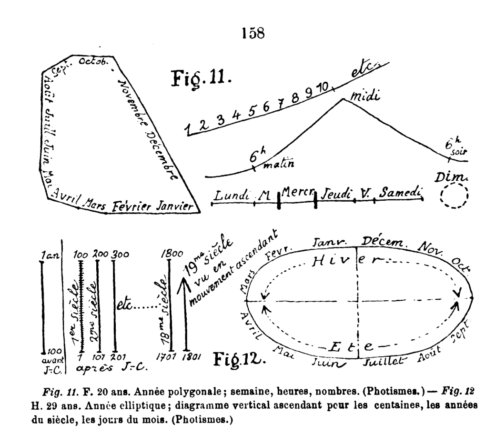
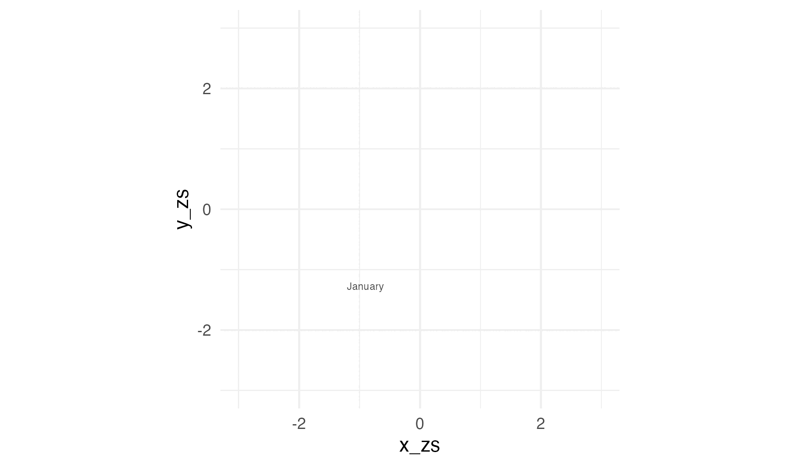
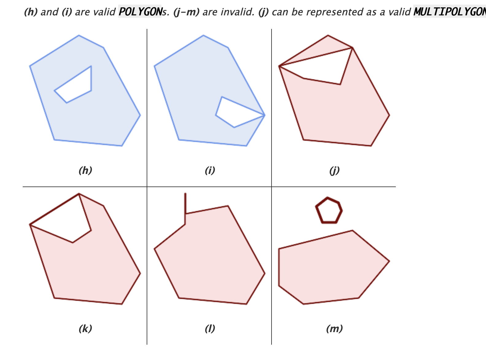

# Introduction {#sec-introductionTitle}

```{css}

.m-table table {
  font-size: 0.6em;
}

.s-table table {
  font-size: 0.4em;
}

.xs-table table {
  font-size: 0.2em;
}

.xxs-table table {
  font-size: 0.1em;
}

.s-slide {
  font-size: 0.75em;
}

.xs-slide {
  font-size: 0.4em;
}

.citation {
  font-size: 0.5em;
}

```

```{r, libraries, message=FALSE, warning=FALSE}
# Make shure environment is empty
rm(list = ls())

# Data import
library(readr)
library(readxl)
# Data wrangling:
library(tidyr)
library(dplyr)
# Render Formatting
library(papaja)
library(RColorBrewer)
library(kableExtra)
# Plots
library(ggplot2)
library(ggridges)
library(ggalluvial)
# geometry/geography feature package
library(sf)
# for ROC analyses:
library(pROC) # See https://www.r-bloggers.com/2019/02/some-r-packages-for-roc-curves/

library(webshot)
```

## Introduction {#sec-introduction}

{fig-align="center"}

[@flournoy1893]

::: s-slide
*Space-Sequence Synesthesia is a perceptual condition in which ordinal sequences (e.g., numbers, days of the week, or months of the year) are experienced as occupying specific spatial locations [@price2009; @rothen2016; @ward2018]*
:::

::: notes
SSS: people experience a particular spatial order for sequences.

Inducer : a sequence

concurrent: spatial place
:::

## Who is a genuine synesthete? {#sec-criteria}

**Suggested criteria** [@seron1992; @deroy2013]

:::: incremental
1.  Conscious

2.  Developmentally early

3.  Automatic

4.  Unidirectional

::: {.fragment .highlight-red}
5.  Consistent in time
:::
::::

::: notes
:::

## Consistency tests

::::: columns
::: {.column .s-slide}
{fig-align="center"}

Task: "Click on the spatial location elicited by the present stimulus"
:::

::: {.incremental .column .s-slide}
-   *Measure of spatial position's variability over time* [@baron-cohen1993]

-   Triangle area [@rothen2016]

-   Limits [i..e @ward2018] :

    -   High consistency if same or close coordinates

    -   Might favour linear over circular forms

    -   Ordinality between items is ignored
:::
:::::

::: notes
Tested for weekdays, months and digits (0 to 9). 3 repetitions each.
:::

## Present study

*Optimizing diagnostics from consistency tests*

```{r Load data}
# In the following I upload and merge the data from Ward, Rothen and Van Peters. Data is stored into a full dataset ds (i.e. 1 row per trial) and a dataset per participant ds_Quest (i.e. 1 row per participant).

###  Ward Data
ds_syn       <- read_excel("raw_synaesthetes_consistency_anon.xlsx")
ds_syn$group <- "Syn"
ds_ctl       <- read_excel("raw_controls_consistency_anon.xlsx")
ds_ctl$group <- "Ctl"

ds_Q_syn       <- read_excel("raw_synaesthetes_questionnaire_anon.xlsx")
ds_Q_syn$group <- "Syn"
ds_Q_ctl       <- read_excel("raw_controls_questionnaire_anon.xlsx")
ds_Q_ctl$group <- "Ctl"

# Merge wards datafiles:
ds <- merge(ds_syn,ds_ctl, all = TRUE)
ds_Q <- merge(ds_Q_syn,ds_Q_ctl, all = TRUE)

# Ward only uses those who completed the Questionnaire (i.e. N = 215+252 = 467)
ds <- ds %>% 
  filter(session_id %in% unique(ds_Q$session_id))
 
### Rothen Data

ds_Rothen <- read.csv("~/Documents/SpaceSequenceSynDiagnostic/SpaceSequenceSynDiagnostic/rawdata.txt", sep="")

### Rename variables to match datasets

# sum(ds_Q$consistency_score != ds_Q$consistency) # Duplicate variable
ds_Q$consistency <- NULL
ds_Q$...36 <- NULL
ds_Q$...37 <- NULL
ds_Q$mean_simulation_Z <- NULL
ds_Q$SD_simulation <- NULL
ds_Q$`z-score`  <- NULL

rm(ds_syn,ds_ctl,ds_Q_syn,ds_Q_ctl)

ds$ID <- ds$session_id
ds_Q$ID <- ds_Q$session_id

ds_Q$dataSource <- "Ward"
ds$dataSource   <- "Ward"

# From Rothen:
names(ds_Rothen)[names(ds_Rothen) == "Group"] <- "group"
ds_Rothen$group <- as.factor(ds_Rothen$group)
levels(ds_Rothen$group) <- c("Ctl","Syn")
names(ds_Rothen)[names(ds_Rothen) == "Inducer"] <- "stimulus"
names(ds_Rothen)[names(ds_Rothen) == "X"] <- "x"
names(ds_Rothen)[names(ds_Rothen) == "Y"] <- "y"
ds_Rothen$SynQuest <- ds_Rothen$group == "Syn"

ds_Rothen$dataSource <- "Rothen"

# From the paper (all the same since lab based):
ds_Rothen$width  <- 1024
ds_Rothen$height <- 768
```

```{r Merge1 Rothen and Ward data}
## 0.2 Merge data:
# remove non matching colnames: 
ColNames_ds <- colnames(ds_Rothen)[colnames(ds_Rothen) %in% colnames(ds)]

ds <- ds %>%
  select(all_of(ColNames_ds))
ds_Rothen <- ds_Rothen %>%
  select(all_of(ColNames_ds))

# Merge Data:
ds   <- merge(ds,ds_Rothen, all = TRUE)

# Because there is no questionnaire in Nicola's data:
ds$SynQuest[ds$dataSource == "Rothen"] = "NaN"

# Questionnaire:
ID <- unique((ds_Rothen$ID))
ds_Q_Rothen <- as.data.frame(ID)
ds_Q_Rothen$dataSource <- "Rothen"
ds_Q_Rothen <- merge(ds_Q_Rothen, ds_Rothen %>% group_by(ID) %>% select(ID, dataSource, group) %>% filter(row_number() == 1), by = c("ID","dataSource"))

# Append rows:
ds_Q$ID <- as.character(ds_Q$ID)
ds_Q <-  bind_rows(ds_Q,ds_Q_Rothen)

# Clear up:
rm(ds_Q_Rothen, ds_Rothen)

## 0.3 Wrangle dataset
# Add Condition, i.e. stim type:
ds$Cond <- NaN
ds$Cond[ds$stimulus %in% c("1","2","3","4","5","6","7","8","9","0")] <- "number"
ds$Cond[ds$stimulus %in% c("Monday","Tuesday","Wednesday","Thursday","Friday","Saturday","Sunday")] <- "weekday"
ds$Cond[ds$stimulus %in% c("January", "February", "March", "April", "May","June","July","August","September","October","November","December")] <- "month"
```

```{r MergeVanPeters}
### ADD Van Petersen Cortex data
filedir <- "~/Documents/SpaceSequenceSynDiagnostic/VanPetersen/Cortex/di.dcc.DSC_2018.00019_653/Consistency test/Preprocessed data/"
fn <- paste0(filedir,dir(filedir))

ds_PeterCor <- read_excel(fn[1],
                                col_types = c("text", "numeric", "text", 
                                              "text", "numeric", "numeric", "numeric", 
                                              "numeric", "numeric", "numeric", 
                                              "numeric", "numeric", "text", "text", 
                                              "text", "numeric", "numeric", "numeric"))

for(i in 2:length(fn)){
  ds_i <- read_excel(fn[i],
                     col_types = c("text", "numeric", "text", 
                                   "text", "numeric", "numeric", "numeric", 
                                   "numeric", "numeric", "numeric", 
                                   "numeric", "numeric", "text", "text", 
                                   "text", "numeric", "numeric", "numeric"))
    ds_PeterCor <- merge(ds_PeterCor, ds_i, all = TRUE)
}

# Here information about group:
ds_PeterCor_Q <- read_excel("~/Documents/SpaceSequenceSynDiagnostic/VanPetersen/Cortex/di.dcc.DSC_2018.00019_653/Consistency test/Final data files/Consistency_scores.xlsx")

names(ds_PeterCor_Q)[names(ds_PeterCor_Q) == "PPcode"] <- "ID"
names(ds_PeterCor)[names(ds_PeterCor) == "Code"] <- "ID"

ID_IN <- intersect(ds_PeterCor$ID, ds_PeterCor_Q$ID)
ds_PeterCor <- ds_PeterCor %>%
    filter(ID %in% ID_IN)
ds_PeterCor_Q <- ds_PeterCor_Q %>%
    filter(ID %in% ID_IN)

# Merge data with group and all dataset: 
ds_PeterCor <- ds_PeterCor_Q %>%
  left_join(ds_PeterCor, by = "ID")

# Rename to match:
names(ds_PeterCor)[names(ds_PeterCor) == "Group"] <- "group"
ds_PeterCor[ds_PeterCor$group == "SSS",]$group <- "Syn"
ds_PeterCor[ds_PeterCor$group == "control",]$group <- "Ctl"
names(ds_PeterCor)[names(ds_PeterCor) == "MouseClick.RESPCursorY"] <- "y"
names(ds_PeterCor)[names(ds_PeterCor) == "MouseClick.RESPCursorX"] <- "x"
names(ds_PeterCor)[names(ds_PeterCor) == "word"] <- "stimulus" # Will need to translate to english!
names(ds_PeterCor)[names(ds_PeterCor) == "BlockList.Cycle"] <- "repetition"

ds_PeterCor$width  <- 1920 # "screen with display resolution set to 1920 x 1080, controlled by a Dell computer running Windows 7."
ds_PeterCor$height <- 1080
ds_PeterCor$dataSource <- "PeterCor"

ds_PeterCor <- ds_PeterCor %>%
  select(all_of(ColNames_ds))

# Translate, weekdays:
ds_PeterCor$stimulus[ds_PeterCor$stimulus == "maandag"]   <- "Monday"
ds_PeterCor$stimulus[ds_PeterCor$stimulus == "dinsdag"]   <- "Tuesday"
ds_PeterCor$stimulus[ds_PeterCor$stimulus == "woensdag"]  <- "Wednesday"
ds_PeterCor$stimulus[ds_PeterCor$stimulus == "donderdag"] <- "Thursday"
ds_PeterCor$stimulus[ds_PeterCor$stimulus == "vrijdag"]   <- "Friday"
ds_PeterCor$stimulus[ds_PeterCor$stimulus == "zaterdag"]  <- "Saturday"
ds_PeterCor$stimulus[ds_PeterCor$stimulus == "zondag"]    <- "Sunday"

# Translate, Monthc:
ds_PeterCor$stimulus[ds_PeterCor$stimulus == "januari"]   <- "January"
ds_PeterCor$stimulus[ds_PeterCor$stimulus == "februari"]  <- "February"
ds_PeterCor$stimulus[ds_PeterCor$stimulus == "maart"]     <- "March"
ds_PeterCor$stimulus[ds_PeterCor$stimulus == "april"]     <- "April"
ds_PeterCor$stimulus[ds_PeterCor$stimulus == "mei"]       <- "May"
ds_PeterCor$stimulus[ds_PeterCor$stimulus == "juni"]      <- "June"
ds_PeterCor$stimulus[ds_PeterCor$stimulus == "juli"]      <- "July"
ds_PeterCor$stimulus[ds_PeterCor$stimulus == "augustus"]  <- "August"
ds_PeterCor$stimulus[ds_PeterCor$stimulus == "september"] <- "September"
ds_PeterCor$stimulus[ds_PeterCor$stimulus == "oktober"]   <- "October"
ds_PeterCor$stimulus[ds_PeterCor$stimulus == "november"]  <- "November"
ds_PeterCor$stimulus[ds_PeterCor$stimulus == "december"] <- "December"

# They added 2 numbers that are not in the other datasets:
ds_PeterCor <- ds_PeterCor %>%
    filter(stimulus != "50") %>%
    filter(stimulus != "100")

# MERGE  
ds   <- merge(ds,ds_PeterCor, all = TRUE)

# Questionnaire:
names(ds_PeterCor_Q)[names(ds_PeterCor_Q) == "Group"] <- "group"
ds_PeterCor_Q[ds_PeterCor_Q$group == "SSS",]$group <- "Syn"
ds_PeterCor_Q[ds_PeterCor_Q$group == "control",]$group <- "Ctl"

ds_PeterCor_Q$dataSource <- "PeterCor"

ds_PeterCor_Q <- ds_PeterCor_Q %>%
  select(ID, group, `Consistency All`, `Consistency Days`, `Consistency Months`,`Consistency Numbers`, dataSource)

# Append rows:
ds_Q <-  bind_rows(ds_Q,ds_PeterCor_Q)

# Tidy workspace:
rm(ds_PeterCor_Q,ds_PeterCor,ds_i, ID, fn,ColNames_ds,i,ID_IN)
```

```{r MergeWard2}
# This data was provided by Jamie by mail. The data is prepared in a separeate file
# Preserve "?" in the colnames: 
ds_Ward2 <- read.csv2("~/Documents/SpaceSequenceSynDiagnostic/SpaceSequenceSynDiagnostic/WardData2.csv", fileEncoding = "UTF-8", check.names = FALSE)
ds_Ward2$ID <- ds_Ward2$session_id 
ds_Ward2$dataSource <- "Ward2"

# Add Cond
ds_Ward2$Cond <- NaN
ds_Ward2$Cond[ds_Ward2$stimulus %in% c("1","2","3","4","5","6","7","8","9","0")] <- "number"
ds_Ward2$Cond[ds_Ward2$stimulus %in% c("Monday","Tuesday","Wednesday","Thursday","Friday","Saturday","Sunday")] <- "weekday"
ds_Ward2$Cond[ds_Ward2$stimulus %in% c("January", "February", "March", "April", "May","June","July","August","September","October","November","December")] <- "month"

# Now I somehow need to define the groups
# If a response in the questionnaire then syn, if not then control.
ds_Ward2$group <- NaN
ds_Ward2$group[is.na(ds_Ward2$`Q1 . Some people routinely think about sequences as arranged in a particular spatial configuration (as in the examples below), do you think this might apply to you? (1=strongly agree, 5= strongly disagree)`)] <- "Ctl"
ds_Ward2$group[!is.na(ds_Ward2$`Q1 . Some people routinely think about sequences as arranged in a particular spatial configuration (as in the examples below), do you think this might apply to you? (1=strongly agree, 5= strongly disagree)`)] <- "Syn"

colNWard2 <- colnames(ds_Ward2)

ds_Ward2_Q <- ds_Ward2 %>%  
  select(c(ID, dataSource, colNWard2[colNWard2 %in% colnames(ds_Q)])) %>% 
  group_by(ID) %>%
  filter(row_number() == 1)

ds_Ward2_Q <- as.data.frame(ds_Ward2_Q)
ds_Ward2_Q$`questionnaire score` <- ds_Ward2_Q[,4] +  
  rowSums(ds_Ward2_Q[,21:24]) +
  rowSums(6 - ds_Ward2_Q[,25:28])

## Merge
ds         <- merge(ds,ds_Ward2, all = TRUE)
ds_Q       <- merge(ds_Q,ds_Ward2_Q,all = TRUE)

rm(ds_Ward2,ds_Ward2_Q)
```

```{r Wrangle data}
# Now we can enrich our dataset and process  several checks
# Add Condition, i.e. stim type:
ds$Cond <- NaN
ds$Cond[ds$stimulus %in% c("1","2","3","4","5","6","7","8","9","0")] <- "number"
ds$Cond[ds$stimulus %in% c("Monday","Tuesday","Wednesday","Thursday","Friday","Saturday","Sunday")] <- "weekday"
ds$Cond[ds$stimulus %in% c("January", "February", "March", "April", "May","June","July","August","September","October","November","December")] <- "month"

# Add stimulus repetition number
ds <- ds %>%
  group_by(ID, stimulus) %>%
  arrange(ID, stimulus, .by_group = TRUE) %>%
  mutate(repetition = row_number()) %>%
  ungroup()

# few trials that have more than 3 repetitions somehow:
ds <- ds %>% filter(repetition <= 3)

# Factorialize group variable to avoid confusions:
ds$group   <- as.factor(ds$group)
ds_Q$group <- as.factor(ds_Q$group)
```

```{r, FilterTrials}
# This is potentially a critical part for the results. Need to decide:
# (1) how to treat same coordinate responses, i.e. when ID clicks on the same position (see also Rothen and Ward)
# (2) how to treat missing data (i.e. NA & NaN)

# For (1), since z-score might fail (i.e. if all same coordinates) -->  turn same coordinates to NaN
# For (2), since sf does not accept missing data -->  we exclude those responses.
# This leads to some stimuli having only 2 repetitions (i.e. ID %in% 4_JB) AND some ID having to few pairs.
# Since polygons need at least 4 coordinate pairs. --> check enough data per repetition

# Important. To reproduce Rothen, the X = -1 and Y = -1 need to be interpreted as missing data (NaN):
ds$x[ds$x == -1] <- NaN
ds$y[ds$y == -1] <- NaN

# Detect ID has the same coordinates across Conditions:
ds <- ds %>%
    group_by(ID, Cond) %>% 
    mutate(SameCoord_x = length(unique(x[!is.na(x)])) == 1,SameCoord_y = length(unique(y[!is.na(y)])) == 1)

# NaNification:
ds$x[ds$SameCoord_x] <- NaN
ds$y[ds$SameCoord_y] <- NaN
ds$x[is.na(ds$x)]    <- NaN  # In VanPeters, some NA data all as NaN
ds$y[is.na(ds$y)]    <- NaN 

N1 <- length(unique(ds$ID)) # Track if ID loss

# Remove NaN from the dataset:
All_n <- length(ds$x) # Track trial loss
ds <- ds %>%
  filter(!is.na(x))
ds <- ds %>%
  filter(!is.na(y))
All_n2 <- length(ds$x)

N2 <- length(unique(ds$ID))  # Track if ID loss

# Check that each stimulus has 3 repetitions (3+2+1 = 6).
ds <- ds %>%
    ungroup() %>%
    group_by(ID, stimulus) %>%
    mutate(SumRep = sum(repetition)== 6)

ds <- ds[ds$SumRep,]
All_n3<- length(ds$x)

# Counts how many full conditions each ID has (should be 3):
tmp2 <- ds %>%
  ungroup() %>%
  group_by(ID, Cond, repetition) %>%
  filter(row_number() == 1) %>%
  summarize(ntrials = length(x)) %>%
  ungroup() %>%
  group_by(ID) %>%
  summarize(nCond = sum(ntrials)/3)

# Later on, we make polygons. These need at least 4 points. Hence we exclude ID's with less than 4 responses per condition:
tmp <- ds %>%
  ungroup() %>%
  group_by(ID, Cond, repetition) %>%
  summarize(ntrials = length(x))

ds <- ds %>%
  filter(!ID %in% tmp$ID[tmp$ntrials < 4])

N3 <- length(unique(ds$ID))

# Match ID to ds_Q:
IDlist <- unique(ds$ID)
ds_Q <- ds_Q %>%
  filter(ID %in% IDlist)
```

```{r Add_zs}
## 0.4 Standardize/scale coordinates
ds <- ds %>%
  group_by(ID) %>% # Not by Cond, so to avoid NaN's
  mutate(x_zs = scale(x)) %>%
  mutate(y_zs = scale(y))
```

```{r ManualAdjust}

# Manually adjust pixels of invalid screen size
# Note: 29 since 29 stimuli
ds$height[ds$ID == 29324] <- 1080
ds$width[ds$ID == 32190 ] <- 1440

# This ID has unexpected changing screen settings, consider exclusion:
ds$width[ds$ID == 33168 ]  <- 308
ds$height[ds$ID == 33168 ] <- 149

ds$width[ds$ID == 35556 ]  <- 1439
ds$height[ds$ID == 35556 ] <- 734

ds$width[ds$ID == 48114 ]  <- 1593
ds$height[ds$ID == 48114 ] <- 671

ds$width[ds$ID == 59854]  <- 1366
ds$height[ds$ID == 59854] <- 663

ds$width[ds$ID == 63127]  <- 1920
ds$height[ds$ID == 63127] <- 880


ds$Screen_area <- ds$width*ds$height

```

{fig-align="center"}

::: s-slide
-   **stage I:** Find a method that best classifies Space-Sequence Synaesthesia and Controls with pre-existing data.
-   **stage II:** Make predictions of optimal method for to-be-collected data (Sachdeva et al., 2024, Stage 1 in-principle acceptance)
:::

```{r}
#| label: fig-ExampleItemtoForm
#| eval: false
#| fig-subcap: Item level,Form level
#| include: false
#| layout-ncol: 2
 
ds %>%
  filter(ID %in%  "1025_MaJo") %>%
  filter(Cond %in% "month") %>%
  group_by(stimulus) %>%
  arrange(stimulus) %>%
  arrange(ordered(stimulus, levels = c("Monday", "Tuesday", "Wednesday", "Thursday", "Friday","Saturday","Sunday"))) %>% 
  arrange(ordered(stimulus, levels = c("January", "February", "March", "April", "May","June","July","August","September","October","November","December"))) %>% # Start ggplot
  ggplot(aes(x = x_zs, y = y_zs, group = stimulus, label = stimulus, fill = stimulus)) +
  geom_polygon(alpha = 0.4) +
  geom_text(aes(x = x_zs, y = y_zs), size = 3, alpha = 0.3) +
  scale_fill_discrete(guide="none") +
  coord_equal() +
  theme_apa()

ds %>%
  filter(ID %in%  "1025_MaJo") %>%
  filter(Cond %in% "month") %>%
  group_by(stimulus) %>%
  arrange(stimulus) %>%
  arrange(ordered(stimulus, levels = c("Monday", "Tuesday", "Wednesday", "Thursday", "Friday","Saturday","Sunday"))) %>% 
  arrange(ordered(stimulus, levels = c("January", "February", "March", "April", "May","June","July","August","September","October","November","December"))) %>% # Start ggplot
  ggplot(aes(x = x_zs, y = y_zs, group = repetition, label = stimulus, fill = stimulus)) +
  geom_path(alpha = 0.4) +
  geom_text(aes(x = x_zs, y = y_zs), size = 3, alpha = 0.3) +
  scale_fill_discrete(guide="none") +
  coord_equal() +
  theme_apa()
```

# Methods

::: {#tbl-panel .s-table layout-ncol="2"}
| Synaesthetes       | N   | Age  |
|--------------------|-----|------|
| [@rothen2016]      | 32  | 23.1 |
| [@ward2022a]       | 252 | 37.2 |
| [@vanpetersen2020] | 22  | 23.2 |
| Ward 2             | 90  | NA   |
| Total:             | 396 |      |

| Controls           | N   | Age  |
|--------------------|-----|------|
| [@rothen2016]      | 37  | 28.2 |
| [@ward2022a]       | 213 | 19.9 |
| [@vanpetersen2020] | 21  | 21.6 |
| Ward 2             | 18  | NA   |
| Total              | 289 |      |
:::

::: notes
-   laboratory settings
    -   @rothen2016
    -   @vanpetersen2020
-   Online testing
    -   @ward2022a
:::

```{r}
#| label: tbl-mytb2
#| eval: false
#| ft-align: center
#| include: false
#| tbl-cap: Summary of data sources

knitr::kable(ds_Q %>%
    group_by(group, dataSource) %>%
    summarize(N = length(ID)) %>%
    pivot_wider(names_from = group, values_from = N),
    col.names = c("Data Source", "Controls", "Sequence-Space Synesthetes"))
```

::: xs-slide
-   Coordinates individually standardized (z-scores)

-   n = `r N1-N2` excluded because same x or y coordinates across conditions and repetitions. n = `r N2-N3` excluded for having less than 4 (x,y) points

-   `r round(((All_n - All_n2)/All_n),2)` % empty trials excluded (i.e. skipped responses)
:::

# Feature extraction

## Area

```{r, triangleArea_fun}
# Define area calculation function
triangle_area <- function(x, y) {
  if(length(x) != 3 | length(y) != 3) return(NA)
  area <- abs(
    x[1]*y[2] + x[2]*y[3] + x[3]*y[1] -
    x[1]*y[3] - x[2]*y[1] - x[3]*y[2]
  ) / 2
  return(area)
}
```

```{r, area_Consitency}
## Same with z-scores:
ds <- ds %>%  
  group_by(ID, stimulus) %>%
  mutate(rep_area = triangle_area(x, y)) %>%
  ungroup()

## Merge
tmp_perID2 <- ds %>% 
    ungroup() %>% 
    group_by(ID) %>% 
    summarize(Area_perc = sum(rep_area, na.rm = TRUE)/(sum(!is.na(rep_area)))*100, Screen_area = unique(Screen_area))  %>%
  select(ID, Area_perc,Screen_area)

tmp_perID2$Area_perc <- tmp_perID2$Area_perc/tmp_perID2$Screen_area
tmp_perID2 <- tmp_perID2 %>% select(ID, Area_perc)
ds_Q <- merge(ds_Q,tmp_perID2,by = "ID")

feature_direction <- c("moreCtl")
rm(tmp_perID2)
```

```{r, area_zsConsitency}
## Same with z-scores:
ds <- ds %>%  
  group_by(ID, stimulus) %>%
  mutate(rep_area_zs = triangle_area(x_zs, y_zs)) %>%
  ungroup()

## Merge
tmp_perID2 <- ds %>% ungroup() %>% 
  group_by(ID) %>% 
  summarize(Area_zs = mean(rep_area_zs, na.rm = TRUE))  %>%
  select(ID, Area_zs)

ds_Q <- merge(ds_Q,tmp_perID2,by = "ID")
rm(tmp_perID2)

feature_direction <- c(feature_direction,"moreCtl")
```

```{r}
#| label: fig-ExampleArea
#| fig-cap: Example
#| fig-subcap: 
#|     - "Min Area"
#|     - "Max Area"
#| layout-ncol: 2

minVal = min(ds_Q$Area_zs)
IDEx <- ds_Q$ID[ds_Q$Area_zs == minVal]

ds %>%
  filter(ID %in% IDEx) %>%
  group_by(stimulus) %>%
  arrange(stimulus) %>%
  arrange(ordered(stimulus, levels = c("Monday", "Tuesday", "Wednesday", "Thursday", "Friday","Saturday","Sunday"))) %>% 
  arrange(ordered(stimulus, levels = c("January", "February", "March", "April", "May","June","July","August","September","October","November","December"))) %>% # Start ggplot
  ggplot(aes(x = x_zs, y = y_zs, group = stimulus, label = stimulus, fill = stimulus)) +
  geom_polygon(alpha = 0.08) +
  geom_text(aes(x = x_zs, y = y_zs), size = 3, alpha = 0.3) +
  xlim(-2,2) +
  ylim(-2,2) +
  scale_fill_discrete(guide="none") +
  facet_grid(~Cond) +
  ggtitle(sprintf("Example ID with minimal area of %.2f",minVal)) +
  theme_minimal()


MaxVal = max(ds_Q$Area_zs)
IDEx <- ds_Q$ID[ds_Q$Area_zs == MaxVal]

ds %>%
  filter(ID %in% IDEx) %>%
  group_by(stimulus) %>%
  arrange(stimulus) %>%
  arrange(ordered(stimulus, levels = c("Monday", "Tuesday", "Wednesday", "Thursday", "Friday","Saturday","Sunday"))) %>% 
  arrange(ordered(stimulus, levels = c("January", "February", "March", "April", "May","June","July","August","September","October","November","December"))) %>% # Start ggplot
  ggplot(aes(x = x_zs, y = y_zs, group = stimulus, label = stimulus, fill = stimulus)) +
  geom_polygon(alpha = 0.08) +
  geom_text(aes(x = x_zs, y = y_zs), size = 3, alpha = 0.3) +
  xlim(-2,2) +
  ylim(-2,2) +
  ggtitle(sprintf("Example ID with maximal area of %.2f",MaxVal)) +
  scale_fill_discrete(guide="none") +
  facet_grid(~Cond) +
  theme_minimal()
```

::: xs-slide
$$
Area = (x1y2 +x2y3 + x3y1 – x1y3 – x2y1 – x3y2) / 2
$$ {#eq-area}
:::

## Perimeter

```{r, perimFun}
### Perimeter function: 
triangle_perimeter <- function(x, y) {
  if(length(x) != 3 | length(y) != 3) return(NA)
  # Side lengths
  a <- sqrt((x[2] - x[1])^2 + (y[2] - y[1])^2)
  b <- sqrt((x[3] - x[2])^2 + (y[3] - y[2])^2)
  c <- sqrt((x[1] - x[3])^2 + (y[1] - y[3])^2)
  perimeter <- a + b + c
  return(perimeter)
}
```

```{r, perim}
## Compute triangle perimeter by group:
ds <- ds %>%  
  group_by(ID, stimulus) %>%
  mutate(triangle_perim = triangle_perimeter(x, y)*100/Screen_area) %>%
  ungroup()

## Summarize By ID:
tmp_ID <- ds %>%
  ungroup() %>% group_by(ID,group) %>%
  summarize(Perimeter_perc = mean(triangle_perim, na.rm = TRUE)) %>%
  select(ID, Perimeter_perc)

## Merge
ds_Q <- merge(ds_Q,tmp_ID,by = "ID")
feature_direction <- c(feature_direction,"moreCtl")
```

```{r, perim_zs}
## Compute triangle perimeter by group:
ds <- ds %>%  
  group_by(ID, stimulus) %>%
  mutate(triangle_perim_zs = triangle_perimeter(x_zs, y_zs)) %>%
  ungroup()

## Summarize By ID:
tmp_ID <- ds %>%
  ungroup() %>% group_by(ID,group) %>%
  summarize(Perimeter_zs = mean(triangle_perim_zs, na.rm = TRUE)) %>%
  select(ID, Perimeter_zs)

## Merge
ds_Q <- merge(ds_Q,tmp_ID,by = "ID")
feature_direction <- c(feature_direction,"moreCtl")
```

```{r}
#| label: fig-Exampleperim
#| fig-cap: Example
#| fig-subcap: 
#|     - "Min Perimeter"
#|     - "Max Perimeter"
#| layout-ncol: 2

minVal = min(ds_Q$Perimeter_zs)
IDEx <- ds_Q$ID[ds_Q$Perimeter_zs == minVal]

ds %>%
  filter(ID %in% IDEx) %>%
  group_by(stimulus) %>%
  arrange(stimulus) %>%
  arrange(ordered(stimulus, levels = c("Monday", "Tuesday", "Wednesday", "Thursday", "Friday","Saturday","Sunday"))) %>% 
  arrange(ordered(stimulus, levels = c("January", "February", "March", "April", "May","June","July","August","September","October","November","December"))) %>% # Start ggplot
  ggplot(aes(x = x_zs, y = y_zs, group = stimulus, label = stimulus, fill = stimulus)) +
  geom_polygon(alpha = 0.08) +
  geom_text(aes(x = x_zs, y = y_zs), size = 3, alpha = 0.3) +
  xlim(-2,2) +
  ylim(-2,2) +
  scale_fill_discrete(guide="none") +
  facet_grid(~Cond) +
  ggtitle(sprintf("Example ID with minimal perimeter of %.2f",minVal)) +
  theme_minimal()


MaxVal = max(ds_Q$Perimeter_zs)
IDEx <- ds_Q$ID[ds_Q$Perimeter_zs == MaxVal]

ds %>%
  filter(ID %in% IDEx) %>%
  group_by(stimulus) %>%
  arrange(stimulus) %>%
  arrange(ordered(stimulus, levels = c("Monday", "Tuesday", "Wednesday", "Thursday", "Friday","Saturday","Sunday"))) %>% 
  arrange(ordered(stimulus, levels = c("January", "February", "March", "April", "May","June","July","August","September","October","November","December"))) %>% # Start ggplot
  ggplot(aes(x = x_zs, y = y_zs, group = stimulus, label = stimulus, fill = stimulus)) +
  geom_polygon(alpha = 0.08) +
  geom_text(aes(x = x_zs, y = y_zs), size = 3, alpha = 0.3) +
  xlim(-2,2) +
  ylim(-2,2) +
  ggtitle(sprintf("Example ID with maximal perimeter of %.2f",MaxVal)) +
  scale_fill_discrete(guide="none") +
  facet_grid(~Cond) +
  theme_minimal()
```

::: xs-slide
$$
Perimeter = \sqrt{(x2 - x1)^2 + (y2 – y1)^2} + 
\sqrt{(x3 - x2)^2 + (y3 –y2)^2} + 
\sqrt{(x1 - x3)^2 + (y1 – y3)^2}
$$ {#eq-perimeter}
:::

## Permuted consistency {visibility="hidden"}

```{r, RootPermAdd}
ds_perm_cons <- read.csv2("permuted_area_Root.csv")
ds_perm_cons$perm_zs <- ds_perm_cons$z.score

ds_Q <- right_join(ds_Q, 
                   ds_perm_cons %>% select(ID, perm_zs),
                   by = "ID")
feature_direction <- c(feature_direction,rep("moreCtl",1))

rm(ds_perm_cons, tmp_ID,tmp2)
```

```{r}
#| label: fig-Exampleperm_zs
#| fig-cap: Example
#| fig-subcap: 
#|     - "Min Permuted"
#|     - "Max Permuted"
#| layout-ncol: 2

minVal = min(ds_Q$perm_zs)
IDEx <- ds_Q$ID[ds_Q$perm_zs == minVal]

ds %>%
  filter(ID %in% IDEx) %>%
  group_by(stimulus) %>%
  arrange(stimulus) %>%
  arrange(ordered(stimulus, levels = c("Monday", "Tuesday", "Wednesday", "Thursday", "Friday","Saturday","Sunday"))) %>% 
  arrange(ordered(stimulus, levels = c("January", "February", "March", "April", "May","June","July","August","September","October","November","December"))) %>% # Start ggplot
  ggplot(aes(x = x_zs, y = y_zs, group = stimulus, label = stimulus, fill = stimulus)) +
  geom_polygon(alpha = 0.4) +
  geom_text(aes(x = x_zs, y = y_zs), size = 3, alpha = 0.3) +
  xlim(-2,2) +
  ylim(-2,2) +
  scale_fill_discrete(guide="none") +
  facet_grid(~Cond) +
  ggtitle(sprintf("Example ID with minimal permuted zs of %.2f",minVal)) +
  theme_minimal()


MaxVal = max(ds_Q$perm_zs)
IDEx <- ds_Q$ID[ds_Q$perm_zs == MaxVal]

ds %>%
  filter(ID %in% IDEx) %>%
  group_by(stimulus) %>%
  arrange(stimulus) %>%
  arrange(ordered(stimulus, levels = c("Monday", "Tuesday", "Wednesday", "Thursday", "Friday","Saturday","Sunday"))) %>% 
  arrange(ordered(stimulus, levels = c("January", "February", "March", "April", "May","June","July","August","September","October","November","December"))) %>% # Start ggplot
  ggplot(aes(x = x_zs, y = y_zs, group = stimulus, label = stimulus, fill = stimulus)) +
  geom_polygon(alpha = 0.4) +
  geom_text(aes(x = x_zs, y = y_zs), size = 3, alpha = 0.3) +
  xlim(-2,2) +
  ylim(-2,2) +
  ggtitle(sprintf("Example ID with maximal permuted zs  of %.2f",MaxVal)) +
  scale_fill_discrete(guide="none") +
  facet_grid(~Cond) +
  theme_minimal()
```

::: xs-slide
$$
Zscore = [(Observed) – (Mean Permuted)] / (SD Permuted)
$$

1000 permutations of x and y coordinates
:::

# Form level

## Self-intersections

```{r, selfInter_fun}

# Define function:
count_self_intersections <- function(x, y, verbose = TRUE) {
  n <- length(x)
  if (n < 4) {
    if (verbose) cat("Need at least 4 points to check for self-intersection.\n")
    return(0)
  }

  # Orientation function
  orientation <- function(p, q, r) {
    val <- (q[2] - p[2]) * (r[1] - q[1]) - (q[1] - p[1]) * (r[2] - q[2])
    if (is.na(val)) return(NA)
    if (val == 0) return(0)
    if (val > 0) return(1) else return(2)
  }

  # Check if q lies on segment pr
  on_segment <- function(p, q, r) {
    if (any(is.na(c(p, q, r)))) return(FALSE)
    q[1] <= max(p[1], r[1]) && q[1] >= min(p[1], r[1]) &&
      q[2] <= max(p[2], r[2]) && q[2] >= min(p[2], r[2])
  }

  # Main intersection check
  segments_intersect <- function(p1, p2, p3, p4) {
    o1 <- orientation(p1, p2, p3)
    o2 <- orientation(p1, p2, p4)
    o3 <- orientation(p3, p4, p1)
    o4 <- orientation(p3, p4, p2)

    if (any(is.na(c(o1, o2, o3, o4)))) return(FALSE)

    # General case
    if (o1 != o2 && o3 != o4) return(TRUE)

    # Special colinear cases
    if (o1 == 0 && on_segment(p1, p3, p2)) return(TRUE)
    if (o2 == 0 && on_segment(p1, p4, p2)) return(TRUE)
    if (o3 == 0 && on_segment(p3, p1, p4)) return(TRUE)
    if (o4 == 0 && on_segment(p3, p2, p4)) return(TRUE)

    return(FALSE)
  }

  count <- 0
  for (i in 1:(n - 2)) {
    for (j in (i + 2):(n - 1)) {
      if (j == i + 1) next  # skip adjacent segments

      p1 <- c(x[i], y[i])
      p2 <- c(x[i + 1], y[i + 1])
      p3 <- c(x[j], y[j])
      p4 <- c(x[j + 1], y[j + 1])

      if (segments_intersect(p1, p2, p3, p4)) {
        count <- count + 1
        if (verbose) {
          cat(sprintf("Intersection #%d: segments (%d-%d) and (%d-%d)\n", count, i, i+1, j, j+1))
        }
      }
    }
  }

  if (verbose) cat("Total crossings:", count, "\n")
  return(count)
}

```

```{r, Self_Intersections}
# Number of intersections for each ID X Cond X repetition
# Important! The dataset must be correctly informed about stimulus order.
ds <- ds %>% 
  group_by(stimulus) %>%
  arrange(stimulus) %>%
  arrange(ordered(stimulus, levels = c("Monday", "Tuesday", "Wednesday", "Thursday", "Friday","Saturday","Sunday"))) %>% 
  arrange(ordered(stimulus, levels = c("January", "February", "March", "April", "May","June","July","August","September","October","November","December"))) %>%
  ungroup() %>%
  group_by(ID, Cond,repetition) %>%
  mutate(nLineCross = (count_self_intersections(x,y, verbose = FALSE))) %>%
  arrange(ID) # ensure ds remains ordered by ID
```

```{r, selfIntertodsQ}
## Average self-intersections per ID by Cond X repetition
tmp <- ds %>%
    group_by(ID,Cond,repetition) %>%
    filter(row_number() == 1) %>% # keep only 1 row per IDXCondXrep
    ungroup() %>% group_by(ID) %>% # Average per ID
    summarise(SelfInter = mean(nLineCross)) %>%
    select(ID, SelfInter) 

## Merge
ds <- merge(ds, tmp,by = "ID")

ds_Q <- right_join(ds_Q, 
           (ds %>% 
                ungroup() %>% 
                group_by(ID) %>% 
                filter(row_number() == 1) %>%
                select(ID, SelfInter)), by = "ID")


feature_direction <- c(feature_direction,"moreCtl")
```

```{r}
#| label: fig-ExampleLineInter
#| fig-cap: Example slef-intersections
ds %>%
  filter(ID %in% "30103") %>%
  ggplot(aes(x = x_zs, y = y_zs, group = stimulus, fill = stimulus, label = stimulus)) +
  geom_path(aes(group = repetition), alpha = 0.1) +
  geom_point(size = 1) +
  geom_text(aes(x = x_zs+0.1, y = y_zs-0.2), size = 2, aplha = 0.8) +
  geom_text(aes(label = nLineCross, x = 0, y = 1.6, size = 12)) +
  facet_grid(repetition ~ Cond) +
  ggtitle("ID with 1.44 (4+2+3 +1+1+0 +2+0+0)/9 self-intersections") +
  theme_apa() +
  theme(legend.position="none")
```

::: notes
First, we extract the number of *self-intersections* of each segments. Conceptually, SSS should have less chance to produce that self-intersect than control. The number of self-intersections are added separately for each repetitions and conditions and averaged per participants.
:::

```{r, ds_segm}

# Turn off spherical geometry:
sf::sf_use_s2(FALSE)

# Explicitly enforce item order (i.e. ordinality):
ds_segm <- ds %>%
  group_by(ID, stimulus) %>%
  arrange(stimulus) %>%
  arrange(ordered(stimulus, levels = c("Monday", "Tuesday", "Wednesday", "Thursday", "Friday","Saturday","Sunday"))) %>% 
  arrange(ordered(stimulus, levels = c("January", "February", "March", "April", "May","June","July","August","September","October","November","December"))) %>%
  ungroup() %>%
  arrange(ID) %>%
  filter(!is.nan(x_zs), !is.nan(y_zs)) %>% # sf hates NaN! Not needed anymore,
  mutate(
    group = as.character(group),
    ID     = as.character(ID),
    Cond      = as.character(Cond),
    repetition     = as.integer(repetition),
    dataSource = as.character(dataSource)
  ) %>%
  group_by(ID, Cond, repetition,group) %>%
  summarise(
    geometry = st_sfc(st_linestring(as.matrix(cbind(x_zs, y_zs)))), # preserves order
    .groups = "drop"
  ) %>%
  st_as_sf(crs = NA)
```

```{r, poly area}
## Pass from segment to polygon
ds_poly          <- st_cast(ds_segm, "POLYGON")
ds_poly$area     <- st_area(ds_poly)

## Poly area
ds_poly <- ds_poly %>%
  group_by(ID) %>%
  mutate(areaPoly_GA = mean(area, na.rm = TRUE))

## Merge
ds_Q <- right_join(ds_Q, 
                   ds_poly %>% st_drop_geometry() %>% ungroup() %>% group_by(ID) %>% filter(row_number() == 1) %>% select(ID, areaPoly_GA),
                   by = "ID")

feature_direction <- c(feature_direction,"moreSyn")
```

```{r, polyPeri}
ds_poly$perimeter    <- st_perimeter(ds_poly)

ds_poly <- ds_poly %>%
  group_by(ID) %>%
  mutate(perimPoly = mean(perimeter, na.rm = TRUE))

ds_Q <- right_join(ds_Q, 
                   ds_poly %>% st_drop_geometry() %>% ungroup() %>% group_by(ID) %>% filter(row_number() == 1) %>% select(ID, perimPoly),
                   by = "ID")

feature_direction <- c(feature_direction,"moreCtl")
```

```{r, polyisSimple}
# Might depend on cast:
# ds_poly          <- st_cast(ds_segm, "POLYGON", group_or_split = TRUE)

ds_poly$isSimple <- st_is_simple(ds_poly)

ds_poly <- ds_poly %>%
  group_by(ID) %>%
  mutate(isSimple_GA = mean(isSimple, na.rm = TRUE))

ds_Q <- right_join(ds_Q, 
                   ds_poly %>% st_drop_geometry() %>% ungroup() %>% group_by(ID) %>% filter(row_number() == 1) %>% select(ID, isSimple_GA),
                   by = "ID")

feature_direction <- c(feature_direction,"moreSyn")
```

```{r, topoValid}
ds_poly$isValidStruct <- st_is_valid(ds_poly, geos_method = "valid_structure")

ds_poly <- ds_poly %>%
  group_by(ID) %>%
  mutate(isValidStruct_M = mean(isValidStruct))

ds_Q <- right_join(ds_Q,
                   ds_poly %>% st_drop_geometry() %>% ungroup() %>% group_by(ID) %>% filter(row_number() == 1) %>% select(ID, isValidStruct_M),
                   by = "ID")

feature_direction <- c(feature_direction,"moreSyn")
```

## Topological validity [@postgis]

```{r}
#| label: fig-ExampTopoValid
#| layout-ncol: 2

minVal = min(ds_Q$isValidStruct_M)
IDEx <- ds_Q$ID[ds_Q$isValidStruct_M == minVal]
IDEx = sample(IDEx,1)

ds_poly %>%
  filter(ID %in% IDEx) %>%
  ggplot(aes(fill = as.factor(repetition))) + 
  geom_sf(alpha = 0.3) +
  facet_grid(repetition ~ Cond) +
  xlim(-2,2) +
  ylim(-2,2) +
  scale_fill_discrete(guide="none") +
  ggtitle(sprintf("Example ID with Validity of %.2f",minVal)) +
  theme_apa()

# ds %>%
#   filter(ID %in% IDEx) %>%
#   group_by(stimulus) %>%
#   arrange(stimulus) %>%
#   arrange(ordered(stimulus, levels = c("Monday", "Tuesday", "Wednesday", "Thursday", "Friday","Saturday","Sunday"))) %>%
#   arrange(ordered(stimulus, levels = c("January", "February", "March", "April", "May","June","July","August","September","October","November","December"))) %>% # Start ggplot
#   ggplot(aes(x = x_zs, y = y_zs, group = stimulus, label = stimulus, fill = stimulus)) +
#   geom_polygon(alpha = 0.4) +
#   geom_text(aes(x = x_zs, y = y_zs), size = 3, alpha = 0.3) +
#   xlim(-2,2) +
#   ylim(-2,2) +
#   scale_fill_discrete(guide="none") +
#   facet_grid(~Cond) +
#   ggtitle(sprintf("Example ID with Validity of %.2f",minVal)) +
#   theme_minimal()


MaxVal = max(ds_Q$isValidStruct_M)
IDEx <- ds_Q$ID[ds_Q$isValidStruct_M == MaxVal]
IDEx = sample(IDEx,1)

ds_poly %>%
  filter(ID %in% IDEx) %>%
  ggplot(aes(fill = as.factor(repetition))) + 
  geom_sf(alpha = 0.3) +
  facet_grid(repetition ~ Cond) +
  xlim(-2,2) +
  ylim(-2,2) +
  scale_fill_discrete(guide="none") +
  ggtitle(sprintf("Example ID with Validity of %.2f",MaxVal)) +
  theme_apa()

# ds %>%
#   filter(ID %in% IDEx) %>%
#   group_by(stimulus) %>%
#   arrange(stimulus) %>%
#   arrange(ordered(stimulus, levels = c("Monday", "Tuesday", "Wednesday", "Thursday", "Friday","Saturday","Sunday"))) %>% 
#   arrange(ordered(stimulus, levels = c("January", "February", "March", "April", "May","June","July","August","September","October","November","December"))) %>% # Start ggplot
#   ggplot(aes(x = x_zs, y = y_zs, group = stimulus, label = stimulus, fill = stimulus)) +
#   geom_polygon(alpha = 0.4) +
#   geom_text(aes(x = x_zs, y = y_zs), size = 3, alpha = 0.3) +
#   xlim(-2,2) +
#   ylim(-2,2) +
#   ggtitle(sprintf("Example ID with Validity of %.2f",MaxVal)) +
#   scale_fill_discrete(guide="none") +
#   facet_grid(~Cond) +
#   theme_minimal()
```

::::: columns
::: {.column .xs-slide}
`sf` simple features package [@pebesma2018]:

1.  Polygon rings are simple (i.e., they do not touch or self-intersect)

2.  Boundary rings to not cross

3.  Boundary rings may only touch points tangentially

4.  Rings that define holes are contained within the exterior ring

5.  Polygon rings must not splits the polygon
:::

::: column
[{fig-align="left" width="226"}](https://postgis.net/docs/using_postgis_dbmanagement.html#OGC_Validity)
:::
:::::

::: notes
We assessed topological validity using geometric validation test.

Topological validity tests if a polygons is well-formed and valid according to the Open Geospatial Consortium (OGC) Simple Features Specification [@herring2010].
:::

## Correlations {visibility="hidden"}

Correlate all x coordinates for weekdays (3\*7 = 21) to the y coordinates.

```{r, corrXY}
#| warning: false

## Correlate x and y across ID and Cond 
Correl <- ds %>%
  group_by(ID, Cond) %>%
  summarise(
    corr = cor(x,y)
  )

## Marge
tmp <- Correl %>% 
  group_by(ID) %>%
  summarise(Corr_M = mean(abs(corr), na.rm = TRUE)) 

ds_Q <- right_join(ds_Q,  tmp %>%  ungroup() %>% arrange(ID), by = "ID")

feature_direction <- c(feature_direction,rep("moreCtl",1))
```

## Permuted topological validity {#sec-permutation-based-feature-extraction}

Permute the response repetition order

```{r}
#| label: fig-ExamppermDemo

library(gridExtra)

tmp_ds <- ds %>%
  filter(ID %in%  "1025_MaJo") %>%
  filter(Cond %in% "month")

plot_list <- list() 

for(i in 1:4){
  plot_list[[i]] <- tmp_ds %>%
    mutate(repetition = sample(tmp_ds$repetition)) %>%
    group_by(stimulus) %>%
    arrange(stimulus) %>%
    arrange(ordered(stimulus, levels = c("Monday", "Tuesday", "Wednesday", "Thursday", "Friday","Saturday","Sunday"))) %>% 
    arrange(ordered(stimulus, levels = c("January", "February", "March", "April", "May","June","July","August","September","October","November","December"))) %>% # Start ggplot
    ggplot(aes(x = x_zs, y = y_zs, group = repetition, label = stimulus, fill = stimulus)) +
    geom_path(alpha = 0.4) +
    geom_text(aes(x = x_zs, y = y_zs), size = 3, alpha = 0.3) +
    scale_fill_discrete(guide="none") +
    coord_equal() +
    theme_apa()
  # print(p)
}

grid.arrange(grobs=plot_list, ncol = 2)
```

```{r, AveragePermute}
ds_perm <- read.csv2("permuted_isValid.csv")

## ATTENTION; RECOMPUTE THE PERMUTATION WITH THE ACTUAL DATASET then remove this
ds_perm <- ds_perm %>% filter(ID %in% ds_Q$ID)
ds_Q   <- ds_Q %>% filter(ID %in% ds_perm$ID)
# read.csv2("permuted_isValid.csv")
ds_Perm_perID <-  ds_perm %>% 
  rowwise() %>% 
  mutate(isValid_perm_M = mean(c_across(n_perm001:n_perm100)), isValid_perm_Med = median(c_across(n_perm001:n_perm100))) %>% 
  select (ID, group, isValid_perm_M, isValid_perm_Med) # removed isValid_Med_perm_ID since median always underperformed the average


ds_Q <- right_join(ds_Q, 
                   ds_Perm_perID %>% st_drop_geometry() %>% ungroup() %>% group_by(ID) %>% arrange(ID) %>% filter(row_number() == 1) %>% select(ID, isValid_perm_M),
                   by = "ID")
feature_direction <- c(feature_direction,rep("moreSyn",1))
```

```{r GLM}
#| eval: false
#| include: false

## Remov the GLM because it is tricky to compare with other features. Also the difference betwen datasets seems to be a biggest problem now. I also don't know how I would discuss it.

# Here was the text:
# Finally, we used General Linear Model (GLM) on the two features with the best AUC and add the prediction as an additional feature. A GLM could provide a formula where multiple features could be combined in order to optimize AUC.

Model3 <- glm(group ~  Area_zs +isValid_perm_M, data = ds_Q, family = binomial)
pred3 = predict(Model3)
ds_Q$GLM_Valid_areazs <- pred3

feature_direction <- c(feature_direction,rep("moreSyn",1))
```

# Results

```{r, defineDPfun}
DP <- function(sensitivity, specificity){
  sensitivity = sensitivity/100
  specificity = specificity/100
  return(sqrt(3/pi)*(log(sensitivity/(1-sensitivity)) + log(specificity/(1-specificity))))
}
```

```{r, InitializeROC_fun}
## Define function to compute ROC:
Comp_ROC <- function(data, group_col, feature, ID, Ord){
  # Ord: must be: moreSyn or moreCtl. Wheter feature value is moer in Syn or ctl.
  if(!setequal(levels(data[[group_col]]), c("Syn","Ctl"))){
    return(warning("group name must inculde: Syn Ctl"))
    break
  }
  
  if (Ord == "moreSyn") {
    Dirhere <- "<"
  } else if (Ord == "moreCtl") {
    Dirhere <- ">"
  } else {
    return(warning("Ord must be moreSyn or moreCtl"))  
  }
  
  ################ ROC analyses ################ 
  ROC_here <- pROC::roc(data[[group_col]] ~ data[[feature]], data, 
                  direction= Dirhere,
                  percent=TRUE,
                  ci=TRUE, boot.n=100, ci.alpha=0.9, stratified=FALSE,
                  )
  
  # Best threshold using Youden's J
  best_coords <- pROC::coords(ROC_here, "best", 
                              ret = c("accuracy","threshold", "sensitivity","specificity","ppv","npv"), 
                              best.method = "youden")
  

  auc_val <- as.numeric(pROC::auc(ROC_here))
  ci_auc  <- ci.auc(ROC_here)
  ciobj   <- pROC::ci.se(ROC_here, # CI of sensitivity
               specificities=seq(0, 100, 5)) # over a select set of specificities

  new_row <- data.frame(
    Feature   = feature,
    AUC        = round(auc_val, 4),
    DP         = DP(as.numeric(best_coords[["sensitivity"]]),as.numeric(best_coords[["specificity"]])),
    threshold  = as.numeric(best_coords[["threshold"]]),
    sensitivity= as.numeric(best_coords[["sensitivity"]]),
    specificity= as.numeric(best_coords[["specificity"]]),
    # ci_low     = as.numeric(ci_auc[1]),
    # ci_high    = as.numeric(ci_auc[3]),
    stringsAsFactors = FALSE
  )
  
  ################ Contingency table ################ 
    if (Ord == "moreSyn") {
    data$diagnosis <- ifelse(data[[feature]] >= best_coords$threshold,  "Test : Syn", "Test : Ctl")
  } else if (Ord == "moreCtl") {
    data$diagnosis <- ifelse(data[[feature]] >= best_coords$threshold,  "Test : Ctl","Test : Syn")
  } else {
    warning("Ord must be moreSyn or moreCtl")  
  }
  
  tab_counts <- table(data[[group_col]], data$diagnosis)
  
  tab_percent <- prop.table(tab_counts, margin = 1) * 100
  
  result <- matrix(
    paste0(tab_counts, " (", round(tab_percent, 1), "%)"),
    nrow = nrow(tab_counts),
    dimnames = dimnames(tab_counts)
  )
  
  ################ General description ################ 
  # Attention, na removed  
  Descr_table <- data %>%
    group_by(!!sym(group_col)) %>%
    summarize(n = length(unique(!!sym(ID))), Mean = mean(!!sym(feature), na.rm = TRUE), SD = sd(!!sym(feature), na.rm = TRUE))

  ################ Return outputs ################ 
  return(list(ROC_properties = new_row, Coningency_table =result, Descr_table = Descr_table, ROC_curve = ROC_here, CI = ciobj))
}
```

```{r compROCallFeat}
#| message: false
#| warning: false

all_cols <- colnames(ds_Q)
feature_list      <- all_cols[42:length(all_cols)]

if(length(feature_list) != length(feature_direction)){
  warning("Attention unmatch feature list and direction")
  message("Attention unmatch feature list and direction")
}
Feats <- as.matrix(t(rbind(feature_list,feature_direction)))

# Now we will loop through features: INITIALIZE ROC_curves
ROC_curves <- list()
ROC_contingency <- list()

# Initialize dataframe to collect relevant ROC values:
All_ROC <- data.frame(Feature=character(),
                      AUC         = character(),
                      threshold   = integer(),
                      sensitivity = integer(),
                      specificity = integer(),
                      ppv         = integer(),
                      npv         = integer(),
                      high_ci     = integer(),
                      low_ci      = integer(),
                      # power       = integer(),
                      stringsAsFactors=FALSE)

# Loop by features:
for(fit_n in 1:length(Feats[,1])){
  ROC_here <- Comp_ROC(ds_Q, "group", Feats[[fit_n,1]],"ID", Feats[[fit_n,2]])
  
  ROC_curves      <- c(ROC_curves,list(ROC_here$ROC_curve,ROC_here$ROC_properties$Feature))
  All_ROC         <- rbind(All_ROC, ROC_here$ROC_properties)
  ROC_contingency <- c(ROC_contingency,list(ROC_here$Coningency_table,ROC_here$ROC_properties$Feature))
}
```

```{r, AUCtest}
# Multiple comparison issue (need ot adjust p val):
# AUC_test  <- roc.test(ds_Q$group, ds_Q$isValid_perm_M, ds_Q$Perimeter_zs,  boot.n=1000, method = "bootstrap")
# AUC_test2 <- roc.test(ds_Q$group, ds_Q$Perimeter_zs, ds_Q$isValidStruct_M,  boot.n=1000, method = "bootstrap")
# AUC_test3 <- roc.test(ds_Q$group, ds_Q$isValid_perm_M, ds_Q$isValidStruct_M,  boot.n=1000, method = "bootstrap")

# Compare ALL the features and adjust, but leads to the same results.
nFeat <- length(ROC_curves)
Odd_idx  <- seq(1,nFeat,by=2)
Pair_idx <- seq(2,nFeat,by=2)

ROC_listed <- list()
Feattype <- c()
for(i in 1:nFeat){
  ROC_listed[[i]] <- ROC_curves[[Odd_idx[i]]]
  Feattype <- c(Feattype,ROC_curves[[Pair_idx[i]]])
}

allAUC  <- sapply(ROC_listed, auc)
sel_auc <- which(allAUC == sort(allAUC, decreasing = TRUE)[1])
toCompare_roc <- ROC_listed[[sel_auc]] # Led Zeppelin would be top rock, but that does not help our RQ

statistic <- sapply(seq_along(ROC_listed), function(i) {
  if (i == sel_auc) return(NA)
  roc.test(toCompare_roc, ROC_listed[[i]],  boot.n=1000,method = "bootstrap")$statistic
})

pvals <- sapply(seq_along(ROC_listed), function(i) {
  if (i == sel_auc) return(NA)
  roc.test(toCompare_roc, ROC_listed[[i]],  boot.n=1000,method = "bootstrap")$p.value
})

# Adjust for multiple comparison: the order is Feattype
pvals_adj <- p.adjust(pvals, method = "fdr") # or fdr since exploratory, lead to the same.

Results_ROCcomp <- data.frame(
  Feature = Feattype,
  D = statistic, 
  pvals = pvals_adj,
  isSign = (pvals_adj <.05)
)
```

::: notes
However, at the proposed cut-off, the permuted validity leads to higher specificity (`r round(All_ROC[All_ROC$Feature == "isValid_perm_M",]$specificity,2)` vs. `r round(All_ROC[All_ROC$Feature == "Perimeter_zs",]$specificity,2)`) hence best to reject controls (i.e. less false negatives) but smaller sensitivity (`r round(All_ROC[All_ROC$Feature == "isValid_perm_M",]$sensitivity,3)` vs. `r round(All_ROC[All_ROC$Feature == "Perimeter_zs",]$sensitivity,3)`), hence perimeter is best at detecting SSS (i.e. leads to less false positives). See @fig-myplot3 in @sec-sm1-feature-distributions for the densities of each standardized features suggesting bi-modal distribution (see also difference in median, see @tbl-mytb05.

In sum, the permuted validity and perimeter both provide similarly best AUC compared to the other features. While the permuted validity is best to have less false negatives (i.e. controls) while perimeter is best for less false positives (i.e. SSS).
:::

## ROC test {visibility="hidden"}

::::: columns
::: {.column width="60%"}
```{r}
#| eval: false
#| include: false

nFeat <- length(ROC_curves)
Odd_idx  <- seq(1,nFeat,by=2)
Pair_idx <- seq(2,nFeat,by=2)

ROC_listed <- list()
Feattype <- c()
for(i in 1:nFeat){
  ROC_listed[[i]] <- ROC_curves[[Odd_idx[i]]]
  Feattype <- c(Feattype,ROC_curves[[Pair_idx[i]]])
}

# ATTENTION THE FEATURE ORDER MUST MATCH ORDER
Feattype_CompOrder <- c("Area [screen size %]",
              "Area [z-score]",         
              "Perimeter [screen size %]",
              "Perimeter [z-score]",
              "Permuted Chance level [z-score]",
              "Segment self-intersections [n/9]",
              "Area of the polygon [z-score]",
              "Perimeter of the polygon [z-score]" ,
              "Simple topology [mean binary/9]",
              "Valid structure [mean binary/9]",
              "Correlation between coordinates [r]",
              "Permuted valid structure [mean binary/9]"  )

Col_ROC = pals::cols25(nFeat/2)

ggroc(ROC_listed) +
  geom_segment(aes(x = 0, xend = 100, y = 100, yend = 0), color="grey", size = 0.01) +
  scale_color_manual(labels = Feattype_CompOrder,values =Col_ROC) + # pals::brewer.pastel1(nFeat)
  theme_apa()+
  theme(legend.title = element_blank()) +
  coord_equal() +
  annotate(
    geom = "curve", x = 77.5, y = 70.40 , xend = 40, yend = 55, 
    curvature = .3, arrow = arrow(length = unit(2, "mm")), color = Col_ROC[12]
  ) +
  annotate(geom = "text", x = 42, y = 51, label = "Permuted Validity", hjust = "left", color = Col_ROC[12]) +
  annotate(
    geom = "curve", x = 74.29, y = 73.60 , xend = 30, yend = 65, 
    curvature = .3, arrow = arrow(length = unit(2, "mm")), color = Col_ROC[4]
  ) +
  annotate(geom = "text", x = 33, y = 60, label = "Perimeter [zs]", hjust = "left", color = Col_ROC[4]) +
  theme(legend.position="right",legend.text=ggplot2::element_text(size=7))
```
:::

::: {.xs-table .column width="40%"}
```{r summaryROC}
#| eval: false
#| ft-align: left
#| include: false


library(kableExtra)

All_ROC$Feature <- Feattype_CompOrder

All_ROC_round <- All_ROC %>% 
    mutate_if(is.numeric, round,2)
All_ROC_round <- All_ROC_round[order(All_ROC_round$AUC, decreasing = TRUE), ]

SortFeat <- All_ROC_round$Feature # Pass further the AUC sorted features

papaja::apa_table(All_ROC_round)

```
:::
:::::

## Receiver Operator Characteristics

```{r}
#| label: fig-myplot2
#| apa-note: Grey line indicates chance level
#| fig-cap: Receiver Operating Characteristic (ROC) curves of all features


nFeat <- length(ROC_curves)
Odd_idx  <- seq(1,nFeat,by=2)
Pair_idx <- seq(2,nFeat,by=2)

ROC_listed <- list()
Feattype <- c()
for(i in 1:nFeat){
  ROC_listed[[i]] <- ROC_curves[[Odd_idx[i]]]
  Feattype <- c(Feattype,ROC_curves[[Pair_idx[i]]])
}

# ATTENTION THE FEATURE ORDER MUST NOT BE CHANGED ABOVE
Feattype <- c("Area [screen size %]",
              "Area [z-score]",         
              "Perimeter [screen size %]",
              "Perimeter [z-score]",
              "Permuted Chance level [z-score]",
              "Segment self-intersections [count/9]",
              "Area of the polygon [z-score]",
              "Perimeter of the polygon [z-score]" ,
              "Simple topology [boolean/9]",
              "Valid structure [boolean/9]",
              "Correlation between coordinates [r]",
              "Permuted valid structure [boolean/9]"  )

Col_ROC = pals::cols25(nFeat/2)

ggroc(ROC_listed) +
  geom_segment(aes(x = 0, xend = 100, y = 100, yend = 0), color="grey", size = 0.01) +
  scale_color_manual(labels = Feattype,values =Col_ROC) + # pals::brewer.pastel1(nFeat)
  theme_apa()+
  theme(legend.title = element_blank()) +
  coord_equal() +
  annotate(
    geom = "curve", x = 77.5, y = 70.40 , xend = 40, yend = 55, 
    curvature = .3, arrow = arrow(length = unit(2, "mm")), color = Col_ROC[12]
  ) +
  annotate(geom = "text", x = 42, y = 51, label = "Permuted Validity", hjust = "left", color = Col_ROC[12]) +
  annotate(
    geom = "curve", x = 74.29, y = 73.60 , xend = 30, yend = 65, 
    curvature = .3, arrow = arrow(length = unit(2, "mm")), color = Col_ROC[4]
  ) +
  annotate(geom = "text", x = 33, y = 60, label = "Perimeter [zs]", hjust = "left", color = Col_ROC[4]) +
  theme(legend.position="right",legend.text=ggplot2::element_text(size=7))
```

-   Permuted validity and perimeter (D = `r round(Results_ROCcomp[Results_ROCcomp$Feature == "Perimeter_zs",]$D,2)`, *p* = `r round(Results_ROCcomp[Results_ROCcomp$Feature == "Perimeter_zs",]$pvals,2)`).

-   Permuted validity vs non permuted (D = `r round(Results_ROCcomp[Results_ROCcomp$Feature == "isValidStruct_M",]$D,2)`, *p* \< .05).

## ROC Table

::: m-table
```{r, summaryROC2}
#| tbl-cap: "Summary of ROC analysis sorted by AUC"
#| ft.align: left
#| apa-note: "*AUC* = Aurea Under the Curve. *DP* = Discrimination Power"


library(kableExtra)

Feattype_CompOrder <- c("Area [screen size %]",
              "Area [z-score]",         
              "Perimeter [screen size %]",
              "Perimeter [z-score]",
              "Permuted Chance level [z-score]",
              "Segment self-intersections [count/9]",
              "Area of the polygon [z-score]",
              "Perimeter of the polygon [z-score]" ,
              "Simple topology [boolean/9]",
              "Valid structure [boolean/9]",
              "Correlation between coordinates [r]",
              "Permuted valid structure [boolean/9]"  )

All_ROC_round <- All_ROC %>% 
    mutate_if(is.numeric, round,2)

# All_ROC_round$Feature <- as.factor(All_ROC_round$Feature)
All_ROC_round$Feature <- Feattype_CompOrder

All_ROC_round <- All_ROC_round[order(All_ROC_round$AUC, decreasing = TRUE), ]

SortFeat <- All_ROC_round$Feature # Pass further the AUC sorted features
# papaja::apa_table(All_ROC_round)

# Add colours for a nice table: since html won't work for .docx and .pdf
n_color <- length(All_ROC_round$Feature)

All_ROC_round[2] <- lapply(All_ROC_round[2], function(x) {
    cell_spec(x, bold = T,
              background  = spec_color(x, end = 0.9,  palette = paletteer::paletteer_c("ggthemes::Red-Green Diverging", n_color), direction = -1 ),
    )
})

All_ROC_round[3] <- lapply(All_ROC_round[3], function(x) {
    cell_spec(x, bold = T,
              background  = spec_color(x, end = 0.9,  palette = paletteer::paletteer_c("ggthemes::Red-Green Diverging", n_color), direction = -1 ),
    )
})

All_ROC_round[5] <- lapply(All_ROC_round[5], function(x) {
    cell_spec(x, bold = T,
              background = spec_color(x, end = 0.9,  palette = paletteer::paletteer_c("ggthemes::Red-Green Diverging", n_color), direction = -1 ),
    )
})

All_ROC_round[6] <- lapply(All_ROC_round[6], function(x) {
    cell_spec(x, bold = T,
              background = spec_color(x, end = 0.9,  palette = paletteer::paletteer_c("ggthemes::Red-Green Diverging", n_color), direction = -1 ),
    )
})

kbl(All_ROC_round, escape = F, align = "c") %>%
  kable_classic_2("striped", full_width = F)

```
:::

## Table Descriptive {visibility="hidden"}

::: s-table
```{r, descrTable}
#| tbl-cap: "Descriptives of each features"
#| ft.align: left

# Well this should table is present higher in the text, however it needs to be informed by the ROC analyisis (because I want the feature order to always be sorted by AUC).
feat_cols <- colnames(ds_Q[,42:length(colnames(ds_Q))])

fmt_ms <- function(x, digits = 2) {
  m    <- mean(x, na.rm = TRUE)
  Med  <- median(x, na.rm = TRUE)
  sd   <- stats::sd(x, na.rm = TRUE)
  paste0(
         formatC(m,  format = "f", digits = digits),
         " (",
         formatC(sd, format = "f", digits = digits),
         ")"
  )
}

# ATTENTION, summarize messes the feature order

tmp <- ds_Q %>%
    select(c(group, feat_cols)) %>%
    pivot_longer(cols = all_of(feat_cols),
                 names_to = "Feature",
                 values_to = "Value") %>%
    group_by(group,  Feature) %>%
    summarise(`M (SD)` = fmt_ms(Value), .groups = "drop") %>%
    pivot_wider(names_from = c(group),
                values_from = c(`M (SD)`)) %>%
    arrange(Feature) # Force to alphabetical order

tmp$Feature <- c("Area [screen size %]",
                 "Area [z-score]",  
                 "Correlation between coordinates [r]",
                 "Perimeter [screen size %]",
                 "Perimeter [z-score]",
                 "Segment self-intersections [count/9]",
                 "Area of the polygon [z-score]",
                 "Simple topology [boolean/9]",
                 "Valid structure [boolean/9]",
                 "Permuted valid structure [boolean/9]",
                 "Perimeter of the polygon [z-score]" ,
                 "Permuted Chance level [z-score]"
)

tmp <- tmp[match(All_ROC_round$Feature, tmp$Feature), ]

knitr::kable(tmp,,
    col.names = c("Feature", "Controls", "Sequence-Space Synaesthetes")) 
rm(tmp)

```
:::

## Density

```{r plotdensity}
#| label: fig-myplot3
#| fig-cap: "Density plots of all the features comparing SSS and controls"
#| apa-note: "all feature's score have been z-score transformed in order to be compared"

library(ggridges)
ds_Q_zs <- ds_Q %>%
  select(feature_list, group,ID) %>%
  mutate_at(feature_list,scale) 

ds_Q_zs <- ds_Q_zs %>% 
  pivot_longer(cols = !c(group,ID),
               names_to = "Feature",
               values_to = "zs") 


ds_Q_zs$Feature <- as.factor(ds_Q_zs$Feature)

levels(ds_Q_zs$Feature) <- c("Area [screen size %]",
              "Area [z-score]",
              "Area of the polygon [z-score]",
              "Correlation between coordinates [r]",
              "Simple topology [boolean/9]",
              "Permuted valid structure [boolean/9]", 
              
              "Valid structure [boolean/9]",
              "Perimeter [screen size %]",
              "Perimeter [z-score]",
              "Perimeter of the polygon [z-score]" ,
              "Permuted Chance level [z-score]",
              "Segment self-intersections [count/9]" )

# So the features are sorted by AUC ;)
ds_Q_zs$Feature <- factor(ds_Q_zs$Feature, levels = rev(All_ROC_round$Feature))

ggplot(ds_Q_zs, aes(x = zs, y = Feature, fill = group, color  = group,point_color = group)) + 
  geom_density_ridges(alpha = 0.5, 
                      jittered_points = TRUE, 
                      position = position_points_jitter(width = 0.05, height = 0), point_shape = '|') +
  xlim(-3, 3) +
  theme_apa() +
  labs(title = "zs densities across criteria", 
       caption = "Note: x axis is trimmed between -3 and 3 z-scores",
       x = "z-score")
```

# Discussion

## Per dataset

```{r AUCbyDataSource}

dataSources <- unique(ds$dataSource)
AUC_ds <- vector("list", length(dataSources))


for(i in 1:length(dataSources)){
  
  ds_here <- ds_Q %>% filter(dataSource %in% dataSources[i])
  
  # INITIALIZE ROC_curves
  ROC_curves <- list()
  ROC_contingency <- list()
  
  # Initialize dataframe to collect relevant ROC values:
  Per_ds_ROC <- data.frame(Feature=character(),
                        AUC = character(),
                        threshold=integer(),
                        sensitivity=integer(),
                        specificity=integer(),
                        ppv = integer(),
                        npv = integer(),
                        high_ci = integer(),
                        low_ci = integer(),
                        stringsAsFactors=FALSE)
  
  # Loop by features:
  for(fit_n in 1:length(Feats[,1])){
    ROC_here <- Comp_ROC(ds_here, "group", Feats[[fit_n,1]],"ID", Feats[[fit_n,2]])
    
    ROC_curves      <- c(ROC_curves,list(ROC_here$ROC_curve,ROC_here$ROC_properties$Feature))
    Per_ds_ROC      <- rbind(Per_ds_ROC, ROC_here$ROC_properties)
    ROC_contingency <- c(ROC_contingency,list(ROC_here$Coningency_table,
                                              ROC_here$ROC_properties$Feature))
  }
  
  Per_ds_round <- Per_ds_ROC %>% 
    mutate_if(is.numeric, round,2)
  
  Per_ds_round <- Per_ds_round[order(Per_ds_round$AUC, decreasing = TRUE), ]
  
  
   AUC_ds[[i]] <- data.frame(
    Feature = Per_ds_round$Feature,
    AUC = Per_ds_round$AUC,
    DP =  Per_ds_round$DP,
    Sensitivity = Per_ds_round$sensitivity,
    Specificity = Per_ds_round$specificity,
    dataSource = dataSources[i],
    N = length(ds_here$ID)
  )
}

AUC_ds <- do.call(rbind, AUC_ds)

# Comment the following if you want to see all features. I thought the figure were a bit overwhelming for my tiny cognitive capacities
AUC_ds <- AUC_ds %>% filter(dataSource != "Ward2")
AUC_ds <- AUC_ds %>% filter(Feature %in%  c("Perimeter_zs", "SelfInter","Area_zs","isValid_perm_M"))
```

```{r}
#| label: fig-myplot10
#| apa-note: Sensitivity and Specificity
#| fig-cap: Lineplots of AUC by data source

AUC_ds$dataSource <- as.factor(AUC_ds$dataSource)
levels(AUC_ds$dataSource) <- c("Van Peterson et al., 2020",
                               "Rothen et al., 2016",
                               "Ward 2022"
               )
AUC_ds$Feature <- as.factor(AUC_ds$Feature)
levels(AUC_ds$Feature) <- c("Area [z-score]", 
              "Permuted valid structure [mean binary/9]",
               "Perimeter [z-score]",
              "Self-intersections [count/9]"
               )

ggplot(AUC_ds, aes(x = dataSource, y = AUC, group = Feature, colour = Feature)) +
  geom_point() +
  geom_line() +
  scale_color_manual(values =pals::cols25(nFeat)) + 
  theme_apa() +
    theme(legend.position="bottom",legend.text=ggplot2::element_text(size=10))  
```

::: s-slide
-   Laboratory vs online study?

-   Instructions or sampling biases?

    -   *"However, they \[controls\] were instructed to vary the location for different stimuli." [@rothen2016]*
:::

## Per questionnaire %'s {visibility="hidden"}

Sub-sampled by 10 % questionnaire scores. Only on data by Ward.

```{r}

ds_Q2 <- ds_Q %>% filter(dataSource %in% c("Ward","Ward2")) %>% filter(!is.na(`questionnaire score`))

p <- seq(0,1,0.10)
quant <- quantile(ds_Q2$`questionnaire score`, probs = p)
quant <- as.numeric(quant)

AUC_perctils <- vector("list", length(quant)/2)


for(quant_n in 1:(length(quant)/2)){
  
  All_ROC <- data.frame(Feature=character(),
                        AUC = character(),
                        threshold=integer(),
                        sensitivity=integer(),
                        specificity=integer(),
                        ppv = integer(),
                        npv = integer(),
                        high_ci = integer(),
                        low_ci = integer(),
                        stringsAsFactors=FALSE)
  
  ds_Q2_quant_n <- ds_Q2 %>% 
  filter(`questionnaire score` <= quant[quant_n] | `questionnaire score` >= quant[length(quant)-quant_n])
  
  # hist(ds_Q2_quant_n$`questionnaire score`)
  
  # Loop by features:
  for(fit_n in 1:length(Feats[,1])){
    ROC_here <- Comp_ROC(ds_Q2_quant_n, "group", Feats[[fit_n,1]],"ID",Feats[[fit_n,2]])
    
    ROC_curves      <- c(ROC_curves,list(ROC_here$ROC_curve,ROC_here$ROC_properties$Feature))
    All_ROC         <- rbind(All_ROC, ROC_here$ROC_properties)
    ROC_contingency <- c(ROC_contingency,list(ROC_here$Coningency_table,ROC_here$ROC_properties$Feature))
  }
  
  All_ROC_round <- All_ROC %>% 
    mutate_if(is.numeric, round,2)
  All_ROC_round <- All_ROC_round[order(All_ROC_round$AUC, decreasing = TRUE), ]
  
  AUC_perctils[[quant_n]] <- data.frame(
    Feature = All_ROC_round$Feature,
    AUC = All_ROC_round$AUC,
    DP = All_ROC_round$DP,
    Sensitivity = All_ROC_round$sensitivity,
    Specificity = All_ROC_round$specificity,
    Quant_min = quant[quant_n],
    Quant_max = quant[length(quant)-quant_n],
    quant_n = quant_n
  )

    # print(knitr::kable(All_ROC_round))
}

AUC_perctils <- do.call(rbind, AUC_perctils)


ggplot(AUC_perctils, aes(x = quant_n, y = AUC, group = Feature, colour = Feature)) +
  geom_path() +
  geom_point() +
  scale_color_manual(values =pals::cols25(nFeat)) + #
  theme_apa() +
    theme(legend.position="right",legend.text=ggplot2::element_text(size=6))

```

## Conclusion

::: incremental
-   Spatial representations seem to follow topological rules

    -   Long tradition in neuroscience to map: i.e. retinotopy, sonotopy or somatotopy [@eagleman2009]

    -   Also for spatial mapping in general population ? i.e. number-space mapping?

-   Next step: stage 2

    -   Test permuted validity, area or perimeter best classify synesthetes vs controls from Chhavi.
:::

## Future directions {visibility="hidden"}

::: incremental
-   

    -   How to implicitly measure (2D) spatial representations of numbers?
:::

# Thanks for your attention!

<div>

{fig-align="center" width="800"}

</div>

## Session Info

```{r}
#| echo: false

sessioninfo::session_info()

```

# Supplementary {visibility="uncounted"}

## Sample descriptives {visibility="uncounted"}

```{r}
#| label: fig-myplot1
#| fig-cap: "Venn diagram of the types of self-reported SSS"
#| fig-subcap: "Only data from Pr. Ward is represented here."

# Load library
library(ggVennDiagram)
na.rm <- function(x){x <- x[!is.na(x)]}
ds_Q_W <- ds_Q %>% filter(dataSource %in% c("Ward","Ward2"))

ID_all    <- na.rm(ds_Q_W$ID[ds_Q_W$dataSource %in% c("Ward","Ward2")])
ID_group  <- na.rm(ds_Q_W$ID[ds_Q_W$group =="Syn"])
ID_number <- na.rm(ds_Q_W$ID[ds_Q_W$`Q2_numbers (1=present, 0=absent)` == 1] )
ID_days   <- na.rm(ds_Q_W$ID[ds_Q_W$`Q2_days  (1=present, 0=absent)` == 1] )
ID_month  <- na.rm(ds_Q_W$ID[ds_Q_W$`Q2_months  (1=present, 0=absent)`== 1] )

x <- list(SSS = ID_group, Number = ID_number, Day = ID_days, Month =ID_month)
# An euler diagram would be best, but there are no good solutions in r for now
ggVennDiagram(x, label = "count", set_color = c("black","orange","orange","orange")) +
    scale_fill_gradient(low = "white", high = "blue")
# If you enjoy more complex visualization than mental health:
# library(nVennR)
# v <- plotVenn(x)
# showSVG(v, outFile = "venn.html", systemShow = TRUE)

# Clean up your env:
rm(ID_number,ID_days,ID_month, tmp, x, colNWard2,N1,N2,N3,N4)
```

::: notes
-   240 of the SSS report having spatial-forms for Numbers, Days and Month;
-   42 only Days and Month;
-   21 only Number and Day.
-   127 controls report spatial-forms for either Days, Numbers, Months or combinations.
:::

## Synaesthetic space forms {visibility="hidden"}

<div>

:::: s-slide
::: incremental
-   Heterogeneity

    -   Idiosyncratic

    -   Category specific forms (i.e. months, number, weekdays) [@flournoy1893]

        -   i.e. Months tend to be elliptical

    -   2D or 3D [@eagleman2009a; @price2013]

    -   Reference frame (i.e. projector or associator [@dixon2004; @smilek2007])

    -   Zooming in/out [@gould2014; @jarick2009]

-   Homogeneity

    -   Cluster together [@ward2022]

    -   Consistent in time
:::
::::

</div>

::: notes
test notes
:::

## Topological simplicity {visibility="uncounted"}

```{r}
#| label: fig-ExampTopoSimple
#| fig-subcap: 
#|     - "Min Simpe"
#|     - "Max Simple"
#| layout-ncol: 2

minVal = min(ds_Q$isSimple_GA)
IDEx <- ds_Q$ID[ds_Q$isSimple_GA == minVal]
IDEx = sample(IDEx,1)

ds_poly %>%
  filter(ID %in% IDEx) %>%
  ggplot(aes(fill = as.factor(repetition))) + 
  geom_sf(alpha = 0.3) +
  facet_grid(repetition ~ Cond) +
  xlim(-2,2) +
  ylim(-2,2) +
  scale_fill_discrete(guide="none") +
  ggtitle(sprintf("Example ID with Simplicity of %.2f",minVal)) +
  theme_apa()


MaxVal = max(ds_Q$isSimple_GA)
IDEx <- ds_Q$ID[ds_Q$isSimple_GA == MaxVal]
IDEx = sample(IDEx,1)

ds_poly %>%
  filter(ID %in% IDEx) %>%
  ggplot(aes(fill = as.factor(repetition))) + 
  geom_sf(alpha = 0.3) +
  facet_grid(repetition ~ Cond) +
  xlim(-2,2) +
  ylim(-2,2) +
  scale_fill_discrete(guide="none") +
  ggtitle(sprintf("Example ID with Simplicity of %.2f",MaxVal)) +
  theme_apa()

```

::: {style=".s-slide"}
-   each ring does not self-intersect or self-touch. Note that simplicity is a condition for validity: a polygon can be simple but still invalid (e.g., if an interior ring extends outside the exterior ring
:::

## % questionnaire: AUC and DP {visibility="uncounted"}

```{r}
#| label: fig-myplot5
#| fig-cap: "Lineplots of AUC and DP by percentile"
#| apa-note: "Each point is an increasing percentiles"
#| fig-subcap: 
#|   - "Area Under the Curve (AUC)"
#|   - "Discrimination Power (DP)"
#| layout-ncol: 2


ggplot(AUC_perctils, aes(x = quant_n, y = AUC, group = Feature, colour = Feature)) +
  geom_path() +
  geom_point() +
  scale_color_manual(values =pals::cols25(nFeat)) + #
  theme_apa() +
    theme(legend.position="bottom",legend.text=ggplot2::element_text(size=6))

ggplot(AUC_perctils, aes(x = quant_n, y = DP, group = Feature, colour = Feature)) +
  geom_path() +
  geom_point() +
  scale_color_manual(values =pals::cols25(nFeat)) + #
  theme_apa() +
    theme(legend.position="bottom",legend.text=ggplot2::element_text(size=6))
```

## % questionnaire Sensitivity and Specificity {visibility="uncounted"}

```{r}
#| label: fig-myplot6
#| fig-cap: "Lineplots of Sensitivity and Specificity by percentiles"
#| apa-note: "Each point is by percentiles"
#| fig-subcap: 
#|   - "Sensitivity"
#|   - "Specificity"
#| layout-ncol: 2

ggplot(AUC_perctils, aes(x = quant_n, y = Sensitivity, group = Feature, colour = Feature)) +
  geom_path() +
  geom_point() +
  scale_color_manual(values =pals::cols25(nFeat)) + #
  theme_apa() +
    theme(legend.position="bottom",legend.text=ggplot2::element_text(size=6))

ggplot(AUC_perctils, aes(x = quant_n, y = Specificity, group = Feature, colour = Feature)) +
  geom_path() +
  geom_point() +
  scale_color_manual(values =pals::cols25(nFeat)) + #
  theme_apa() +
    theme(legend.position="bottom",legend.text=ggplot2::element_text(size=6))
```

## Data source: AUC and DP {visibility="uncounted"}

```{r}
#| label: fig-myplot9
#| apa-note: "AUC"
#| fig-cap: "Lineplots of AUC and DP by data source"
#| fig-subcap: 
#|   - "Area Under the Curve (AUC)"
#|   - "Discrimination Power (DP)"
#| layout-ncol: 2


ggplot(AUC_ds, aes(x = dataSource, y = AUC, group = Feature, colour = Feature)) +
  geom_point() +
  geom_line() +
  scale_color_manual(values =pals::cols25(nFeat)) + 
  theme_apa() +
    theme(legend.position="bottom",legend.text=ggplot2::element_text(size=10))

ggplot(AUC_ds, aes(x = dataSource, y = DP, group = Feature, colour = Feature)) +
  geom_point() +
  geom_line() +
  scale_color_manual(values =pals::cols25(nFeat)) + 
  theme_apa() +
    theme(legend.position="bottom",legend.text=ggplot2::element_text(size=10))
```

## Data source: Sensitivity and Specificity {visibility="uncounted"}

```{r}
#| label: fig-myplot12
#| apa-note: Sensitivity and Specificity
#| fig-cap: Lineplots of Sensitivity and Specificity by data source
#| fig-subcap: 
#|   - "Sensitivity"
#|   - "Specificity"
#| layout-ncol: 2

ggplot(AUC_ds, aes(x = dataSource, y = Sensitivity, group = Feature, colour = Feature)) +
  geom_point() +
  geom_line() +
  scale_color_manual(values =pals::cols25(nFeat)) + 
  theme_apa() +
    theme(legend.position="bottom",legend.text=ggplot2::element_text(size=10))  

ggplot(AUC_ds, aes(x = dataSource, y = Specificity, group = Feature, colour = Feature)) +
  geom_point() +
  geom_line() +
  scale_color_manual(values =pals::cols25(nFeat)) + 
  theme_apa() +
    theme(legend.position="bottom",legend.text=ggplot2::element_text(size=10))  
```

## Per datasets table {visibility="uncounted"}

Best AUC criteria differs by data sources.

::: s-table
```{r}
#| label: tbl-mytb4
#| tbl-cap: "Average feature for each group and dataset"
#| ft.align: left

feat_cols <-c("Perimeter_zs","isValid_perm_M")

papaja::apa_table(ds_Q %>%
    filter(dataSource != "Ward2") %>%
    select(c(group, dataSource, feat_cols)) %>%
    pivot_longer(cols = all_of(feat_cols),
                 names_to = "Feature",
                 values_to = "Value") %>%
    group_by(group, dataSource, Feature) %>%
    summarise(`M (SD)` = fmt_ms(Value), .groups = "drop") %>%
    pivot_wider(names_from = c(group),
                values_from = `M (SD)`) %>%
    arrange(match(Feature, feat_cols))
)
```
:::

## Correlations {visibility="uncounted"}

```{r}
#| label: fig-myplot8
#| message: false
#| warning: false
#| apa-note: Only data from Ward is included here
#| fig-cap: Correlation with self-reported questionnaire
#| fig-height: 9
#| fig-width: 9

library(corrplot)

# Or shorter version (no details on questionaire):
sel_dsQ <- ds_Q %>%
  select(c(`questionnaire score`,feature_list)) %>%
  filter(!is.na(`questionnaire score`))  %>%
  select_if(~ !any(is.na(.)))

cols <- colnames(sel_dsQ)
cols[cols %in% SortFeat] <- SortFeat

sel_dsQ <- sel_dsQ[, cols]
  
sel_CorMat <- cor(sel_dsQ)
sel_CorMat_test <- cor.mtest(sel_dsQ)


corrplot(abs(sel_CorMat), method = 'circle', is.corr = FALSE, col.lim = c(0,1),col = COL1("YlOrRd"), diag=FALSE, type = 'lower', addCoef.col ='black')

# corrplot::corrplot(abs(sel_CorMat), p.mat = sel_CorMat_test$p, method = 'color', is.corr = FALSE, type = 'upper', col.lim=c(0, 1), insig='blank')
```

The two highest correlations are indeed between the questionnaire score and perimeter (r = .58) and permuted validity (r = .50), see @fig-myplot8.

## Venn Pass Features {visibility="uncounted"}

```{r}

AllList       <- list(Group = ds_Q$ID[ds_Q$group == "Syn"])


All_ROC_round <- All_ROC %>% 
    mutate_if(is.numeric, round,2)
All_ROC_round <- All_ROC_round[order(All_ROC_round$AUC, decreasing = TRUE), ]

for(feat_i in 1:length(All_ROC_round$Feature) ){
  feat_here <- All_ROC_round$Feature[feat_i] 
  
  if(feat_i %in% c(2)){ # Sorry for the lazy programming here 
    
  ds_Q[[paste0("pass_",feat_here)]]  <- ds_Q[[feat_here]] >= All_ROC_round$threshold[feat_i]
  AllList[[feat_here]] <- (ds_Q$ID[ds_Q[[feat_here]] >= All_ROC_round$threshold[feat_i]])
  
  } else {
    
     ds_Q[[paste0("pass_",feat_here)]]  <- ds_Q[[feat_here]] <= All_ROC_round$threshold[feat_i]
  AllList[[feat_here]] <- (ds_Q$ID[ds_Q[[feat_here]] <= All_ROC_round$threshold[feat_i]])
  }
}


library(ggVennDiagram)
na.rm <- function(x){x <- x[!is.na(x)]}

ID_Ctl     <- ds_Q$ID[ds_Q$group =="Ctl"]
ID_SSS     <- ds_Q$ID[ds_Q$group =="Syn"]
ID_passPerim <- ds_Q$ID[ds_Q$pass_Perimeter_zs]
ID_passValidPerm  <- ds_Q$ID[ds_Q$pass_isValid_perm_M]


x <- list(Ctl = ID_Ctl, Syn = ID_SSS, Perim = ID_passPerim, Valid_perm = ID_passValidPerm)

# An euler diagram would be best, but there are no good solutions in r for now
ggVennDiagram(x, label = "count") +
    scale_fill_gradient(low = "white", high = "blue")

```

## References {visibility="uncounted"}

```{r}
#| eval: false
#| include: false
# To generate the .gif figure in the presentation:
source(GenerateIDGif.R)
```
